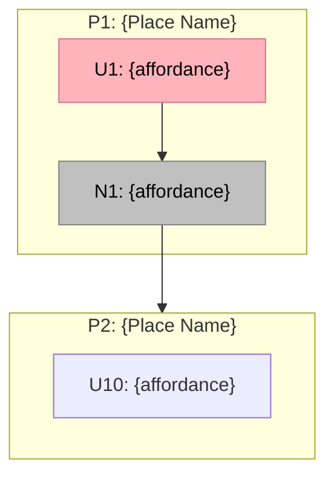

# {Vertical} — Breadboard

**Purpose**: Map all UI affordances, code affordances, and wiring for the {Vertical} vertical before building
**Input**: Shaping doc (selected shape + parts), scope definition, improved journey design, APP_FLOW
**Status**: {Draft | Complete}

---

## Places

| ID   | Place   | Type     | Entry Point | Description            |
| ---- | ------- | -------- | ----------- | ---------------------- |
| P1   |         | Page     |             |                        |
| P2   |         | Page     |             |                        |
| P2.1 |         | Subplace |             |                        |
| P3   |         | Modal    |             |                        |
| P4   | Backend | API/DB   |             | Database and resolvers |

---

## UI Affordances

### P1 — {Place Name}

| #   | Place | Component | Affordance | Control | Wires Out | Returns To |
| --- | ----- | --------- | ---------- | ------- | --------- | ---------- |
| U1  | P1    |           |            | click   |           |            |
| U2  | P1    |           |            | type    |           |            |

### P2 — {Place Name}

| #   | Place | Component | Affordance | Control | Wires Out | Returns To |
| --- | ----- | --------- | ---------- | ------- | --------- | ---------- |
| U10 | P2    |           |            | click   |           |            |
| U11 | P2    |           |            | type    |           |            |

### P2.1 — {Subplace Name}

| #   | Place | Component | Affordance | Control | Wires Out | Returns To |
| --- | ----- | --------- | ---------- | ------- | --------- | ---------- |
| U20 | P2.1  |           |            | click   |           |            |

### P3 — {Modal Name}

| #   | Place | Component | Affordance | Control | Wires Out | Returns To |
| --- | ----- | --------- | ---------- | ------- | --------- | ---------- |
| U30 | P3    |           |            | click   |           |            |

---

## Code Affordances

| #   | Place | Component | Affordance | Phase | Control | Wires Out | Returns To |
| --- | ----- | --------- | ---------- | ----- | ------- | --------- | ---------- |
| N1  | P1    |           |            | 1     | call    |           |            |
| N2  | P1    |           |            | 1     | call    |           |            |

---

## Data Stores

| #   | Place | Store | Type        | Read By | Written By |
| --- | ----- | ----- | ----------- | ------- | ---------- |
| S1  | P1    |       | URL state   |         |            |
| S2  | P1    |       | React state |         |            |
| S3  | P1    |       | Mock data   |         |            |

---

## Mermaid Diagram

### Mermaid Color Conventions

| Type               | Color             | Hex       | Style             |
| ------------------ | ----------------- | --------- | ----------------- |
| UI affordances     | Pink              | `#FFB3BA` | Solid border      |
| Code affordances   | Grey              | `#C0C0C0` | Solid border      |
| Data stores        | Lavender          | `#D8BFD8` | Solid border      |
| Chunks             | Blue              | `#87CEEB` | Thick border      |
| Place references   | Pink              | `#FFB3BA` | Dashed border     |
| Places (subgraphs) | White/transparent | --        | Subgraph boundary |

---

## Wiring Verification

- [ ] Every U has at least one Wires Out or Returns To
- [ ] Every N has a trigger and either Wires Out or Returns To
- [ ] Every S has at least one reader and one writer
- [ ] No dangling wire references
- [ ] Every R from shaping has corresponding affordances (scope coverage)
- [ ] Mermaid diagram matches tables (tables are truth)

---

## Component Boundaries

| Component | Place(s) | Contains Affordances | Location                   | Shared? |
| --------- | -------- | -------------------- | -------------------------- | ------- |
|           |          |                      | `components/features/`     | Yes     |
|           |          |                      | `app/(dashboard)/{route}/` | No      |

---

## Vertical Slices

### Slice Summary

| #   | Slice | Mechanism | Affordances | Demo               |
| --- | ----- | --------- | ----------- | ------------------ |
| V1  |       |           | U-, N-      | "{demo statement}" |
| V2  |       |           | U-, N-      | "{demo statement}" |

### V1 — {Slice Name}

| #   | Place | Component | Affordance | Control | Wires Out | Returns To |
| --- | ----- | --------- | ---------- | ------- | --------- | ---------- |
|     |       |           |            |         |           |            |

### V2 — {Slice Name}

| #   | Place | Component | Affordance | Control | Wires Out | Returns To |
| --- | ----- | --------- | ---------- | ------- | --------- | ---------- |
|     |       |           |            |         |           |            |

---

## Scope Coverage

Verify every requirement from the shaping doc has corresponding affordances:

| Req | Requirement    | Affordances | Covered? |
| --- | -------------- | ----------- | -------- |
| R0  | {from shaping} | U-, N-, S-  | Yes/No   |
| R1  |                |             |          |

---

## Phase 2 Extensions

Code affordances that will be added in Phase 2:

| ID  | Place | Affordance | Replaces     | Description |
| --- | ----- | ---------- | ------------ | ----------- |
| N-  |       |            | N- (Phase 1) |             |

---

## Related Documents

- `docs/workspace/{pipeline-id}/shaping.md` (selected shape + parts)
- `docs/workspace/{pipeline-id}/frame.md` (problem/outcome context)
- `docs/workspace/{pipeline-id}/scope.md` (scope boundaries)
- `docs/workspace/{pipeline-id}/improved-journey.md` (improved journey)
- `docs/APP_FLOW.md` (routes and navigation)
- `CLAUDE.md` (design system, quality checklist)
