# Data Access Layer — Breadboard

**Source**: `docs/shaping/dal/shaping.md` (Shape B: Structural Foundation, 14 parts)
**Issue**: #158 (DAL with mock passthrough), Epic #360 (DAL Architecture)

---

## Breadboard Type: Code Architecture

This breadboard maps a **code architecture** refactor, not a user-facing feature. There are no UI affordances (U) — all affordances are Code (N) and Data Store (S). Places represent **architectural layers** rather than screens.

**The "user"** is a developer or agent importing data into a component. The journey:

```text
Component needs data → imports from DAL domain file → DAL re-exports from provider →
provider reads from data source → returns typed result
```

**The "demo"** per slice is a successful `npm run build` + `npm test` with zero regressions.

---

## Places

| #   | Place                 | Description                                                                           |
| --- | --------------------- | ------------------------------------------------------------------------------------- |
| P1  | Consumer Layer        | App components, pages, and features that need data (46 files today)                   |
| P2  | DAL Public API        | `lib/dal/{domain}.ts` files — the single import boundary                              |
| P3  | Provider Router       | `lib/dal/_providers/index.ts` — env-based provider selection                          |
| P4  | Mock Provider         | `lib/dal/_providers/mock/{domain}.ts` — mock data implementations                     |
| P5  | Shared Infrastructure | `lib/dal/_shared/` — Result type, validation, error handling                          |
| P6  | Services Layer        | `lib/services/` — cross-entity business logic (color resolution, board projections)   |
| P7  | Data Source           | `lib/mock-data.ts` — raw entity arrays and config values (legacy, P4 reads from this) |
| P8  | Configuration         | Environment variables and `next.config.ts` — runtime settings                         |

---

## Code Affordances

### P2: DAL Public API (`lib/dal/`)

Each domain file is the single import path for that entity. Consumers import from here, never from P4 or P7.

| #    | Place | Component          | Affordance                         | Control      | Wires Out     | Returns To     |
| ---- | ----- | ------------------ | ---------------------------------- | ------------ | ------------- | -------------- |
| N1   | P2    | `dal/customers.ts` | `getCustomers()`                   | call (async) | → N20         | → P1 consumers |
| N2   | P2    | `dal/customers.ts` | `getCustomerById(id)`              | call (async) | → N36, → N20  | → P1 consumers |
| N3   | P2    | `dal/customers.ts` | `getCustomerQuotes(customerId)`    | call (async) | → N36, → N20  | → P1 consumers |
| N4   | P2    | `dal/customers.ts` | `getCustomerJobs(customerId)`      | call (async) | → N36, → N20  | → P1 consumers |
| N5   | P2    | `dal/customers.ts` | `getCustomerContacts(customerId)`  | call (async) | → N36, → N20  | → P1 consumers |
| N6   | P2    | `dal/customers.ts` | `getCustomerNotes(customerId)`     | call (async) | → N36, → N20  | → P1 consumers |
| N7   | P2    | `dal/customers.ts` | `getCustomerArtworks(customerId)`  | call (async) | → N36, → N20  | → P1 consumers |
| N8   | P2    | `dal/customers.ts` | `getCustomerInvoices(customerId)`  | call (async) | → N36, → N20  | → P1 consumers |
| N9   | P2    | `dal/jobs.ts`      | `getJobs()`                        | call (async) | → N21         | → P1 consumers |
| N10  | P2    | `dal/jobs.ts`      | `getJobById(id)`                   | call (async) | → N36, → N21  | → P1 consumers |
| N11  | P2    | `dal/jobs.ts`      | `getJobsByLane(lane)`              | call (async) | → N21         | → P1 consumers |
| N12  | P2    | `dal/jobs.ts`      | `getJobsByServiceType(type)`       | call (async) | → N21         | → P1 consumers |
| N13  | P2    | `dal/jobs.ts`      | `getJobTasks(jobId)`               | call (async) | → N36, → N21  | → P1 consumers |
| N14  | P2    | `dal/jobs.ts`      | `getJobNotes(jobId)`               | call (async) | → N36, → N21  | → P1 consumers |
| N15  | P2    | `dal/quotes.ts`    | `getQuotes()`                      | call (async) | → N22         | → P1 consumers |
| N16  | P2    | `dal/quotes.ts`    | `getQuoteById(id)`                 | call (async) | → N36, → N22  | → P1 consumers |
| N17  | P2    | `dal/invoices.ts`  | `getInvoices()`                    | call (async) | → N23         | → P1 consumers |
| N18  | P2    | `dal/invoices.ts`  | `getInvoiceById(id)`               | call (async) | → N36, → N23  | → P1 consumers |
| N19  | P2    | `dal/invoices.ts`  | `getInvoicePayments(invoiceId)`    | call (async) | → N36, → N23  | → P1 consumers |
| N19a | P2    | `dal/invoices.ts`  | `getInvoiceCreditMemos(invoiceId)` | call (async) | → N36, → N23  | → P1 consumers |
| N19b | P2    | `dal/invoices.ts`  | `getQuoteInvoice(quoteId)`         | call (async) | → N36, → N23  | → P1 consumers |
| N19c | P2    | `dal/garments.ts`  | `getGarmentCatalog()`              | call (async) | → N24         | → P1 consumers |
| N19d | P2    | `dal/garments.ts`  | `getGarmentById(id)`               | call (async) | → N36, → N24  | → P1 consumers |
| N19e | P2    | `dal/garments.ts`  | `getAvailableBrands()`             | call (async) | → N24         | → P1 consumers |
| N19f | P2    | `dal/colors.ts`    | `getColors()`                      | call (async) | → N25         | → P1 consumers |
| N19g | P2    | `dal/colors.ts`    | `getColorById(id)`                 | call (async) | → N36, → N25  | → P1 consumers |
| N19h | P2    | `dal/screens.ts`   | `getScreens()`                     | call (async) | → N26         | → P1 consumers |
| N19i | P2    | `dal/screens.ts`   | `getScreensByJobId(jobId)`         | call (async) | → N36, → N26  | → P1 consumers |
| N19j | P2    | `dal/settings.ts`  | `getMockupTemplates()`             | call (async) | → N27         | → P1 consumers |
| N19k | P2    | `dal/settings.ts`  | `getBrandPreferences()`            | call (async) | → N27         | → P1 consumers |
| N19l | P2    | `dal/settings.ts`  | `getDisplayPreference()`           | call (async) | → N27         | → P1 consumers |
| N19m | P2    | `dal/settings.ts`  | `getAutoPropagationConfig()`       | call (async) | → N27         | → P1 consumers |
| N19n | P2    | `dal/settings.ts`  | `getDtfSheetTiers()`               | call (async) | → N27         | → P1 consumers |
| N19o | P2    | `dal/artworks.ts`  | `getArtworks()`                    | call (async) | → N27a        | → P1 consumers |
| N19p | P2    | `dal/artworks.ts`  | `getArtworkById(id)`               | call (async) | → N36, → N27a | → P1 consumers |

**Implementation note**: Each P2 function is a **re-export** from its P4 mock provider — not a function call. At runtime, the consumer calls the P4 function directly; P2 is a module routing layer:

```typescript
// lib/dal/customers.ts — re-export (P2 → P4 is module alias, not call)
export { getCustomers, getCustomerById, ... } from './_providers/mock/customers';
```

The "Wires Out → N20" in the table represents this re-export relationship. In the Mermaid diagram, dashed arrows (`-.->`) are used to distinguish re-exports from true function calls (`-->`). In Phase 2, swapping the re-export source is the one-line change that switches providers.

### P3: Provider Router (`lib/dal/_providers/index.ts`)

| #   | Place | Component             | Affordance          | Control | Wires Out | Returns To                           |
| --- | ----- | --------------------- | ------------------- | ------- | --------- | ------------------------------------ |
| N35 | P3    | `_providers/index.ts` | `getProviderName()` | call    | → S10     | → P4 (mock), → future P4b (supabase) |

**Mechanism**: Reads `DATA_PROVIDER` env var, validates against allowlist `('mock' | 'supabase')`, throws on invalid/missing. Used by provider factory functions when per-domain routing is needed in Phase 2.

**Phase 1 simplification**: In Phase 1, DAL files re-export directly from `_providers/mock/`. The router is installed but not in the critical path — it serves as the pattern for Phase 2 per-domain switching.

### P4: Mock Provider (`lib/dal/_providers/mock/`)

Each mock provider file wraps the raw data from P7 in async functions that return typed copies.

| #    | Place | Component           | Affordance              | Control      | Wires Out                         | Returns To  |
| ---- | ----- | ------------------- | ----------------------- | ------------ | --------------------------------- | ----------- |
| N20  | P4    | `mock/customers.ts` | Mock customer functions | call (async) | → S1, → S2, → S3, → S4            | → N1-N8     |
| N21  | P4    | `mock/jobs.ts`      | Mock job functions      | call (async) | → S5                              | → N9-N14    |
| N22  | P4    | `mock/quotes.ts`    | Mock quote functions    | call (async) | → S6                              | → N15-N16   |
| N23  | P4    | `mock/invoices.ts`  | Mock invoice functions  | call (async) | → S7, → S8, → S9                  | → N17-N19b  |
| N24  | P4    | `mock/garments.ts`  | Mock garment functions  | call (async) | → S11                             | → N19c-N19e |
| N25  | P4    | `mock/colors.ts`    | Mock color functions    | call (async) | → S12                             | → N19f-N19g |
| N26  | P4    | `mock/screens.ts`   | Mock screen functions   | call (async) | → S13                             | → N19h-N19i |
| N27  | P4    | `mock/settings.ts`  | Mock settings functions | call (async) | → S14, → S15, → S16, → S17, → S18 | → N19j-N19n |
| N27a | P4    | `mock/artworks.ts`  | Mock artwork functions  | call (async) | → S19                             | → N19o-N19p |

**Critical constraint (B11)**: Mock providers return **copies** (spread or `structuredClone`), never references to the mutable source arrays. This prevents accidental mutation of shared state.

### P5: Shared Infrastructure (`lib/dal/_shared/`)

| #   | Place | Component               | Affordance                 | Control | Wires Out | Returns To                           |
| --- | ----- | ----------------------- | -------------------------- | ------- | --------- | ------------------------------------ |
| N30 | P5    | `_shared/result.ts`     | `Result<T, E>` type        | type    | —         | → all mutation returns               |
| N31 | P5    | `_shared/result.ts`     | `ok(value)` constructor    | call    | —         | → P4 mutations                       |
| N32 | P5    | `_shared/result.ts`     | `err(error)` constructor   | call    | —         | → P4 mutations                       |
| N33 | P5    | `_shared/result.ts`     | `isOk(result)` type guard  | call    | —         | → P1 consumers                       |
| N34 | P5    | `_shared/result.ts`     | `isErr(result)` type guard | call    | —         | → P1 consumers                       |
| N36 | P5    | `_shared/validation.ts` | `validateUUID(id)`         | call    | —         | → N2-N8, N10, N13-N14, N16, N18-N19p |
| N37 | P5    | `_shared/errors.ts`     | `DalError` base class      | type    | —         | → P4 thrown errors                   |

**3-tier error handling (R4.4)**:

- **Lookups**: Return `T | null` — consumer checks for null
- **Mutations**: Return `Result<T, E>` — consumer pattern-matches on `isOk`/`isErr`
- **Bugs**: Throw `DalError` — programming errors that indicate broken invariants

### P6: Services Layer (`lib/services/`)

| #   | Place | Component              | Affordance                                                                             | Control      | Wires Out                           | Returns To     |
| --- | ----- | ---------------------- | -------------------------------------------------------------------------------------- | ------------ | ----------------------------------- | -------------- |
| N40 | P6    | `color-resolution.ts`  | `resolveEffectiveFavorites(entityType, entityId?)`                                     | call (async) | → N19f, → N19k, → N2                | → P1 consumers |
| N41 | P6    | `color-resolution.ts`  | `getInheritanceChain(entityType, entityId?)`                                           | call (async) | → N19f, → N19k, → N2                | → P1 consumers |
| N42 | P6    | `color-resolution.ts`  | `propagateAddition(level, colorId)`                                                    | call (async) | → N19m, → N19k, → N1                | → P1 consumers |
| N43 | P6    | `color-resolution.ts`  | `getImpactPreview(level, colorId)`                                                     | call (async) | → N19k, → N1                        | → P1 consumers |
| N44 | P6    | `color-resolution.ts`  | `getBrandPreference(brandName)`                                                        | call (async) | → N19k                              | → P1 consumers |
| N45 | P6    | `color-resolution.ts`  | Color removal functions (`removeFromAll`, `removeFromLevelOnly`, `removeFromSelected`) | call (async) | → N19k, → N1                        | → P1 consumers |
| N50 | P6    | `board-projections.ts` | `projectJobToCard(job)`                                                                | call (async) | → N2, → N18, → N19d, → N19g, → N19p | → P1 consumers |
| N51 | P6    | `board-projections.ts` | `projectScratchNoteToCard(note)`                                                       | call         | —                                   | → P1 consumers |
| N52 | P6    | `screen-helpers.ts`    | `getScreensByJobId(jobId)`                                                             | call (async) | → N19h                              | → P1 consumers |
| N53 | P6    | `screen-helpers.ts`    | `getActiveCustomerScreens(customerId)`                                                 | call (async) | → N54                               | → P1 consumers |
| N54 | P6    | `screen-helpers.ts`    | `deriveScreensFromJobs(customerId)`                                                    | call (async) | → N9                                | → P1 consumers |

### P8: Configuration

| #   | Place | Component           | Affordance                                                                        | Control | Wires Out | Returns To          |
| --- | ----- | ------------------- | --------------------------------------------------------------------------------- | ------- | --------- | ------------------- |
| N60 | P8    | `next.config.ts`    | Security headers (`X-Content-Type-Options`, `X-Frame-Options`, `Referrer-Policy`) | config  | —         | → HTTP responses    |
| N61 | P8    | `.env` / Vercel env | `DATA_PROVIDER` env var                                                           | config  | —         | → N35               |
| N62 | P8    | `CLAUDE.md`         | DAL import rule                                                                   | doc     | —         | → Agent behavior    |
| N63 | P8    | `package.json`      | `server-only` dependency                                                          | config  | —         | → Phase 2 readiness |

---

## Data Stores

### P7: Data Source (`lib/mock-data.ts`)

Entity arrays — the raw data. Only P4 (mock provider) reads these.

| #   | Place | Store                                 | Type                   | Readers                      |
| --- | ----- | ------------------------------------- | ---------------------- | ---------------------------- |
| S1  | P7    | `customers`                           | `Customer[]`           | N20                          |
| S2  | P7    | `contacts`                            | `Contact[]`            | N20                          |
| S3  | P7    | `customerGroups`                      | `Group[]`              | N20                          |
| S4  | P7    | `customerAddresses` / `customerNotes` | `Address[]` / `Note[]` | N20                          |
| S5  | P7    | `jobs`                                | `Job[]`                | N21                          |
| S6  | P7    | `quotes`                              | `Quote[]`              | N22                          |
| S7  | P7    | `invoices`                            | `Invoice[]`            | N23                          |
| S8  | P7    | `payments`                            | `Payment[]`            | N23                          |
| S9  | P7    | `creditMemos`                         | `CreditMemo[]`         | N23                          |
| S10 | P8    | `DATA_PROVIDER` env var               | `string`               | N35                          |
| S11 | P7    | `garmentCatalog`                      | `GarmentCatalog[]`     | N24                          |
| S12 | P7    | `colors`                              | `Color[]`              | N25                          |
| S13 | P7    | `screens`                             | `Screen[]`             | N26                          |
| S14 | P7    | `mockupTemplates`                     | `MockupTemplate[]`     | N27                          |
| S15 | P7    | `brandPreferences`                    | `BrandPreference[]`    | N27                          |
| S16 | P7    | `displayPreference`                   | `DisplayPreference`    | N27                          |
| S17 | P7    | `autoPropagationConfig`               | `PropagationConfig`    | N27                          |
| S18 | P7    | `dtfSheetTiers`                       | `DTFSheetTier[]`       | N27                          |
| S19 | P7    | `artworks`                            | `Artwork[]`            | N27a                         |
| S20 | P7    | `quoteCards`                          | `QuoteCard[]`          | N21 (via mock jobs provider) |
| S21 | P7    | `scratchNotes`                        | `ScratchNote[]`        | N21 (via mock jobs provider) |

---

## Wiring Diagram

```mermaid
flowchart TB
    subgraph P1["P1: Consumer Layer (46 files)"]
        C1["Page components"]
        C2["Feature components"]
        C3["Data tables"]
    end

    subgraph P2["P2: DAL Public API (lib/dal/)"]
        N1_8["N1-N8: dal/customers.ts"]
        N9_14["N9-N14: dal/jobs.ts"]
        N15_16["N15-N16: dal/quotes.ts"]
        N17_19b["N17-N19b: dal/invoices.ts"]
        N19c_e["N19c-N19e: dal/garments.ts"]
        N19f_g["N19f-N19g: dal/colors.ts"]
        N19h_i["N19h-N19i: dal/screens.ts"]
        N19j_n["N19j-N19n: dal/settings.ts"]
        N19o_p["N19o-N19p: dal/artworks.ts"]
    end

    subgraph P5["P5: Shared Infrastructure (lib/dal/_shared/)"]
        N30["N30-N34: Result type + guards"]
        N36["N36: validateUUID()"]
        N37["N37: DalError"]
    end

    subgraph P3["P3: Provider Router"]
        N35["N35: getProviderName()"]
    end

    subgraph P4["P4: Mock Provider (lib/dal/_providers/mock/)"]
        N20["N20: mock/customers.ts"]
        N21["N21: mock/jobs.ts"]
        N22["N22: mock/quotes.ts"]
        N23["N23: mock/invoices.ts"]
        N24["N24: mock/garments.ts"]
        N25["N25: mock/colors.ts"]
        N26["N26: mock/screens.ts"]
        N27["N27: mock/settings.ts"]
        N27a["N27a: mock/artworks.ts"]
    end

    subgraph P6["P6: Services Layer (lib/services/)"]
        N40_45["N40-N45: color-resolution.ts"]
        N50_51["N50-N51: board-projections.ts"]
        N52_54["N52-N54: screen-helpers.ts"]
    end

    subgraph P7["P7: Data Source (lib/mock-data.ts)"]
        S_ent["S1-S21: Entity arrays + configs"]
    end

    subgraph P8["P8: Configuration"]
        N60["N60: Security headers"]
        N61["N61: DATA_PROVIDER env"]
        N62["N62: CLAUDE.md rules"]
        N63["N63: server-only package"]
    end

    %% Consumer → DAL
    C1 --> N1_8
    C1 --> N9_14
    C1 --> N15_16
    C1 --> N17_19b
    C2 --> N19c_e
    C2 --> N19f_g
    C2 --> N19h_i
    C3 --> N19j_n
    C3 --> N19o_p

    %% Consumer → Services
    C1 --> N40_45
    C1 --> N50_51
    C2 --> N52_54

    %% DAL → Validation
    N1_8 --> N36
    N9_14 --> N36
    N15_16 --> N36
    N17_19b --> N36
    N19c_e --> N36
    N19f_g --> N36
    N19h_i --> N36
    N19o_p --> N36

    %% DAL re-exports from Mock Provider
    N1_8 -.-> N20
    N9_14 -.-> N21
    N15_16 -.-> N22
    N17_19b -.-> N23
    N19c_e -.-> N24
    N19f_g -.-> N25
    N19h_i -.-> N26
    N19j_n -.-> N27
    N19o_p -.-> N27a

    %% Mock Provider → Data Source
    N20 --> S_ent
    N21 --> S_ent
    N22 --> S_ent
    N23 --> S_ent
    N24 --> S_ent
    N25 --> S_ent
    N26 --> S_ent
    N27 --> S_ent
    N27a --> S_ent

    %% Services → DAL
    N40_45 --> N19f_g
    N40_45 --> N19j_n
    N40_45 --> N1_8
    N50_51 --> N1_8
    N50_51 --> N17_19b
    N50_51 --> N19c_e
    N50_51 --> N19f_g
    N50_51 --> N19o_p
    N52_54 --> N19h_i
    N52_54 --> N9_14

    %% Provider Router → Config
    N35 --> N61

    classDef api fill:#90EE90,stroke:#228B22,color:#000
    classDef provider fill:#d3d3d3,stroke:#808080,color:#000
    classDef shared fill:#e6e6fa,stroke:#9370db,color:#000
    classDef service fill:#FFD700,stroke:#B8860B,color:#000
    classDef store fill:#ffb6c1,stroke:#d87093,color:#000
    classDef config fill:#b3e5fc,stroke:#0288d1,color:#000
    classDef consumer fill:#fff,stroke:#333,color:#000

    class N1_8,N9_14,N15_16,N17_19b,N19c_e,N19f_g,N19h_i,N19j_n,N19o_p api
    class N20,N21,N22,N23,N24,N25,N26,N27,N27a provider
    class N30,N36,N37 shared
    class N40_45,N50_51,N52_54 service
    class S_ent store
    class N60,N61,N62,N63,N35 config
    class C1,C2,C3 consumer
```



---

## Phase 2 Extensions

When Supabase is added, these N-rows are added or modified:

| ID  | Place | Affordance              | Replaces        | Description                                                       |
| --- | ----- | ----------------------- | --------------- | ----------------------------------------------------------------- |
| N70 | P2    | `import 'server-only'`  | B3 (no guard)   | Added to top of every DAL file — prevents client bundle inclusion |
| N71 | P2    | `cache()` wrapper       | B4 (no cache)   | Wraps each DAL function for per-request deduplication             |
| N72 | P4b   | `supabase/customers.ts` | N20 (mock)      | Supabase implementation of customer queries                       |
| N73 | P4b   | `supabase/jobs.ts`      | N21 (mock)      | Supabase implementation of job queries                            |
| N74 | P4b   | `supabase/{domain}.ts`  | N22-N27a (mock) | Remaining Supabase domain providers                               |
| N75 | P3    | Per-domain routing      | N35 (global)    | `getProvider('customers')` returns per-domain provider selection  |

---

## Scope Coverage Verification

| Req  | Requirement                         | Affordances                                                                   | Covered?                |
| ---- | ----------------------------------- | ----------------------------------------------------------------------------- | ----------------------- |
| R0   | Single data access boundary         | N1-N19p (all DAL functions), N62 (CLAUDE.md rule)                             | Yes                     |
| R1   | Zero-disruption backend swap        | N20-N27a (re-exportable), N35 (provider router), N70-N75 (Phase 2 extensions) | Yes                     |
| R1.1 | Async signatures                    | N1-N19p (all async)                                                           | Yes                     |
| R1.2 | Provider pattern with env switching | N35, S10                                                                      | Yes                     |
| R2   | Per-entity incremental migration    | N20-N27a (one file per domain)                                                | Yes                     |
| R2.1 | Per-domain provider routing         | N20-N27a (separate files per domain)                                          | Yes                     |
| R2.2 | Mixed providers in same app         | Per-domain re-exports (swap one line per domain)                              | Yes                     |
| R3   | Agent-friendly architecture         | 9 domain files (~50-100 lines each) vs 1 monolith (2,429 lines)               | Yes                     |
| R3.1 | 8-20x context reduction             | Each domain file: ~50-100 lines of typed function signatures                  | Yes                     |
| R3.2 | No merge conflicts                  | Separate files per domain, no shared mutable state                            | Yes                     |
| R3.3 | Self-documenting signatures         | Explicit return types, Zod-typed params                                       | Yes                     |
| R4   | Security boundary                   | N36 (validation), N30-N34 (Result type), N37 (DalError)                       | Yes                     |
| R4.1 | Auth insertion point                | Async signatures accept future session param                                  | Yes                     |
| R4.2 | `server-only` guard                 | N63 (package installed), N70 (Phase 2 activation)                             | Deferred (Nice-to-have) |
| R4.3 | DTO returns                         | Mock providers return copies, not references                                  | Yes                     |
| R4.4 | 3-tier error handling               | N30-N34 (Result), N36 (validation null), N37 (DalError throw)                 | Yes                     |
| R4.5 | Fail-closed provider                | N35 (throws on invalid env)                                                   | Yes                     |
| R4.6 | Input validation at boundary        | N36 (validateUUID)                                                            | Yes                     |
| R4.7 | No raw array exports                | N1-N19p (functions only), N20-N27a (copies)                                   | Yes                     |
| R4.8 | Error responses don't leak          | N37 (DalError wraps, doesn't expose internals)                                | Yes                     |
| R5   | Type-safe Zod contracts             | All returns typed via existing Zod schemas                                    | Yes                     |
| R5.1 | Zod-typed returns                   | N1-N19p return `z.infer<>` types                                              | Yes                     |
| R5.2 | Schema coexistence                  | Existing `lib/schemas/` unchanged, DAL uses same types                        | Yes                     |
| R6   | Testable without infra              | Mock provider is default, no DB needed                                        | Yes                     |
| R6.1 | 529 tests pass unchanged            | Strangler fig migration preserves all behavior                                | Yes                     |
| R6.2 | DAL foundation tests                | Provider router + validation + Result type tested                             | Yes                     |
| R7   | Zero user-visible change            | Pure import path refactor, same data, same rendering                          | Yes                     |
| R8   | Services for cross-entity logic     | N40-N54 (services layer)                                                      | Yes                     |
| R8.1 | Color resolution in services        | N40-N45                                                                       | Yes                     |
| R8.2 | Board projections in services       | N50-N51                                                                       | Yes                     |

---

## Vertical Slices

### Slice Summary

| #   | Slice                           | Shape Parts                  | Affordances                     | Demo                                                                                                                     |
| --- | ------------------------------- | ---------------------------- | ------------------------------- | ------------------------------------------------------------------------------------------------------------------------ |
| V1  | Foundation infrastructure       | B5, B9, B10, B12, B13, B14   | N30-N37, N35, N60-N63           | `npm test` passes with new shared types; `npm run build` passes with security headers; provider router throws on bad env |
| V2  | First domain + provider pattern | B1, B2 (customers only)      | N1-N8, N20                      | Dashboard page renders customer data via `dal/customers.ts`; all existing customer tests pass                            |
| V3  | Entity domain migration         | B1, B2 (remaining 8 domains) | N9-N19p, N21-N27a               | All 46 files import from `dal/` instead of `mock-data`; full test suite green; `npm run build` clean                     |
| V4  | Services extraction             | B6, B7, B8 (cleanup)         | N40-N54                         | Color preferences page works via `services/color-resolution.ts`; Kanban board works via `services/board-projections.ts`  |
| V5  | Cleanup + verification          | B8 (final wave), B11         | S1-S21 import boundary enforced | Zero direct `mock-data` imports outside `_providers/mock/` and tests; lint rule / grep check passes                      |

### V1: Foundation Infrastructure

**Shape parts**: B5 (Result type), B9 (fail-closed provider), B10 (UUID validation), B12 (`server-only` install), B13 (security headers), B14 (CLAUDE.md rules)

| #   | Component               | Affordance                        | Control | Wires Out | Returns To               |
| --- | ----------------------- | --------------------------------- | ------- | --------- | ------------------------ |
| N30 | `_shared/result.ts`     | `Result<T, E>` type definition    | type    | —         | All mutation returns     |
| N31 | `_shared/result.ts`     | `ok(value)` constructor           | call    | —         | P4 mutations             |
| N32 | `_shared/result.ts`     | `err(error)` constructor          | call    | —         | P4 mutations             |
| N33 | `_shared/result.ts`     | `isOk(result)` type guard         | call    | —         | P1 consumers             |
| N34 | `_shared/result.ts`     | `isErr(result)` type guard        | call    | —         | P1 consumers             |
| N35 | `_providers/index.ts`   | `getProviderName()` — fail-closed | call    | → S10     | P4/P4b routing           |
| N36 | `_shared/validation.ts` | `validateUUID(id)` via Zod        | call    | —         | All ID-accepting DAL fns |
| N37 | `_shared/errors.ts`     | `DalError` base class             | type    | —         | P4 thrown errors         |
| N60 | `next.config.ts`        | Security headers                  | config  | —         | HTTP responses           |
| N61 | `.env`                  | `DATA_PROVIDER=mock`              | config  | —         | N35                      |
| N62 | `CLAUDE.md`             | Import rules                      | doc     | —         | Agent behavior           |
| N63 | `package.json`          | `server-only` dependency          | config  | —         | Phase 2                  |

**Demo**: `npm test` validates Result type + validation + provider router. `npm run build` succeeds with security headers. `DATA_PROVIDER=invalid npm run build` throws.

**Parallelization**: N30-N34 (Result type), N36-N37 (validation/errors), N35+N61 (provider router), N60 (security headers), N62-N63 (docs/deps) — all independent, can be built concurrently by 5 agents.

---

### V2: First Domain + Provider Pattern (Customers)

**Shape parts**: B1, B2 (customers domain only — establishes the pattern)

| #     | Component           | Affordance                    | Control      | Wires Out    | Returns To |
| ----- | ------------------- | ----------------------------- | ------------ | ------------ | ---------- |
| N1    | `dal/customers.ts`  | `getCustomers()`              | call (async) | → N20        | P1         |
| N2    | `dal/customers.ts`  | `getCustomerById(id)`         | call (async) | → N36, → N20 | P1         |
| N3-N8 | `dal/customers.ts`  | Remaining customer functions  | call (async) | → N36, → N20 | P1         |
| N20   | `mock/customers.ts` | Mock customer implementations | call (async) | → S1-S4      | N1-N8      |

**Demo**: Dashboard page and customer pages render correctly. Customer-related tests pass. Import path changed from `@/lib/mock-data` to `@/lib/dal/customers`.

**Why customers first**: Most import sites (8 functions), exercises both simple lookups (`getCustomerById`) and relational queries (`getCustomerQuotes`), demonstrates the full pattern for subsequent domains.

---

### V3: Entity Domain Migration (Remaining 8 Domains)

**Shape parts**: B1, B2 (all remaining domains)

**Parallelization window** — these 8 domains are independent and can be built concurrently:

| Agent   | Domain                                 | Affordances     | Files to update |
| ------- | -------------------------------------- | --------------- | --------------- |
| Agent A | `dal/jobs.ts` + `mock/jobs.ts`         | N9-N14, N21     | ~8 files        |
| Agent B | `dal/quotes.ts` + `mock/quotes.ts`     | N15-N16, N22    | ~6 files        |
| Agent C | `dal/invoices.ts` + `mock/invoices.ts` | N17-N19b, N23   | ~6 files        |
| Agent D | `dal/garments.ts` + `mock/garments.ts` | N19c-N19e, N24  | ~4 files        |
| Agent E | `dal/colors.ts` + `mock/colors.ts`     | N19f-N19g, N25  | ~3 files        |
| Agent F | `dal/screens.ts` + `mock/screens.ts`   | N19h-N19i, N26  | ~2 files        |
| Agent G | `dal/settings.ts` + `mock/settings.ts` | N19j-N19n, N27  | ~3 files        |
| Agent H | `dal/artworks.ts` + `mock/artworks.ts` | N19o-N19p, N27a | ~2 files        |

**Demo**: All 46 files import from `dal/` instead of `mock-data`. Full test suite (529 tests) green. `npm run build` clean.

---

### V4: Services Extraction

**Shape parts**: B6 (color resolution), B7 (board projections)

| #       | Component                       | Affordance                              | Control      | Wires Out                                                             | Returns To |
| ------- | ------------------------------- | --------------------------------------- | ------------ | --------------------------------------------------------------------- | ---------- |
| N40-N45 | `services/color-resolution.ts`  | Color hierarchy functions (6 exports)   | call (async) | → dal/colors, dal/customers, dal/settings                             | P1         |
| N50-N51 | `services/board-projections.ts` | Board projection functions (2 exports)  | call (async) | → dal/customers, dal/invoices, dal/garments, dal/colors, dal/artworks | P1         |
| N52-N54 | `services/screen-helpers.ts`    | Screen derivation functions (3 exports) | call (async) | → dal/screens, dal/jobs                                               | P1         |

**Demo**: Color preferences page works via service. Kanban board renders via service. Screen Room tab works via service. All color-preferences tests pass.

**Parallelization**: N40-N45 and N50-N51 and N52-N54 are independent — 3 agents.

---

### V5: Cleanup + Verification

**Shape parts**: B8 (final wave), B11 (no raw exports)

| Task                            | What                                                                                | Verification                          |
| ------------------------------- | ----------------------------------------------------------------------------------- | ------------------------------------- |
| Remove unused mock-data exports | Delete entity array exports that are no longer directly imported                    | Grep confirms zero direct imports     |
| Import boundary enforcement     | Add grep check to CI: `mock-data` imports only in `_providers/mock/` and test files | CI script passes                      |
| Deprecation comment             | Add `@deprecated` JSDoc to `mock-data.ts` entity arrays                             | TypeScript shows deprecation warnings |
| skill/template updates          | Update `.claude/skills/screen-builder/templates/` to use DAL imports                | Templates generate correct imports    |

**Demo**: `grep -r "from.*mock-data" --include="*.ts" --include="*.tsx" | grep -v "_providers/mock" | grep -v "__tests__" | grep -v "node_modules"` returns zero results. Full build + test suite green.

---

## Quality Gate

- [x] Every Place passes the blocking test (architectural boundaries — code in one layer cannot bypass another)
- [x] Every R from shaping has corresponding affordances (scope coverage table above)
- [x] Every N has a trigger and either Wires Out or Returns To
- [x] Every S has at least one reader
- [x] No dangling wire references
- [x] Slices defined with demo statements
- [x] Phase indicators on code affordances where relevant (Phase 2 extensions table)
- [x] Mermaid diagram matches tables (tables are truth)
- [x] Parallelization windows explicitly marked (V1: 5 agents, V3: 8 agents, V4: 3 agents)

---

## Breadboard Reflection Audit

**Date**: 2026-02-16
**Method**: Traced 5 developer stories through wiring, applied naming test to all affordances, verified table/diagram consistency against actual source code.

### Findings Fixed (8 wiring corrections)

All findings were in P6 (Services Layer) — the DAL infrastructure (P2-P5) and mock provider (P4) wiring was correct.

| #   | Affordance                      | Issue                                                                                  | Fix Applied                                             |
| --- | ------------------------------- | -------------------------------------------------------------------------------------- | ------------------------------------------------------- |
| F1  | N40 `resolveEffectiveFavorites` | Over-wired: N19g (getColorById) and N1 (getCustomers) unused                           | Removed N19g, N1; kept N19f, N19k, N2                   |
| F2  | N41 `getInheritanceChain`       | Missing: does `customers.find(c => c.id === entityId)`                                 | Added N2 (getCustomerById)                              |
| F3  | N42 `propagateAddition`         | Wrong: uses `autoPropagationConfig` (N19m) and iterates ALL customers (N1), not colors | Replaced N19f→N19m; added N1                            |
| F4  | N43 `getImpactPreview`          | Wrong: iterates ALL customers, doesn't use colors                                      | Removed N19f; added N1                                  |
| F5  | N45 removal functions           | Wrong: iterate ALL customers, don't use colors                                         | Removed N19f; added N1                                  |
| F6  | N50 `projectJobToCard`          | All 5 wires pointed to `getAll` functions; code does `.find(x => x.id === id)`         | Changed N1→N2, N17→N18, N19c→N19d, N19f→N19g, N19o→N19p |
| F7  | N53 `getActiveCustomerScreens`  | Wired to data sources; actually delegates to N54                                       | Changed to → N54                                        |
| F8  | N54 `deriveScreensFromJobs`     | Wired to screens (N19h); only uses jobs                                                | Removed N19h                                            |

### Root Cause

**getAll vs getById confusion**: When porting from `mock-data.ts` where code does `array.find(x => x.id === id)`, the initial breadboard wired to the `getAll` function (e.g., `getCustomers`). The correct DAL wire is to `getById` (e.g., `getCustomerById`) — the filtering happens inside the provider, not the consumer. This is the key abstraction that makes the Supabase swap efficient: `SELECT ... WHERE id = $1` instead of fetching the entire table.

### Accepted Notes (no fix needed)

- **P2→P4 re-export relationship**: Clarified in implementation note. Tables say "Wires Out" but the mechanism is re-export (module alias). Diagram uses dashed arrows to distinguish.
- **N35 (Provider Router)**: Installed in Phase 1 for validation/testing, not in critical data path. Phase 2 activates it for per-domain routing.
- **C1/C2/C3 diagram-only labels**: Visual grouping for P1 consumers, not designed affordances. P1 is context, not scope.
- **P4 bundled affordances (N20-N27a)**: Each row represents ~2-8 functions. The 1:1 correspondence with P2 individual functions makes this unambiguous. Acceptable compression for code architecture breadboard.
- **Pure computation helpers**: `lib/helpers/job-utils.ts` (`computeTaskProgress`) used by N50 is not a data access function — stays in `lib/helpers/`, not migrated to DAL or services.
