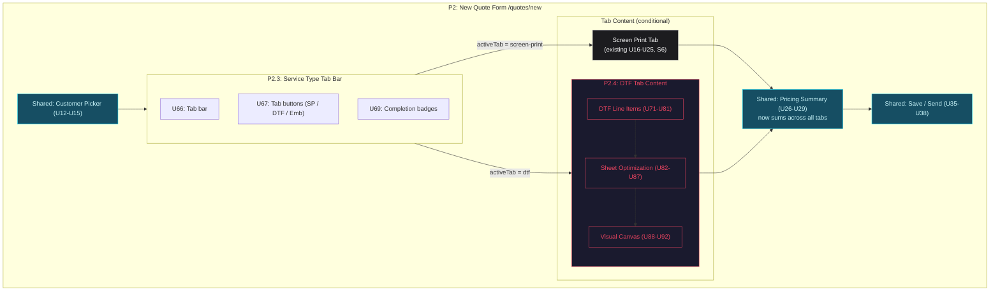

# DTF Gang Sheet Builder — Breadboard

**Purpose**: Map Shape D's 6 parts into concrete affordances, wiring, and vertical slices for the Feb 21 demo build
**Input**: Selected Shape D (shaping doc), spike affordance tables, existing quoting breadboard
**Status**: Complete

---

## Shape D Parts (Input)

From `docs/shaping/dtf-gang-sheet/shaping.md` — selected shape with zero flagged unknowns:

| Part   | Mechanism                                                      |
| ------ | -------------------------------------------------------------- |
| **D1** | Service type tab navigation in quote builder                   |
| **D2** | DTF line item builder (artwork + size preset + quantity)       |
| **D3** | Sheet optimization algorithm (shelf-packing + cost comparison) |
| **D4** | Read-only visual canvas (SVG, 22"-wide sheets)                 |
| **D5** | DTF production steps on job cards                              |
| **D6** | Standalone DTF size presets (small/medium/large + custom)      |

**Deferred**: Sibling jobs (#211), artwork model overhaul (#212), DTF+Press (#213).

---

## Integration with Existing Quoting Breadboard

This breadboard extends `docs/breadboards/quoting-breadboard.md`. ID ranges are chosen to avoid conflicts:

| Element          | Existing Range                    | DTF Range  |
| ---------------- | --------------------------------- | ---------- |
| Places           | P1–P4 (P2.1, P2.2)                | P2.3, P2.4 |
| UI Affordances   | U1–U65                            | U66–U93    |
| Code Affordances | N1–N32 (N33–N39 reserved Phase 2) | N40–N56    |
| Data Stores      | S1–S18                            | S19–S27    |

### Connection Points (Existing → DTF)

| Existing Affordance                   | How DTF Connects                                                                                           |
| ------------------------------------- | ---------------------------------------------------------------------------------------------------------- |
| **P2** (New Quote Form)               | Gains tab bar (D1) above line items section                                                                |
| **U24** (Add Another Line Item)       | Now lives inside Screen Print tab only                                                                     |
| **N16** (calculateSubtotal)           | Must sum across all service type subtotals (screen print + DTF)                                            |
| **N20/N21** (saveQuote / saveAndSend) | Must include DTF line items + sheet calculation in payload                                                 |
| **N22** (validateForm)                | Extended: delegates to N41 for per-tab completion checks; quote can't save until all enabled tabs pass N41 |
| **S6** (Line items array)             | Now screen-print-specific; DTF has separate S21                                                            |

---

## Places

| ID   | Place                | Type            | Description                                                                     |
| ---- | -------------------- | --------------- | ------------------------------------------------------------------------------- |
| P2   | New Quote Form       | Page (modified) | Gains service type tab bar; existing content becomes Screen Print tab content   |
| P2.3 | Service Type Tab Bar | Subplace of P2  | Tab navigation for switching between service types                              |
| P2.4 | DTF Tab Content      | Subplace of P2  | DTF line items, sheet optimization, visual canvas — visible when DTF tab active |

**Blocking test**: Neither P2.3 nor P2.4 are blocking — they are conditional render zones within P2. The customer picker (above tabs) and pricing summary (below tabs) remain always visible regardless of active tab.

**Not Places**: Split/Combine toggle (local state within P2.4), sheet calculation results panel (display within P2.4), multi-sheet canvas pagination (navigation within P2.4).

**Unchanged Places**: P1 (Quotes List), P2.1 (Customer Creation Modal), P2.2 (Color Swatch Picker), P3 (Quote Detail), P3.1 (Email Preview Modal), P4 (Edit Quote Form) — all function as documented in the quoting breadboard.

---

## Visual Overview

### Diagram 1: Modified P2 Layout

How the tab architecture changes the New Quote Form (P2). Customer picker and pricing summary are shared; the middle section is switched by the active tab.



### Diagram 2: DTF Data Flow

How user inputs flow through calculation to canvas rendering. All Phase 1 — client-side.

```mermaid
flowchart TD
    subgraph inputs["User Inputs (per DTF line item)"]
        ART["U73: Artwork name"]
        SIZE["U75: Size preset dropdown"]
        CUST_SIZE["U76-U77: Custom width/height"]
        QTY["U79: Quantity"]
    end

    subgraph resolve["Size Resolution"]
        N46["N46: resolveDimensions()\npreset → {width, height}"]
    end

    subgraph calc["Calculation Chain"]
        N47["N47: calculateSheetLayout()"]
        N48["N48: shelfPack()\n22\" wide, 1\" margins"]
        N49["N49: optimizeCost()\ncompare tier combinations"]
    end

    subgraph stores["Data Stores"]
        S21["S21: dtfLineItems[]"]
        S22["S22: sheetCalculation"]
        S24["S24: canvasLayout"]
    end

    subgraph outputs["Outputs"]
        U84["U84: Sheet result card"]
        U86["U86: Total DTF cost"]
        U87["U87: Utilization badge"]
        U88["U88: SVG canvas"]
    end

    SIZE --> N46
    CUST_SIZE --> N46
    ART --> S21
    N46 --> S21
    QTY --> S21

    S21 --> N47
    N47 --> N48
    N48 --> N49
    N49 --> S22
    N48 --> S24

    S22 --> U84
    S22 --> U86
    S22 --> U87
    S24 --> U88

    classDef input fill:#1c1c1f,stroke:#a1a1aa,color:#fafafa
    classDef calcNode fill:#164e63,stroke:#22d3ee,color:#cffafe
    classDef storeNode fill:#e6e6fa,stroke:#9370db,color:#000
    classDef outputNode fill:#052e16,stroke:#34d399,color:#d1fae5

    class ART,SIZE,CUST_SIZE,QTY input
    class N46,N47,N48,N49 calcNode
    class S21,S22,S24 storeNode
    class U84,U86,U87,U88 outputNode
```

---

## UI Affordances

### P2.3 — Service Type Tab Bar (D1)

| ID  | Affordance                                                    | Control | Wires Out               | Returns To                                                     |
| --- | ------------------------------------------------------------- | ------- | ----------------------- | -------------------------------------------------------------- |
| U66 | Service type tab bar (horizontal, below customer picker)      | display | —                       | ← S20 enabledServiceTypes                                      |
| U67 | Tab button per service type (Screen Print / DTF / Embroidery) | click   | → N40 handleTabSwitch() | ← S19 activeServiceTab (highlight), ← S20 (which tabs visible) |
| U68 | Active tab underline indicator                                | display | —                       | ← S19 activeServiceTab                                         |
| U69 | Tab completion badge (checkmark when tab content is valid)    | display | —                       | ← N41 validateTabCompletion()                                  |
| U70 | "Add Service Type" dropdown button                            | click   | → N42 addServiceType()  | ← S20 (show only types not yet enabled)                        |

### P2.4 — DTF Tab Content: Line Items (D2 + D6)

| ID  | Affordance                                                                                              | Control | Wires Out                                            | Returns To                                   |
| --- | ------------------------------------------------------------------------------------------------------- | ------- | ---------------------------------------------------- | -------------------------------------------- |
| U71 | DTF line item list (container for all rows)                                                             | display | —                                                    | ← S21 dtfLineItems                           |
| U72 | "Add Design" button                                                                                     | click   | → N43 addDtfLineItem()                               | → new row in S21                             |
| U73 | Artwork name text input (Phase 1: free text)                                                            | type    | → N45 updateDtfLineItem(id, 'artworkName', val)      | → S21                                        |
| U74 | Artwork thumbnail placeholder (grey box with image icon)                                                | display | —                                                    | ← S21 item (Phase 2: real artwork thumbnail) |
| U75 | Size preset dropdown ("Small/Collectibles 4×4″", "Medium/Pocket 6×6″", "Large/Shirts 10×12″", "Custom") | select  | → N46 resolveDimensions(), → N45 updateDtfLineItem() | ← S26 DTF_SIZE_PRESETS                       |
| U76 | Custom width input (inches, shown when preset = "Custom")                                               | type    | → N45 updateDtfLineItem(id, 'width', val)            | → S21, conditional on U75 = Custom           |
| U77 | Custom height input (inches, shown when preset = "Custom")                                              | type    | → N45 updateDtfLineItem(id, 'height', val)           | → S21, conditional on U75 = Custom           |
| U78 | Dimensions display (e.g., "4″ × 4″")                                                                    | display | —                                                    | ← S21 item.width, item.height                |
| U79 | Quantity input (integer ≥ 1)                                                                            | type    | → N45 updateDtfLineItem(id, 'quantity', val)         | → S21                                        |
| U80 | Remove line item button (if > 1 rows)                                                                   | click   | → N44 removeDtfLineItem(id)                          | → S21 splice                                 |
| U81 | DTF service type subtotal (sum of sheet costs)                                                          | display | —                                                    | ← N54 calculateDtfSubtotal()                 |

### P2.4 — DTF Tab Content: Sheet Optimization (D3)

| ID  | Affordance                                                                 | Control | Wires Out                                    | Returns To                                  |
| --- | -------------------------------------------------------------------------- | ------- | -------------------------------------------- | ------------------------------------------- |
| U82 | "Calculate Layout" button (primary action in DTF tab)                      | click   | → N47 calculateSheetLayout()                 |                                             |
| U83 | Split / Combine toggle (radio group, default: Combine)                     | click   | → S23 splitMode, → N50 recalculateOnChange() | ← S23                                       |
| U84 | Sheet result card (per sheet: tier label, dimensions, design count, price) | display | —                                            | ← S22 sheetCalculation.sheets[]             |
| U85 | Total sheets count                                                         | display | —                                            | ← S22 sheetCalculation.totalSheets          |
| U86 | Total DTF cost                                                             | display | —                                            | ← S22 sheetCalculation.totalCost            |
| U87 | Space utilization badge (percentage per sheet)                             | display | —                                            | ← S22 sheetCalculation.sheets[].utilization |

### P2.4 — DTF Tab Content: Visual Canvas (D4)

| ID  | Affordance                                                                     | Control | Wires Out              | Returns To                           |
| --- | ------------------------------------------------------------------------------ | ------- | ---------------------- | ------------------------------------ |
| U88 | Sheet canvas (SVG, 22"-wide scaled to viewport, variable height)               | display | —                      | ← N51 generateCanvasSvg() from S24   |
| U89 | Design rectangles (positioned boxes with artwork name label)                   | display | —                      | ← S24 canvasLayout designs[]         |
| U90 | Spacing indicator lines (dashed lines between designs showing gap measurement) | display | —                      | ← S24 margins                        |
| U91 | Sheet boundary lines (solid border with edge margin visualization)             | display | —                      | ← S24 sheetDimensions                |
| U92 | Multi-sheet tab bar (Sheet 1 / Sheet 2 / ...)                                  | click   | → S27 activeSheetIndex | ← S22 sheetCalculation.sheets.length |

### Job Card — DTF Production Steps (D5)

| ID  | Affordance                                                                            | Control | Wires Out | Returns To                 |
| --- | ------------------------------------------------------------------------------------- | ------- | --------- | -------------------------- |
| U93 | DTF task badges on job card (Gang sheet prepared / DTF printed / QC passed / Shipped) | display | —         | ← N53 getDtfTaskTemplate() |

---

## Code Affordances

| ID                         | Place  | Affordance                                             | Phase | Trigger                                       | Wires Out                                                                                                                         | Returns To                                                   |
| -------------------------- | ------ | ------------------------------------------------------ | ----- | --------------------------------------------- | --------------------------------------------------------------------------------------------------------------------------------- | ------------------------------------------------------------ |
| **D1: Tab Architecture**   |        |                                                        |       |                                               |                                                                                                                                   |                                                              |
| N40                        | P2     | handleTabSwitch(serviceType)                           | 1     | U67 click                                     | → set S19 activeServiceTab                                                                                                        | → conditional render of tab content                          |
| N41                        | P2     | validateTabCompletion(serviceType)                     | 1     | N45 any update, N44 remove, N47 calculate     | → run extracted SP validation rules (for SP tab), → N56 (for DTF tab)                                                             | → U69 badges                                                 |
| N42                        | P2     | addServiceType(serviceType)                            | 1     | U70 click                                     | → append to S20 enabledServiceTypes, → set S19 to new tab                                                                         | → U66 re-render tabs                                         |
| **D2: DTF Line Items**     |        |                                                        |       |                                               |                                                                                                                                   |                                                              |
| N43                        | P2.4   | addDtfLineItem()                                       | 1     | U72 click                                     | → append empty item to S21 `{id, artworkName:'', width:0, height:0, quantity:1, sizePreset:'small'}`                              | → U71 re-render                                              |
| N44                        | P2.4   | removeDtfLineItem(id)                                  | 1     | U80 click                                     | → splice from S21                                                                                                                 | → trigger N54, N41                                           |
| N45                        | P2.4   | updateDtfLineItem(id, field, value)                    | 1     | U73, U75, U76, U77, U79 change                | → update S21 item field                                                                                                           | → trigger N54, N41                                           |
| N46                        | P2.4   | resolveDimensions(preset)                              | 1     | U75 select (when preset ≠ "custom")           | → read S26 DTF_SIZE_PRESETS, return {width, height}                                                                               | → N45 (sets width + height)                                  |
| **D3: Sheet Optimization** |        |                                                        |       |                                               |                                                                                                                                   |                                                              |
| N47                        | P2.4   | calculateSheetLayout()                                 | 1     | U82 click                                     | → read S21 (line items) + S23 (splitMode) + S25 (tiers); → N48 shelfPack(); → N49 optimizeCost(); → write S22, S24; → trigger N54 | —                                                            |
| N48                        | P2.4   | shelfPack(designs[], sheetWidth=22, margin=1)          | 1     | N47 call                                      | → place designs L→R, T→B with 1" margins; when row full, start new shelf; when sheet full, start new sheet                        | → return positioned designs per sheet                        |
| N49                        | P2.4   | optimizeCost(packedSheets[], tiers[])                  | 1     | N47 call after N48                            | → for each sheet, find cheapest tier that fits; compare 1-large vs 2-small splits                                                 | → return optimized sheet assignments with costs              |
| N50                        | P2.4   | recalculateOnChange()                                  | 1     | U83 toggle (after initial calculation exists) | → if S22 exists, re-run N47 with new S23 splitMode                                                                                | —                                                            |
| **D4: Visual Canvas**      |        |                                                        |       |                                               |                                                                                                                                   |                                                              |
| N51                        | P2.4   | generateCanvasSvg(sheetLayout)                         | 1     | S24 write (after N47)                         | → read S24 canvasLayout; → N52 scaleToViewport(); produce SVG elements                                                            | → U88-U91 render                                             |
| N52                        | P2.4   | scaleToViewport(physicalWidthInches, containerWidthPx) | 1     | N51 call, window resize                       | → calculate px-per-inch ratio: `containerWidth / physicalWidth`                                                                   | → N51 uses scale for all positioning                         |
| **D5: Production Steps**   |        |                                                        |       |                                               |                                                                                                                                   |                                                              |
| N53                        | Global | getDtfTaskTemplate()                                   | 1     | Job creation from DTF quote                   | → return `[{name:'Gang sheet prepared'}, {name:'DTF printed'}, {name:'QC passed'}, {name:'Shipped'}]`                             | → job.tasks when DTF job is created                          |
| **Integration**            |        |                                                        |       |                                               |                                                                                                                                   |                                                              |
| N54                        | P2.4   | calculateDtfSubtotal()                                 | 1     | N47 complete, N44 remove                      | → sum S22 sheetCalculation.totalCost (or 0 if not yet calculated)                                                                 | → U81 display, → feeds into existing N16 calculateSubtotal() |
| N55                        | P2     | mergeQuoteData()                                       | 1     | Existing N20/N21 (before save)                | → combine S6 (screen print line items) + S21 (DTF line items) + S22 (sheet calculation) into quote payload                        | → existing save flow                                         |
| N56                        | P2.4   | validateDtfTab()                                       | 1     | N41 call for DTF tab                          | → check: ≥1 line item in S21, each has artworkName + valid dimensions + qty ≥ 1, S22 exists (layout calculated)                   | → N41 (feeds U69 badge)                                      |

**Phase 1 notes**: All N40–N56 are client-side: `useState`, local calculation functions, constants. No API calls, no database. Mock data for sheet tiers from `lib/schemas/dtf-pricing.ts` shape.

**Implementation note — state placement for R1.2**: S21–S24, S27 are conceptually in P2.4 (where they enable behavior) but must survive tab switching. Implementation must either: (a) lift all DTF state to P2 (QuoteForm) and pass as props to DtfTabContent, or (b) use CSS-based show/hide (`display:none`) instead of conditional rendering for tab content. Option (a) is preferred — it matches the existing pattern where S6 (screen print line items) lives in QuoteForm.

---

## Data Stores

| ID  | Place  | Store               | Type                                                                                                                         | Read By                                                                           | Written By                                     |
| --- | ------ | ------------------- | ---------------------------------------------------------------------------------------------------------------------------- | --------------------------------------------------------------------------------- | ---------------------------------------------- |
| S19 | P2     | activeServiceTab    | React state (`"screen-print" \| "dtf"`)                                                                                      | N40 (re-render), U67 (active highlight), U68 (indicator), tab content conditional | N40 handleTabSwitch, N42 addServiceType        |
| S20 | P2     | enabledServiceTypes | React state (`string[]`, default: `["screen-print"]`)                                                                        | U66 (which tabs to show), U70 (which types available to add), N41, N55            | N42 addServiceType                             |
| S21 | P2.4   | dtfLineItems        | React state (array of `{id, artworkName, width, height, quantity, sizePreset}`)                                              | U71 list render, N47 calculate, N54 subtotal, N55 merge, N56 validate             | N43 add, N44 remove, N45 update                |
| S22 | P2.4   | sheetCalculation    | React state (`{sheets: [{tier, designs[], utilization}], totalCost, totalSheets} \| null`)                                   | U84-U87 displays, N54 subtotal, N56 validate                                      | N47 calculateSheetLayout, N50 recalculate      |
| S23 | P2.4   | splitMode           | React state (`"combine" \| "split"`, default: `"combine"`)                                                                   | N47 calculate, U83 toggle display                                                 | U83 toggle click                               |
| S24 | P2.4   | canvasLayout        | React state (positioned design rects with coordinates, per sheet)                                                            | N51 generateCanvasSvg, U88-U91 render                                             | N47 calculateSheetLayout (co-written with S22) |
| S25 | Global | dtfSheetTiers       | Mock data (from `dtfSheetTierSchema` shape)                                                                                  | N49 optimizeCost                                                                  | — (imported from mock data)                    |
| S26 | Global | DTF_SIZE_PRESETS    | Constant (`[{label:'Small/Collectibles', w:4, h:4}, {label:'Medium/Pocket', w:6, h:6}, {label:'Large/Shirts', w:10, h:12}]`) | N46 resolveDimensions, U75 dropdown options                                       | — (constant)                                   |
| S27 | P2.4   | activeSheetIndex    | React state (number, default: 0)                                                                                             | N51 (which sheet to render), U92 (active tab highlight)                           | U92 tab click                                  |

---

## Wiring Verification

- [x] Every interactive U has at least one Wires Out (U66 is display-only — acceptable)
- [x] Every N has a trigger and either Wires Out or Returns To
- [x] Every S has at least one reader and one writer (S25, S26 are read-only constants — acceptable for Phase 1)
- [x] No dangling wire references
- [x] Navigation wiring: N40 switches tab content (conditional render within P2, not Place navigation)
- [x] Data flow: S21 → N47 → S22/S24 → U84-U92 chain is complete
- [x] N47/N50 writes correctly placed in Wires Out (not Returns To)
- [x] N51 → N52 wire present in N51's Wires Out
- [x] N41/N22 relationship clarified (N22 delegates to N41, not circular)

**Cross-Place wiring (DTF → Existing)**:

- P2.4 → P2: N54 calculateDtfSubtotal() feeds into existing N16 calculateSubtotal()
- P2.4 → P2: N55 mergeQuoteData() wraps existing N20/N21 save to include DTF payload
- P2 → P2.4: N41 validateTabCompletion() calls N56 for DTF tab, runs extracted SP rules for Screen Print tab
- P2 ← P2: N22 validateForm() delegates to N41 for per-tab completion checks
- P2.3 → P2: N40 handleTabSwitch() controls which tab content renders (Screen Print S6 vs DTF S21)

---

## Vertical Slices

### Slice Summary

| #   | Slice                    | Parts  | Affordances                         | Demo                                                                        |
| --- | ------------------------ | ------ | ----------------------------------- | --------------------------------------------------------------------------- |
| V1  | Tab Architecture         | D1     | U66-U70, N40-N42, S19-S20           | "Click between Screen Print and DTF tabs — state preserved, badges update"  |
| V2  | DTF Line Items + Presets | D2, D6 | U71-U81, N43-N46, N54-N56, S21, S26 | "Add 3 designs (small/medium/custom sizes), see subtotal, save mixed quote" |
| V3  | Sheet Calculation        | D3     | U82-U87, N47-N50, S22-S23, S25      | "Click Calculate — 2 sheets at optimal tiers, cost + utilization shown"     |
| V4  | Visual Canvas            | D4     | U88-U92, N51-N52, S24, S27          | "See auto-arranged designs on 22×24″ SVG with spacing indicators"           |
| V5  | DTF Production Steps     | D5     | U93, N53                            | "DTF job card shows: Gang sheet prepared → DTF printed → QC → Shipped"      |

### V1: Tab Architecture (D1)

**Demo**: "Open /quotes/new. Three tabs appear below customer picker: Screen Print (active, shows existing form), DTF, Embroidery (disabled). Click DTF — tab switches, screen print data preserved. Click back — screen print data still there. Completion badges show checkmarks when tab content is valid."

| ID  | Affordance                   | Control | Wires Out                  | Returns To           |
| --- | ---------------------------- | ------- | -------------------------- | -------------------- |
| U66 | Service type tab bar         | display | —                          | ← S20                |
| U67 | Tab buttons (SP / DTF / Emb) | click   | → N40                      | ← S19, S20           |
| U68 | Active tab indicator         | display | —                          | ← S19                |
| U69 | Completion badge             | display | —                          | ← N41                |
| U70 | "Add Service Type" dropdown  | click   | → N42                      | ← S20                |
| N40 | handleTabSwitch()            | —       | → S19                      | → tab content render |
| N41 | validateTabCompletion()      | —       | → extracted SP rules / N56 | → U69                |
| N42 | addServiceType()             | —       | → S20, S19                 | → U66                |
| S19 | activeServiceTab             | state   | —                          | —                    |
| S20 | enabledServiceTypes          | state   | —                          | —                    |

**Modifications to existing**: Wrap existing P2 line items section (U16-U25) inside a conditional render (`activeTab === "screen-print"`). DTF tab shows placeholder "Coming next" until V2.

### V2: DTF Line Items + Size Presets (D2 + D6)

**Demo**: "Switch to DTF tab. Click 'Add Design'. Enter artwork name 'Tiger Logo', select 'Large/Shirts 10×12″', quantity 50. Add two more: 'Stars' at Small 4×4″ qty 100, 'Banner' at Custom 8×14″ qty 25. DTF subtotal updates. Save as mixed screen print + DTF quote."

| ID  | Affordance                    | Control  | Wires Out      | Returns To            |
| --- | ----------------------------- | -------- | -------------- | --------------------- |
| U71 | DTF line item list            | display  | —              | ← S21                 |
| U72 | "Add Design" button           | click    | → N43          | → S21                 |
| U73 | Artwork name input            | type     | → N45          | → S21                 |
| U74 | Artwork thumbnail placeholder | display  | —              | —                     |
| U75 | Size preset dropdown          | select   | → N46, N45     | ← S26                 |
| U76 | Custom width input            | type     | → N45          | → S21                 |
| U77 | Custom height input           | type     | → N45          | → S21                 |
| U78 | Dimensions display            | display  | —              | ← S21                 |
| U79 | Quantity input                | type     | → N45          | → S21                 |
| U80 | Remove button                 | click    | → N44          | → S21                 |
| U81 | DTF subtotal                  | display  | —              | ← N54                 |
| N43 | addDtfLineItem()              | —        | → S21          | → U71                 |
| N44 | removeDtfLineItem()           | —        | → S21          | → N54, N41            |
| N45 | updateDtfLineItem()           | —        | → S21          | → N54, N41            |
| N46 | resolveDimensions()           | —        | ← S26          | → N45                 |
| N54 | calculateDtfSubtotal()        | —        | ← S22          | → U81, → existing N16 |
| N55 | mergeQuoteData()              | —        | ← S6, S21, S22 | → existing N20/N21    |
| N56 | validateDtfTab()              | —        | ← S21, S22     | → N41                 |
| S21 | dtfLineItems                  | state    | —              | —                     |
| S26 | DTF_SIZE_PRESETS              | constant | —              | —                     |

### V3: Sheet Calculation (D3)

**Demo**: "With 3 designs entered (Tiger 10×12″ qty 50, Stars 4×4″ qty 100, Banner 8×14″ qty 25), click 'Calculate Layout'. System shows: Sheet 1 (22×48″, $24.99, 78% utilization), Sheet 2 (22×24″, $14.99, 65% utilization). Total: $39.98 for 2 sheets. Toggle to Split mode — recalculates as individual sheets."

| ID  | Affordance                | Control   | Wires Out                            | Returns To |
| --- | ------------------------- | --------- | ------------------------------------ | ---------- |
| U82 | "Calculate Layout" button | click     | → N47                                |            |
| U83 | Split/Combine toggle      | click     | → S23, N50                           | ← S23      |
| U84 | Sheet result card         | display   | —                                    | ← S22      |
| U85 | Total sheets count        | display   | —                                    | ← S22      |
| U86 | Total DTF cost            | display   | —                                    | ← S22      |
| U87 | Utilization badge         | display   | —                                    | ← S22      |
| N47 | calculateSheetLayout()    | —         | → N48, N49, → write S22 + S24, → N54 | —          |
| N48 | shelfPack()               | —         | —                                    | → N47      |
| N49 | optimizeCost()            | —         | ← S25                                | → N47      |
| N50 | recalculateOnChange()     | —         | → N47 (conditional)                  | —          |
| S22 | sheetCalculation          | state     | —                                    | —          |
| S23 | splitMode                 | state     | —                                    | —          |
| S25 | dtfSheetTiers             | mock data | —                                    | —          |

**Algorithm detail (N48 shelfPack)**:

1. Sort designs by height (tallest first) for better packing
2. For each design × quantity, place instances left-to-right on current shelf
3. When design doesn't fit horizontally (x + width + margin > 22"), start new shelf below (y += tallest-in-shelf + margin)
4. When design doesn't fit vertically (y + height + margin > sheetLength), start new sheet
5. All margins = 1" (recommended DTF spacing standard)
6. Sheet width is always 22"; length determined by tier

**Algorithm detail (N49 optimizeCost)**:

1. For each packed sheet, find the smallest tier whose length ≥ sheet's used height
2. Calculate total cost: sum of selected tier prices
3. Compare against splitting: 2 smaller tier sheets vs 1 larger tier sheet
4. Pick minimum total cost option

### V4: Visual Canvas (D4)

**Demo**: "After calculation, the sheet canvas appears below the results. A 22×48″ sheet shows Tiger (10×12″ blue rect) top-left, Banner (8×14″ green rect) beside it, and Stars (4×4″ orange rects, 100 copies) filling remaining space. Dashed spacing lines show 1″ gaps. Sheet 2 tab shows overflow designs. Sheet boundary has a solid border with margin indicators."

| ID  | Affordance          | Control | Wires Out    | Returns To |
| --- | ------------------- | ------- | ------------ | ---------- |
| U88 | Sheet canvas (SVG)  | display | —            | ← N51      |
| U89 | Design rectangles   | display | —            | ← S24      |
| U90 | Spacing indicators  | display | —            | ← S24      |
| U91 | Sheet boundary      | display | —            | ← S24      |
| U92 | Multi-sheet tabs    | click   | → S27        | ← S22      |
| N51 | generateCanvasSvg() | —       | ← S24, → N52 | → U88-U91  |
| N52 | scaleToViewport()   | —       | —            | → N51      |
| S24 | canvasLayout        | state   | —            | —          |
| S27 | activeSheetIndex    | state   | —            | —          |

**SVG structure (N51)**:

```text
<svg viewBox="0 0 {scaledWidth} {scaledHeight}">
  <!-- Sheet boundary -->
  <rect class="sheet-border" ... />
  <!-- Edge margins (1" from each edge) -->
  <rect class="margin-zone" fill="rgba(255,255,255,0.03)" ... />
  <!-- Design rectangles -->
  <g class="design" transform="translate(x, y)">
    <rect width={w} height={h} fill="bg-surface" stroke="border" />
    <text>Tiger Logo</text>
    <text class="dimensions">10" × 12"</text>
  </g>
  <!-- Spacing indicators (between adjacent designs) -->
  <line class="spacing-line" stroke-dasharray="4 2" ... />
  <text class="spacing-label">1"</text>
</svg>
```

### V5: DTF Production Steps (D5)

**Demo**: "View a DTF job on the Kanban board. The job card shows 4 task badges: Gang sheet prepared, DTF printed, QC passed, Shipped — instead of the screen print steps (Screen burned, Press setup, etc.)."

| ID  | Affordance           | Control | Wires Out | Returns To  |
| --- | -------------------- | ------- | --------- | ----------- |
| U93 | DTF task badges      | display | —         | ← N53       |
| N53 | getDtfTaskTemplate() | —       | —         | → job.tasks |

**Task template (N53)**:

```typescript
const DTF_TASK_TEMPLATE = [
  { name: 'Gang sheet prepared', status: 'pending' },
  { name: 'DTF printed', status: 'pending' },
  { name: 'QC passed', status: 'pending' },
  { name: 'Shipped', status: 'pending' },
]
```

This replaces the screen print task template (`Screen burned → Press setup → Press run → QC → Finishing → Shipped`) when `job.serviceType === "dtf"`.

---

## Build Order

| #   | Slice                        | Depends On                      | Blocks               | Notes                                                                                        |
| --- | ---------------------------- | ------------------------------- | -------------------- | -------------------------------------------------------------------------------------------- |
| 1   | **V1: Tab Architecture**     | Existing P2 form                | V2, V5               | Modifies QuoteForm.tsx to add tab wrapper                                                    |
| 2a  | **V2: DTF Line Items**       | V1                              | V3, V6 (integration) | New DtfLineItemRow component + mock data                                                     |
| 2b  | **V5: DTF Production Steps** | V1 (service type awareness)     | —                    | Small: add task template + conditional in job card                                           |
| 3   | **V3: Sheet Calculation**    | V2 (needs line item data model) | V4                   | Core algorithm is a pure function — can develop in parallel with V2 UI once types are agreed |
| 4   | **V4: Visual Canvas**        | V3 (needs calculation output)   | —                    | SVG rendering from positioned layout data                                                    |

### Parallelization Windows

```text
Wave 1:  V1 (tabs)
Wave 2:  V2 (line items)  ‖  V5 (production steps)  ‖  V3-algo (pure function, needs types only)
Wave 3:  V3-UI (wire algorithm into form)  ‖  V2-integration (save/validate)
Wave 4:  V4 (canvas)
```

**Key parallelization opportunities**:

- **V2 and V5** are fully independent after V1 — different areas of the codebase (quote form vs job cards)
- **V3 algorithm** (N48 shelfPack + N49 optimizeCost) is a pure function with no UI dependencies — can be developed and unit-tested in parallel with V2 once the DTF line item type shape is defined
- **V3 UI** (Calculate button, results display, split/combine toggle) wires the algorithm into the form — depends on both V2 UI and V3 algorithm being ready
- **V4** depends on V3's output format (S24 canvasLayout) but is otherwise self-contained SVG rendering

**Critical path**: V1 → V2 → V3 → V4 (longest chain to the visual "wow" moment)

---

## Scope Coverage

| Req      | Requirement                                                                | Affordances                                                     | Covered? |
| -------- | -------------------------------------------------------------------------- | --------------------------------------------------------------- | -------- |
| **R0**   | Gary can create DTF film-only quotes with auto-arranged gang sheet layouts | U71-U92, N43-N52, S21-S24 (full DTF flow)                       | Yes      |
| **R1**   | Quoting architecture supports multiple service types                       | —                                                               | —        |
| R1.1     | Single quote can contain SP + DTF + Emb as separate tabs                   | U66-U70, N40-N42, S19-S20                                       | Yes      |
| R1.2     | Switching tabs preserves all entered data                                  | N40 (state preservation), S6 + S21 (separate stores per tab)    | Yes      |
| R1.3     | Per-service-type completion; can't finalize until all done                 | U69, N41, N56, extended N22                                     | Yes      |
| R1.4     | Existing screen print flow minimally changed                               | Wrap existing U16-U25 in conditional; no functional changes     | Yes      |
| **R2**   | DTF line items follow content-first workflow                               | —                                                               | —        |
| R2.1     | User picks images, sets size + quantity; each = line item                  | U73, U75-U79, N43-N46, S21                                      | Yes      |
| R2.2     | Standalone size presets (3 categories + custom); NOT artwork-tied          | U75-U78, N46, S26 DTF_SIZE_PRESETS                              | Yes      |
| R2.3     | Split/Combine toggle                                                       | U83, S23, N50                                                   | Yes      |
| **R3**   | Sheet optimization calculates cheapest arrangement                         | —                                                               | —        |
| R3.1     | Auto-calculate optimal sheet size(s)                                       | U82, N47-N48, S22                                               | Yes      |
| R3.2     | Cost optimization over space optimization                                  | N49 optimizeCost (compares tier combos for min cost)            | Yes      |
| R3.3     | DTF spacing standards (1/2" min, 1" recommended)                           | N48 shelfPack (margin=1)                                        | Yes      |
| **R4**   | Visual confirmation of gang sheet layout                                   | —                                                               | —        |
| R4.1     | Read-only canvas on 22"-wide sheet(s)                                      | U88-U91, N51-N52, S24                                           | Yes      |
| R4.2     | Space utilization indicator                                                | U87, S22 sheets[].utilization                                   | Yes      |
| R4.3     | Multi-sheet pagination                                                     | U92, S27 activeSheetIndex                                       | Yes      |
| **R5.3** | DTF jobs use simplified production steps                                   | U93, N53 (DTF task template)                                    | Yes      |
| **R6**   | Demo-ready with mock data                                                  | Phase 1 client-side, mock tiers from S25, hardcoded presets S26 | Yes      |

All Must-have requirements covered. R5.1, R5.2 are Out (deferred to #211).

---

## Phase 2 Extensions

| ID  | Place | Affordance                            | Replaces              | Description                                                                                |
| --- | ----- | ------------------------------------- | --------------------- | ------------------------------------------------------------------------------------------ |
| N57 | P2.4  | fetchArtworkLibrary(customerId)       | U73 text input        | Real artwork picker with customer's DTF artwork library; thumbnails + saved size templates |
| N58 | P2.4  | calculateSheetLayoutServer(lineItems) | N47 client-side       | Server-side calculation via API route for complex layouts + caching                        |
| N59 | P2.4  | saveDtfLineItems(quoteId, items)      | S21 client state      | Persist DTF line items to database                                                         |
| N60 | P2.4  | exportGangSheetPDF(layout)            | — (new)               | Generate print-ready PDF/image of gang sheet layout for RIP software                       |
| N61 | P2.4  | interactiveCanvasEditor(layout)       | N51 read-only SVG     | Drag-and-drop design repositioning on canvas                                               |
| N62 | P2.4  | artworkSizeTemplates(artworkId)       | S26 hardcoded presets | Per-artwork DTF size templates from artwork model overhaul (#212)                          |
| N63 | P2    | createSiblingJobs(quoteId)            | — (new)               | Spawn separate jobs per service type when multi-service quote accepted (#211)              |
| N64 | P2    | autoSaveDtfDraft()                    | — (new)               | Periodic auto-save of DTF tab state to prevent data loss                                   |

---

## Component Boundaries

| Component                 | Place(s) | Contains Affordances                      | Location                                       | New?     |
| ------------------------- | -------- | ----------------------------------------- | ---------------------------------------------- | -------- |
| **ServiceTypeTabBar**     | P2.3     | U66-U70, N40-N42, S19-S20                 | `quotes/_components/ServiceTypeTabBar.tsx`     | Yes      |
| **DtfTabContent**         | P2.4     | U71-U92, N43-N56, S21-S27                 | `quotes/_components/DtfTabContent.tsx`         | Yes      |
| **DtfLineItemRow**        | P2.4     | U73-U80, N45-N46 (per row)                | `quotes/_components/DtfLineItemRow.tsx`        | Yes      |
| **SheetCalculationPanel** | P2.4     | U82-U87, N47-N50, S22-S23                 | `quotes/_components/SheetCalculationPanel.tsx` | Yes      |
| **GangSheetCanvas**       | P2.4     | U88-U92, N51-N52, S24, S27                | `quotes/_components/GangSheetCanvas.tsx`       | Yes      |
| **QuoteForm**             | P2, P4   | Modified: wraps line items in tab content | `quotes/_components/QuoteForm.tsx`             | Modified |

**File structure (additions)**:

```text
app/(dashboard)/quotes/_components/
  ServiceTypeTabBar.tsx    ← NEW: tab navigation (V1)
  DtfTabContent.tsx        ← NEW: DTF tab wrapper (V2)
  DtfLineItemRow.tsx       ← NEW: single DTF line item (V2)
  SheetCalculationPanel.tsx ← NEW: calculate + results (V3)
  GangSheetCanvas.tsx      ← NEW: SVG canvas (V4)
  QuoteForm.tsx            ← MODIFIED: add tab wrapper

lib/
  dtf/
    shelf-pack.ts          ← NEW: shelfPack algorithm (V3)
    cost-optimize.ts       ← NEW: optimizeCost algorithm (V3)
    dtf-constants.ts       ← NEW: DTF_SIZE_PRESETS, DTF_TASK_TEMPLATE (V2, V5)
  mock-data.ts             ← MODIFIED: add DTF sheet tier mock data
```

---

## Quality Gate

Before marking this breadboard complete:

- [x] Every Place passes the blocking test
- [x] Every R from shaping has corresponding affordances (scope coverage table)
- [x] Every U has at least one Wires Out or Returns To (display-only Us have Returns To)
- [x] Every N has a trigger and either Wires Out or Returns To
- [x] Every S has at least one reader and one writer (S25, S26 are read-only imports — acceptable)
- [x] No dangling wire references
- [x] Slices defined with demo statements (V1-V5)
- [x] Phase indicators on code affordances (all Phase 1)
- [x] Mermaid diagrams match tables (tables are truth)
- [x] Parallelization windows marked in build order
- [x] Connection points to existing quoting breadboard documented

---

## Reflection Audit (2026-02-15)

7 user stories traced through wiring, 17 affordances passed the naming test, 0 diagram-only nodes found.

**Smells found and fixed:**

| #   | Smell                                                                     | Fix Applied                                                                 |
| --- | ------------------------------------------------------------------------- | --------------------------------------------------------------------------- |
| 1   | N47 Returns To contained writes/triggers (should be Wires Out)            | Moved S22/S24 writes and N54 trigger to Wires Out; Returns To set to "—"    |
| 2   | N50 Returns To claimed S22/S24 writes belonging to N47                    | Returns To set to "—"                                                       |
| 3   | N51 Wires Out missing → N52 call                                          | Added → N52 to N51's Wires Out                                              |
| 4   | N41/N22 circular reference (N41 "calls N22" and "returns to N22")         | Clarified: N41 contains extracted SP validation rules; N22 delegates to N41 |
| 5   | DTF stores (S21-S27) placed in P2.4 but must survive tab switching (R1.2) | Added implementation note: lift state to P2 or use CSS-based tab visibility |

**No structural changes** — all affordance IDs, slice boundaries, and build order remain unchanged. Fixes were wiring column corrections and an implementation note.

---

## Related Documents

- `docs/shaping/dtf-gang-sheet/shaping.md` (selected Shape D, requirements)
- `docs/shaping/dtf-gang-sheet/frame.md` (problem/outcome)
- `docs/spikes/spike-dtf-gang-sheet-builder.md` (initial affordance tables, spacing standards)
- `docs/breadboards/quoting-breadboard.md` (existing system this extends)
- `lib/schemas/dtf-pricing.ts` (sheet tier schema consumed by S25)
- `lib/schemas/quote.ts` (existing line item schema — S6 becomes screen-print-specific)
