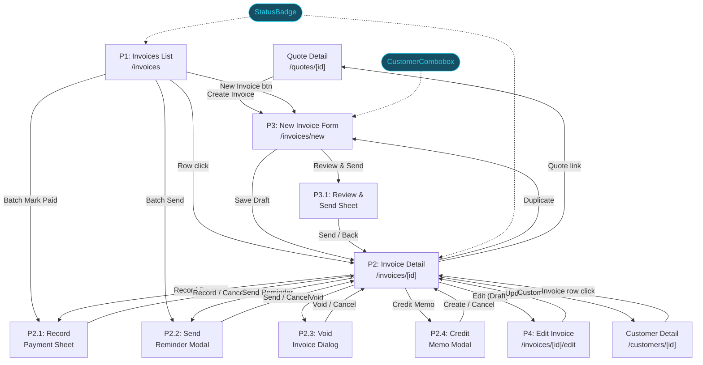
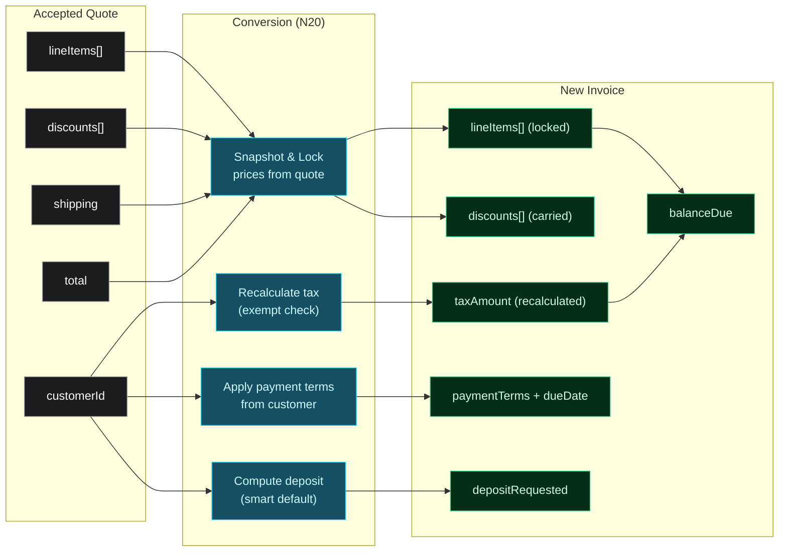

# Invoicing — Breadboard

**Purpose**: Map all UI affordances, code affordances, and wiring for the Invoicing vertical before building
**Input**: Decision record (19 decisions), UX patterns, integration map, competitor analysis, compliance research, existing quoting vertical
**Status**: Complete

---

## Schema Gaps (Pre-Build)

Before building, create/update these schemas:

1. **New `invoice.ts`** — Invoice schema with status lifecycle (`draft | sent | partial | paid | void`), overdue computed from dueDate + balance. Fields: `invoiceNumber`, `customerId`, `quoteId?`, `jobId?`, `lineItems[]`, `discounts[]`, `shipping`, `taxRate`, `taxAmount`, `subtotal`, `total`, `amountPaid`, `balanceDue`, `payments[]`, `dueDate`, `paymentTerms`, `depositRequested`, `depositAmount`, `itemizationMode` (`itemized | bundled`), `pricingSnapshot`, `billingAddress`, `internalNotes`, `customerNotes`, `reminders[]`, `auditLog[]`, `isVoid`, `voidReason?`, `creditMemoIds[]`.
2. **New `credit-memo.ts`** — Credit memo schema linked to invoice: `creditMemoNumber`, `invoiceId`, `customerId`, `reason`, `lineItems[]`, `totalCredit`, `notes`, `createdAt`.
3. **New `payment.ts`** — Payment schema: `id`, `invoiceId`, `amount`, `date`, `method` (Check, Cash, Square, Venmo, Zelle, Credit Card, ACH, Other), `reference`, `createdAt`.
4. **Update `note.ts`** — Add `"invoice"` and `"credit-memo"` to `noteEntityTypeEnum`.
5. **Update `constants.ts`** — Add `INVOICE_STATUS_LABELS`, `INVOICE_STATUS_COLORS`, `PAYMENT_METHOD_LABELS`, `CREDIT_MEMO_REASON_LABELS`.
6. **Update `mock-data.ts`** — Add 6-8 invoices across all statuses, 10+ payments, 1-2 credit memos, matching existing quotes/jobs/customers.

---

## Places

| ID | Place | Type | Entry Point | Description |
|----|-------|------|-------------|-------------|
| P1 | Invoices List | Page | `/invoices` sidebar link | Stats bar + smart view tabs + filterable DataTable with batch ops |
| P2 | Invoice Detail | Page | `/invoices/[id]` via row click (P1) or after save (P3) | Full view with line items, pricing, payment ledger, reminders |
| P2.1 | Record Payment Sheet | Sheet | "Record Payment" button (P2) | Slide-out form for recording payments |
| P2.2 | Send Reminder Modal | Modal | "Send Reminder" button (P2) | Email preview for overdue follow-up |
| P2.3 | Void Invoice Dialog | Dialog | "Void" button (P2) | Confirmation dialog with reason |
| P2.4 | Create Credit Memo Modal | Modal | "Issue Credit Memo" button (P2) | Create CM document linked to invoice |
| P3 | New Invoice Form | Page | `/invoices/new` or `/invoices/new?quoteId=xxx` | Create from scratch or pre-populated from accepted quote |
| P3.1 | Review & Send Sheet | Sheet | "Review & Send" button (P3) | Preview invoice + email before sending |
| P4 | Edit Invoice Form | Page | `/invoices/[id]/edit` via "Edit" (P2, Draft only) | Reuses P3 form component with pre-filled data |

**Blocking test**: P2.1 (sheet overlay blocks detail), P2.2 (modal blocks detail), P2.3 (dialog blocks detail), P2.4 (modal blocks detail), P3.1 (sheet blocks form). P4 is a separate route.

**Not Places** (local state within a Place): Itemization toggle (P2, P3), collapsible form sections (P3), change tracking diff (P2), reminder timeline expansion (P2).

---

## Visual Overview

### Diagram 1: Places & Navigation Flow



### Diagram 2: Quote-to-Invoice Conversion Data Flow



### Diagram 3: Invoice Status State Machine

```mermaid
stateDiagram-v2
    [*] --> draft: Create invoice
    draft --> sent: Send to customer
    draft --> void: Void (cancel)
    sent --> partial: First payment < total
    sent --> paid: Payment = total
    sent --> void: Void
    partial --> paid: Remaining paid
    partial --> void: Void
    paid --> [*]: Complete

    state "overdue" as overdue
    note right of overdue: Computed: past dueDate\n+ balance > 0\nApplies to sent/partial
```

---

## UI Affordances

### P1 — Invoices List

**Stats Bar (top)**

| ID | Affordance | Control | Wires Out | Returns To |
|----|------------|---------|-----------|------------|
| U1 | Total Outstanding card ($X,XXX) | display | ← N1 calculateStats() | |
| U2 | Overdue card (count + $total, red accent) | display | ← N1 calculateStats() | |
| U3 | Paid This Month card ($X,XXX) | display | ← N1 calculateStats() | |
| U4 | Avg Days to Pay card (XX days) | display | ← N1 calculateStats() | |

**Toolbar & Tabs**

| ID | Affordance | Control | Wires Out | Returns To |
|----|------------|---------|-----------|------------|
| U5 | Smart view tabs (All / Draft / Outstanding / Overdue / Paid) | click | → N2 filterInvoices() | → S1 URL ?view, filtered table |
| U6 | Search input (invoice # or customer name) | type | → N3 searchInvoices() | → S2 URL ?q, filtered table |
| U7 | "New Invoice" button (primary CTA) | click | → navigate to P3 | |
| U8 | Column sort headers (Invoice #, Customer, Status, Amount, Due Date, Balance Due, Created) | click | → N4 sortInvoices() | → S3 sort state |

**Table & Actions**

| ID | Affordance | Control | Wires Out | Returns To |
|----|------------|---------|-----------|------------|
| U9 | Invoice row click | click | → navigate to P2 (`/invoices/[id]`) | |
| U10 | Status badge per row (Draft/Sent/Partial/Paid/Overdue/Void) | display | ← S4 invoice.status + overdue calc | |
| U11 | Due date display (relative: "Due in 5 days", "3 days overdue") | display | ← N5 formatRelativeDate() | |
| U12 | Balance Due column (tabular-nums, right-aligned) | display | ← S4 invoice.balanceDue | |
| U13 | Batch checkbox per row | toggle | → N6 toggleRowSelection() | → S5 selectedIds |
| U14 | Batch action: Send Selected | click | → N7 batchSend() | → toast, status updates |
| U15 | Batch action: Mark as Paid | click | → N8 batchMarkPaid() | → toast, status updates |
| U16 | Batch action: Send Reminder | click | → N9 batchSendReminder() | → toast |
| U17 | Customer name link per row | click | → navigate to `/customers/[customerId]` | |
| U18 | Empty state "Create your first invoice" link | click | → navigate to P3 | |

### P2 — Invoice Detail

**Header**

| ID | Affordance | Control | Wires Out | Returns To |
|----|------------|---------|-----------|------------|
| U19 | Invoice header (INV-XXXX, status badge) | display | ← S6 invoice data | |
| U20 | Action: Edit (Draft only) | click | → navigate to P4 | |
| U21 | Action: Send (Draft only) | click | → N10 sendInvoice() | → toast, status update |
| U22 | Action: Record Payment (Sent/Partial/Overdue) | click | → open P2.1 | |
| U23 | Action: Send Reminder (Sent/Partial/Overdue) | click | → open P2.2 | |
| U24 | Action: Void (not Paid) | click | → open P2.3 | |
| U25 | Action: Issue Credit Memo (Paid) | click | → open P2.4 | |
| U26 | Action: Duplicate | click | → N11 duplicateInvoice() | → navigate to P3 (pre-filled) |
| U27 | Breadcrumb: Dashboard > Invoices > INV-XXXX | click | → navigate to P1 or Dashboard | |

**Customer & Source Info**

| ID | Affordance | Control | Wires Out | Returns To |
|----|------------|---------|-----------|------------|
| U28 | Customer info card (name, company, billing contact, billing address) | display | ← S6, S10 customer data | |
| U29 | Customer name link | click | → navigate to `/customers/[customerId]` | |
| U30 | Linked quote # (clickable) | click | → navigate to `/quotes/[quoteId]` | |
| U31 | Linked job # (clickable) | click | → navigate to `/jobs/[jobId]` | |
| U32 | Payment terms display (e.g., "Net 30") | display | ← S6 invoice.paymentTerms | |
| U33 | Due date display | display | ← S6 invoice.dueDate | |

**Line Items & Pricing**

| ID | Affordance | Control | Wires Out | Returns To |
|----|------------|---------|-----------|------------|
| U34 | Itemization toggle (Itemized / Bundled) | toggle | → N12 toggleItemization() | → S7 mode, re-render line items |
| U35 | Line items table (description, qty, unit price, line total) | display | ← S6 invoice.lineItems, S7 mode | |
| U36 | Pricing summary (subtotal, discounts, shipping, tax, total) | display | ← S6 invoice totals | |
| U37 | Change tracking indicator ("3 changes from quote") | click | → N13 showChangeDiff() | → expand diff panel |
| U38 | Change diff panel (quote vs invoice line comparison) | display | ← N13 computeChangeDiff() | |

**Payments**

| ID | Affordance | Control | Wires Out | Returns To |
|----|------------|---------|-----------|------------|
| U39 | Balance Due display (large, prominent, color-coded) | display | ← S6 invoice.balanceDue | |
| U40 | Payment ledger table (date, method, amount, reference) | display | ← S6 invoice.payments | |
| U41 | Total Paid summary | display | ← S6 invoice.amountPaid | |
| U42 | "Record Payment" button (below ledger) | click | → open P2.1 | |

**Reminders & Notes**

| ID | Affordance | Control | Wires Out | Returns To |
|----|------------|---------|-----------|------------|
| U43 | Reminder timeline (sent dates, next scheduled) | display | ← S6 invoice.reminders | |
| U44 | Internal notes display | display | ← S6 invoice.internalNotes | |
| U45 | Customer notes display | display | ← S6 invoice.customerNotes | |
| U46 | Audit log entries (collapsible) | toggle | ← S6 invoice.auditLog | |

### P2.1 — Record Payment Sheet

| ID | Affordance | Control | Wires Out | Returns To |
|----|------------|---------|-----------|------------|
| U47 | Amount input (pre-filled with balance due) | type | | → S8 payment.amount |
| U48 | Date input (default: today) | type | | → S8 payment.date |
| U49 | Method dropdown (Check, Cash, Square, Venmo, Zelle, Credit Card, ACH, Other) | select | | → S8 payment.method |
| U50 | Reference/Note input (optional — check #, transaction ID) | type | | → S8 payment.reference |
| U51 | "Record Payment" button | click | → N14 recordPayment() | → add to ledger, update balance, close P2.1 |
| U52 | Cancel / close | click | → close P2.1 | → return to P2 |

### P2.2 — Send Reminder Modal

| ID | Affordance | Control | Wires Out | Returns To |
|----|------------|---------|-----------|------------|
| U53 | Email preview (to, subject, body with balance + days overdue) | display | ← S6 invoice + customer data | |
| U54 | "Send Reminder" button | click | → N15 sendReminder() | → add to timeline, toast, close P2.2 |
| U55 | Cancel / close | click | → close P2.2 | → return to P2 |

### P2.3 — Void Invoice Dialog

| ID | Affordance | Control | Wires Out | Returns To |
|----|------------|---------|-----------|------------|
| U56 | Warning message ("This action cannot be undone") | display | | |
| U57 | Void reason textarea | type | | → local state |
| U58 | "Void Invoice" button (destructive) | click | → N16 voidInvoice() | → status update, audit log, close P2.3 |
| U59 | Cancel | click | → close P2.3 | → return to P2 |

### P2.4 — Create Credit Memo Modal

| ID | Affordance | Control | Wires Out | Returns To |
|----|------------|---------|-----------|------------|
| U60 | Reason dropdown (Shortages, Misprints, Defects, Overcharges, Returns) | select | | → S9 creditMemo.reason |
| U61 | Line items from invoice (checkboxes + editable credit amounts) | toggle/type | | → S9 creditMemo.lineItems |
| U62 | Total credit amount (auto-calculated) | display | ← N17 calculateCreditTotal() | |
| U63 | Internal notes textarea | type | | → S9 creditMemo.notes |
| U64 | "Create Credit Memo" button | click | → N18 createCreditMemo() | → toast, link on P2, close P2.4 |
| U65 | Cancel / close | click | → close P2.4 | → return to P2 |

### P3 — New Invoice Form

**Two entry points:**
1. From scratch: "New Invoice" button on P1
2. From accepted quote: `/invoices/new?quoteId=xxx` (auto-populates everything)

**Section 1: Customer**

| ID | Affordance | Control | Wires Out | Returns To |
|----|------------|---------|-----------|------------|
| U66 | Customer combobox (type-ahead, auto-populated if from quote) | type/select | → N19 filterCustomers(), N20 selectCustomer() | → S11 selectedCustomer, customer info card |
| U67 | Customer info card (name, company, payment terms, billing address) | display | ← S11 selectedCustomer, S10 customer data | |

**Section 2: Source**

| ID | Affordance | Control | Wires Out | Returns To |
|----|------------|---------|-----------|------------|
| U68 | Linked quote # display (auto-set from URL param, read-only) | display | ← S12 quoteId | |
| U69 | Linked job # selector (optional, from customer's jobs) | select | → N21 selectJob() | → S13 jobId |

**Section 3: Line Items**

| ID | Affordance | Control | Wires Out | Returns To |
|----|------------|---------|-----------|------------|
| U70 | Itemization toggle (Itemized / Bundled) | toggle | → N12 toggleItemization() | → S7 mode |
| U71 | Line item rows (description, qty, unit price, line total) | type | → N22 updateLineItem() | → S14 lineItems, → N25 |
| U72 | "Add Line Item" button | click | → N23 addLineItem() | → new row in S14 |
| U73 | "Remove" per line item (if >1) | click | → N24 removeLineItem() | → remove from S14, → N25 |
| U74 | Additional charges section (rush fee, art charges, screen setup) | type | → N22 updateLineItem() | → S14 lineItems, → N25 |

**Section 4: Pricing**

| ID | Affordance | Control | Wires Out | Returns To |
|----|------------|---------|-----------|------------|
| U75 | Subtotal display (read-only) | display | ← N25 calculateInvoiceTotal() | |
| U76 | Discounts section (carried from quote, editable) | type | → N26 updateDiscount() | → S15 discounts, → N25 |
| U77 | Shipping input | type | → N27 updateShipping() | → S16 shipping, → N25 |
| U78 | Tax rate input (% — pre-filled 0 if exempt, else state rate) | type | → N28 updateTaxRate() | → S17 taxRate, → N25 |
| U79 | Tax amount display (auto-calculated) | display | ← N25 calculateInvoiceTotal() | |
| U80 | Total display | display | ← N25 calculateInvoiceTotal() | |

**Section 5: Payment Terms & Deposit**

| ID | Affordance | Control | Wires Out | Returns To |
|----|------------|---------|-----------|------------|
| U81 | Payment terms dropdown (from customer default, editable) | select | → N29 updatePaymentTerms() | → S18 terms, recalculate due date |
| U82 | Due date display (calculated from terms, editable) | type | → N30 updateDueDate() | → S19 dueDate |
| U83 | "Request Deposit" toggle | toggle | → N31 toggleDeposit() | → S20 depositRequested |
| U84 | Deposit amount input (smart default from customer tier) | type | → N32 updateDepositAmount() | → S21 depositAmount |
| U85 | Deposit % / flat $ toggle | toggle | → N33 toggleDepositMode() | → recalculate S21 |
| U86 | "Recommended: $X (50%)" helper text | display | ← N34 calculateSmartDeposit() | |

**Section 6: Notes (collapsed)**

| ID | Affordance | Control | Wires Out | Returns To |
|----|------------|---------|-----------|------------|
| U87 | Notes section accordion toggle | toggle | → local expand/collapse | |
| U88 | Internal notes textarea | type | → N35 updateNotes('internal') | → S22 |
| U89 | Customer notes textarea | type | → N35 updateNotes('customer') | → S23 |

**Actions**

| ID | Affordance | Control | Wires Out | Returns To |
|----|------------|---------|-----------|------------|
| U90 | "Save as Draft" button (secondary) | click | → N36 saveInvoice('draft') | → navigate to P2, toast |
| U91 | "Review & Send" button (primary CTA) | click | → N37 validateAndPreview() | → open P3.1 |
| U92 | "Cancel" text link | click | → navigate to P1 | |
| U93 | Inline validation error messages | display | ← N38 validateForm() | |

### P3.1 — Review & Send Sheet

| ID | Affordance | Control | Wires Out | Returns To |
|----|------------|---------|-----------|------------|
| U94 | Invoice preview (read-only summary: customer, line items, totals, terms) | display | ← form state (S11-S23) | |
| U95 | Email preview (to: billing contact, subject, body with total + due date) | display | ← S11 customer + form totals | |
| U96 | "Send Invoice" button | click | → N39 saveAndSend() | → navigate to P2, toast "INV-XXXX sent" |
| U97 | "Back to Edit" button | click | → close P3.1 | → return to P3 |

### P4 — Edit Invoice Form

Reuses the exact same form component as P3 with these differences:

| ID | Affordance | Control | Wires Out | Returns To |
|----|------------|---------|-----------|------------|
| — | All P3 affordances (U66-U93) | — | — | Pre-filled from existing invoice data |
| U98 | "Update Invoice" button (replaces U90 "Save as Draft") | click | → N40 updateInvoice() | → navigate to P2, toast |
| U99 | Page title: "Edit Invoice INV-XXXX" (replaces "New Invoice") | display | ← route param invoice number | |

---

## Code Affordances

| ID | Place | Affordance | Phase | Trigger | Wires Out | Returns To |
|----|-------|------------|-------|---------|-----------|------------|
| N1 | P1 | calculateStats(invoices[]) | 1 | P1 mount, S4 change | → compute outstanding, overdue, paid this month, avg days | → U1-U4 stats cards |
| N2 | P1 | filterInvoices(view) | 1 | U5 tab click | → update S1 URL param, filter S4 | → re-render filtered rows |
| N3 | P1 | searchInvoices(query) | 1 | U6 type (debounced) | → update S2 URL param, filter S4 | → re-render filtered rows |
| N4 | P1 | sortInvoices(column, dir) | 1 | U8 header click | → update S3 sort state | → re-render sorted rows |
| N5 | P1 | formatRelativeDate(dueDate) | 1 | U11 render | → "Due in 5 days" or "3 days overdue" | → U11 display |
| N6 | P1 | toggleRowSelection(id) | 1 | U13 toggle | → add/remove from S5 | → show/hide batch actions bar |
| N7 | P1 | batchSend(ids[]) | 1 | U14 click | → update status to 'sent' for each | → toast, clear S5 |
| N8 | P1 | batchMarkPaid(ids[]) | 1 | U15 click | → update status to 'paid', set balanceDue=0 | → toast, clear S5 |
| N9 | P1 | batchSendReminder(ids[]) | 1 | U16 click | → add reminder entry to each invoice | → toast, clear S5 |
| N10 | P2 | sendInvoice(invoiceId) | 1 | U21 click | → update status 'draft' → 'sent', add audit log | → toast, re-render P2 |
| N11 | P2 | duplicateInvoice(invoiceId) | 1 | U26 click | → copy line items/customer into form state | → navigate to P3 pre-filled |
| N12 | P2/P3 | toggleItemization(mode) | 1 | U34/U70 toggle | → set S7 | → re-render line items (grouped vs expanded) |
| N13 | P2 | computeChangeDiff(quoteId, invoice) | 1 | U37 click, P2 mount (if quoteId exists) | → compare quote snapshot vs invoice line items | → U38 diff panel |
| N14 | P2.1 | recordPayment(invoiceId, payment) | 1 | U51 click | → add to S6.payments, update amountPaid + balanceDue, auto-transition status, add audit log | → close P2.1, toast, re-render P2 |
| N15 | P2.2 | sendReminder(invoiceId) | 1 | U54 click | → add to S6.reminders, add audit log | → close P2.2, toast "Reminder sent" |
| N16 | P2.3 | voidInvoice(invoiceId, reason) | 1 | U58 click | → set isVoid, voidReason, status display, add audit log | → close P2.3, toast, re-render P2 |
| N17 | P2.4 | calculateCreditTotal(lineItems[]) | 1 | U61 change | → sum selected credit amounts | → U62 display |
| N18 | P2.4 | createCreditMemo(invoiceId, data) | 1 | U64 click | → create CM in S25, link on invoice, add audit log | → close P2.4, toast |
| N19 | P3 | filterCustomers(query) | 1 | U66 type | → filter S10 by name/company | → combobox dropdown options |
| N20 | P3 | selectCustomer(customerId) | 1 | U66 select | → set S11, auto-fill payment terms, billing address, tax exempt status, compute smart deposit | → U67 info card, U81 terms, U82 due date, U86 deposit hint |
| N21 | P3 | selectJob(jobId) | 1 | U69 select | → set S13 | → display linked job |
| N22 | P3 | updateLineItem(idx, field, value) | 1 | U71/U74 type | → update S14[idx] | → trigger N25 |
| N23 | P3 | addLineItem() | 1 | U72 click | → append empty item to S14 | → render new row |
| N24 | P3 | removeLineItem(idx) | 1 | U73 click | → splice from S14 | → trigger N25 |
| N25 | P3 | calculateInvoiceTotal() | 1 | N22-N24, N26-N28 changes | → subtotal + discounts + shipping + tax | → U75, U79, U80 |
| N26 | P3 | updateDiscount(idx, field, value) | 1 | U76 type | → update S15[idx] | → trigger N25 |
| N27 | P3 | updateShipping(amount) | 1 | U77 type | → set S16 | → trigger N25 |
| N28 | P3 | updateTaxRate(rate) | 1 | U78 type | → set S17, recalculate tax amount | → trigger N25 |
| N29 | P3 | updatePaymentTerms(terms) | 1 | U81 select | → set S18, recalculate due date from today + terms | → U82 due date |
| N30 | P3 | updateDueDate(date) | 1 | U82 type | → set S19 (manual override) | |
| N31 | P3 | toggleDeposit(enabled) | 1 | U83 toggle | → set S20 | → show/hide deposit inputs |
| N32 | P3 | updateDepositAmount(amount) | 1 | U84 type | → set S21 | |
| N33 | P3 | toggleDepositMode(mode) | 1 | U85 toggle | → recalculate S21 (% of total vs flat) | → U84 value |
| N34 | P3 | calculateSmartDeposit(customer) | 1 | N20 select customer | → compute from tier: standard=50%, preferred=50%, contract=per agreement, wholesale=100% | → U86 helper text |
| N35 | P3 | updateNotes(type, text) | 1 | U88/U89 type | → set S22 or S23 | |
| N36 | P3 | saveInvoice(status='draft') | 1 | U90 click | → N38 validate, generate invoiceNumber, add to S4, add audit log | → navigate to P2, toast |
| N37 | P3 | validateAndPreview() | 1 | U91 click | → N38 validate, if valid open P3.1 | → P3.1 or U93 errors |
| N38 | P3 | validateForm() | 1 | N36, N37 before save | → check required: customer, ≥1 line item, valid amounts | → U93 errors or proceed |
| N39 | P3.1 | saveAndSend(data) | 1 | U96 click | → N38 validate, save with status 'sent', add audit log | → navigate to P2, toast "INV-XXXX sent" |
| N40 | P4 | updateInvoice(invoiceId, data) | 1 | U98 click | → N38 validate, update existing in S4, add audit log | → navigate to P2, toast |
| N41 | P3 | populateFromQuote(quoteId) | 1 | P3 mount (if ?quoteId in URL) | → read quote from S24, map to form: customer, line items, discounts, shipping | → pre-fill all form fields |
| N42 | P3 | generateInvoiceNumber() | 1 | N36, N39 save | → next sequential "INV-XXXX" from S4 | → invoice.invoiceNumber |
| N43 | P2 | computeOverdueStatus(invoice) | 1 | P2 mount | → dueDate < today AND balanceDue > 0 | → overdue badge, days count |
| N44 | P1 | computeOverdueForRow(invoice) | 1 | P1 render rows | → same as N43, for list display | → U10 overdue variant, U11 text |

**Phase 2 extensions**: N10/N39 send real email via SMTP. N14 integrates with Square payment gateway. N36/N39/N40 become server actions syncing to QuickBooks. N15 triggers automated email via Resend/SendGrid. New: N45 generatePDF(), N46 syncToQuickBooks(), N47 applyLateFee(), N48 recurringInvoice().

---

## Data Stores

| ID | Place | Store | Type | Read By | Written By |
|----|-------|-------|------|---------|------------|
| S1 | P1 | `?view` URL param (All/Draft/Outstanding/Overdue/Paid) | URL state | N2, U5 active tab | U5 click → N2 |
| S2 | P1 | `?q` URL param (search) | URL state | N3, U6 input value | U6 type → N3 |
| S3 | P1 | Sort column + direction | React state | N4, table header indicators | U8 click → N4 |
| S4 | Global | Invoices array (mock data) | Mock data (mutated client-side) | P1 table, P2 detail, N1 stats, N11, N41 | N7-N10, N14-N16, N18, N36, N39, N40 |
| S5 | P1 | Selected row IDs (batch) | React state | U14-U16 enabled state, batch action bar | U13 toggle → N6 |
| S6 | P2 | Current invoice (derived) | Derived from S4 by route `[id]` | All P2 displays, P2.1-P2.4 | N10, N14-N16, N18 |
| S7 | P2/P3 | Itemization mode (`itemized` / `bundled`) | React state | U34/U70, N12, line item rendering | U34/U70 toggle → N12 |
| S8 | P2.1 | Payment form `{ amount, date, method, reference }` | React state (local) | U47-U50 inputs, N14 | U47-U50 type/select |
| S9 | P2.4 | Credit memo form `{ reason, lineItems[], notes }` | React state (local) | U60-U63 inputs, N17-N18 | U60-U63 type/select |
| S10 | Global | Customers array (mock data) | Mock data (import) | N19 filter, N20 customer fields, U28 | — (read-only) |
| S11 | P3 | Selected customer | React state | U67 info card, N25 tax calc, N34 deposit | U66 select → N20 |
| S12 | P3 | Linked quoteId (from URL param) | React state | U68 display, N41 populate | N41 from URL on mount |
| S13 | P3 | Linked jobId | React state | U69 display | U69 select → N21 |
| S14 | P3 | Line items array | React state | N25, all line item UIs | N22-N24, N41 populate |
| S15 | P3 | Discounts array | React state | N25, U76 | N26, N41 populate |
| S16 | P3 | Shipping amount | React state | N25, U77 | N27, N41 populate |
| S17 | P3 | Tax rate (%) | React state | N25 tax calc, U78 | N28, N20 (from customer exempt) |
| S18 | P3 | Payment terms | React state | N29, U81, due date calc | U81 select → N29, N20 (from customer) |
| S19 | P3 | Due date | React state | U82 display | N29 calculated, U82 manual override → N30 |
| S20 | P3 | Deposit requested (boolean) | React state | U83 toggle state, deposit UI visibility | U83 toggle → N31 |
| S21 | P3 | Deposit amount | React state | U84, U86 | N32, N33, N34 smart default |
| S22 | P3 | Internal notes | React state | U88, N36/N39 save | U88 type → N35 |
| S23 | P3 | Customer notes | React state | U89, N36/N39 save | U89 type → N35 |
| S24 | Global | Quotes array (mock data) | Mock data (import, read-only) | N41 populate from quote | — |
| S25 | Global | Credit memos array (mock data) | Mock data (mutated client-side) | P2 linked CMs display | N18 create |

---

## Wiring Verification

- [x] Every interactive U has at least one Wires Out or Returns To
- [x] Every N has a trigger (from a U or another N)
- [x] Every S has at least one reader and one writer (S10, S24 are read-only mock data — acceptable for Phase 1)
- [x] Every "Wires Out" target exists in the tables
- [x] Every "Returns To" target exists in the tables
- [x] No orphan affordances
- [x] Every CORE feature from research decisions has corresponding affordances (see Scope Coverage below)

**Cross-Place wiring**:
- Quote Detail → P3: "Create Invoice" navigates to `/invoices/new?quoteId=xxx`, N41 populates from quote
- P3 → P3.1: N37 validates, opens P3.1 with form data
- P3.1 → P2: N39 saves and sends, navigates to P2 invoice detail
- P2 → P2.1: U22/U42 opens sheet, N14 records payment and updates S6/S4
- P2 → P2.4: U25 opens modal, N18 creates CM in S25 and links on S6
- P2 → P4: U20 navigates to edit route, reuses P3 form pre-filled from S6
- P1 batch ops: N7-N9 modify multiple invoices in S4 simultaneously
- Customer Detail → P2: Invoices tab links directly to `/invoices/[id]`

---

## Component Boundaries

| Component | Place(s) | Contains Affordances | Location | Shared? |
|-----------|----------|---------------------|----------|---------|
| **InvoiceStatsBar** | P1 | U1-U4, N1 | `app/(dashboard)/invoices/_components/InvoiceStatsBar.tsx` | No — invoice-specific (pattern reusable for other stat bars) |
| **InvoicesDataTable** | P1 | U5-U18, N2-N9, N44, S1-S5 | `app/(dashboard)/invoices/_components/InvoicesDataTable.tsx` | Extends shared DataTable pattern |
| **InvoiceDetailView** | P2 | U19-U46, N10-N13, N43, S6-S7 | `app/(dashboard)/invoices/[id]/page.tsx` | No — invoice-specific |
| **InvoiceActions** | P2 | U20-U26 | `app/(dashboard)/invoices/_components/InvoiceActions.tsx` | No — context-aware per status |
| **PaymentLedger** | P2 | U39-U42 | `app/(dashboard)/invoices/_components/PaymentLedger.tsx` | No — invoice-specific |
| **RecordPaymentSheet** | P2.1 | U47-U52, N14, S8 | `app/(dashboard)/invoices/_components/RecordPaymentSheet.tsx` | No — invoice-specific |
| **SendReminderModal** | P2.2 | U53-U55, N15 | `app/(dashboard)/invoices/_components/SendReminderModal.tsx` | No — invoice-specific |
| **VoidInvoiceDialog** | P2.3 | U56-U59, N16 | `app/(dashboard)/invoices/_components/VoidInvoiceDialog.tsx` | No — invoice-specific |
| **CreateCreditMemoModal** | P2.4 | U60-U65, N17-N18, S9 | `app/(dashboard)/invoices/_components/CreateCreditMemoModal.tsx` | No — invoice-specific |
| **InvoiceForm** | P3, P4 | U66-U93, N19-N38, N41-N42, S7, S11-S23 | `app/(dashboard)/invoices/_components/InvoiceForm.tsx` | No — shared between new + edit |
| **InvoiceLineItemRow** | P3, P4 | U71 per row, N22 | `app/(dashboard)/invoices/_components/InvoiceLineItemRow.tsx` | No — invoice-specific (similar to QuoteLineItemRow) |
| **InvoicePricingSummary** | P3, P4 | U75-U80, N25-N28, S15-S17 | `app/(dashboard)/invoices/_components/InvoicePricingSummary.tsx` | No — invoice-specific (extends PricingSummary pattern) |
| **DepositSection** | P3, P4 | U83-U86, N31-N34, S20-S21 | `app/(dashboard)/invoices/_components/DepositSection.tsx` | No — invoice-specific |
| **PaymentTermsSection** | P3, P4 | U81-U82, N29-N30, S18-S19 | `app/(dashboard)/invoices/_components/PaymentTermsSection.tsx` | No — invoice-specific |
| **ReviewSendSheet** | P3.1 | U94-U97, N39 | `app/(dashboard)/invoices/_components/ReviewSendSheet.tsx` | No — invoice-specific |
| **ChangeDiffPanel** | P2 | U37-U38, N13 | `app/(dashboard)/invoices/_components/ChangeDiffPanel.tsx` | No — invoice-specific |
| **ReminderTimeline** | P2 | U43 | `app/(dashboard)/invoices/_components/ReminderTimeline.tsx` | No — invoice-specific |
| **StatusBadge** | P1, P2 | U10, U19 | `components/features/StatusBadge.tsx` | Yes — extend existing for invoice statuses |
| **CustomerCombobox** | P3 | U66, N19-N20 | `components/features/CustomerCombobox.tsx` | Yes — reuse existing |
| **CollapsibleSection** | P3 | U87 | `app/(dashboard)/quotes/_components/CollapsibleSection.tsx` | Yes — reuse from quoting |
| **OverdueBadge** | P1, P2 | U10 (overdue variant), U19 (overdue) | `components/features/OverdueBadge.tsx` | Yes — new shared component (pulse animation, days count) |

**File structure**:
```text
components/features/
  StatusBadge.tsx             ← extend for invoice statuses
  CustomerCombobox.tsx        ← reuse as-is
  OverdueBadge.tsx            ← NEW shared component

app/(dashboard)/invoices/
  page.tsx                    ← P1: Invoices List
  new/
    page.tsx                  ← P3: New Invoice Form
  [id]/
    page.tsx                  ← P2: Invoice Detail
    edit/
      page.tsx                ← P4: Edit Invoice Form
  _components/
    InvoiceStatsBar.tsx
    InvoicesDataTable.tsx
    InvoiceForm.tsx           ← shared form for P3 + P4
    InvoiceLineItemRow.tsx
    InvoicePricingSummary.tsx
    InvoiceActions.tsx
    PaymentLedger.tsx
    RecordPaymentSheet.tsx
    SendReminderModal.tsx
    VoidInvoiceDialog.tsx
    CreateCreditMemoModal.tsx
    DepositSection.tsx
    PaymentTermsSection.tsx
    ReviewSendSheet.tsx
    ChangeDiffPanel.tsx
    ReminderTimeline.tsx

lib/schemas/
  invoice.ts                  ← NEW
  credit-memo.ts              ← NEW
  payment.ts                  ← NEW (or inline in invoice.ts)
  note.ts                     ← UPDATE (add "invoice" entity type)
```

---

## Build Order

| # | Component/Screen | Depends On | Blocks | Est. Complexity |
|---|-----------------|------------|--------|-----------------|
| 1 | Schema creation (invoice.ts, credit-memo.ts, payment method enum) | — | All build items | Medium |
| 2 | Constants update (status labels/colors, payment methods, CM reasons) | Step 1 | All UI components | Low |
| 3 | Mock data (6-8 invoices, 10+ payments, 1-2 credit memos) | Steps 1-2 | All UI components | Medium |
| 4a | StatusBadge extension (add invoice status variants) | Step 2 | Steps 5, 7 | Low |
| 4b | OverdueBadge (new shared component) | Step 2 | Steps 5, 7 | Low |
| 5 | InvoiceStatsBar + InvoicesDataTable + Invoices List page (P1) | Steps 3, 4a, 4b | — | Medium |
| 6 | InvoiceForm + InvoiceLineItemRow + InvoicePricingSummary + DepositSection + PaymentTermsSection | Step 3, CustomerCombobox (exists) | Steps 8, 9, 10 | High |
| 7 | InvoiceDetailView + InvoiceActions + PaymentLedger + ReminderTimeline + ChangeDiffPanel | Steps 3, 4a, 4b | Steps 8, 9 | High |
| 8 | New Invoice page (P3) + ReviewSendSheet (P3.1) + quote-to-invoice populate logic (N41) | Steps 6, 7 | Step 10 | Medium |
| 9 | RecordPaymentSheet (P2.1) + SendReminderModal (P2.2) + VoidInvoiceDialog (P2.3) + CreateCreditMemoModal (P2.4) | Step 7 | — | Medium |
| 10 | Edit Invoice page (P4) | Steps 6, 8 | — | Low (reuses InvoiceForm) |
| 11 | Customer Detail: Invoices tab + financial summary | Steps 3, 7 | — | Medium |
| 12 | Sidebar nav link (add "Invoices" between Quotes and Customers) | Step 5 | — | Low |
| 13 | Quote Detail: "Create Invoice" button wiring | Step 8 | — | Low |

**Parallelization**: Steps 4a + 4b can run in parallel. Steps 5 and 6 can run in parallel (after steps 3 + 4a). Step 7 can overlap with later stages of 6. Steps 9, 10, 11 can run in parallel (after 7).

**Critical path**: 1 → 2 → 3 → 6 → 8 (InvoiceForm with quote-to-invoice conversion is highest complexity)

---

## Scope Coverage

Verify every key decision from the invoicing research is represented:

| Decision/Feature | Affordances | Covered? |
|------------------|-------------|----------|
| Single invoice with partial payments (#1, #8) | N14 recordPayment, U40 ledger, auto-status transition | Yes |
| Smart deposit defaults (#2, #9) | N34 calculateSmartDeposit, U83-U86, S20-S21 | Yes |
| Quote-to-invoice conversion (#5) | N41 populateFromQuote, U68 linked quote, N13 changeDiff | Yes |
| Configurable line item display (#2) | N12 toggleItemization, U34/U70, S7 mode | Yes |
| Payment recording (multiple methods) | U47-U52, N14, S8 (Check/Cash/Square/Venmo/Zelle/CC/ACH/Other) | Yes |
| Invoice numbering matching QB (#10) | N42 generateInvoiceNumber, sequential | Yes |
| Change tracking (#12) | N13 computeChangeDiff, U37-U38 diff panel | Yes |
| Payment reminders (#13) | U43 timeline, U53-U55 send modal, N15, reminder cadence display | Yes |
| Credit memos (#15) | P2.4, U60-U65, N17-N18, S9, S25 | Yes |
| Customer-furnished garments (#17) | Line items support $0 garment cost, description-only rows | Yes |
| Tax rate per invoice (#18) | U78 tax rate input, N28, S17 | Yes |
| AR aging stats (#19) | U1-U4 stats bar, N1 calculateStats | Yes |
| Void workflow | P2.3, U56-U59, N16, audit log | Yes |
| Batch operations (list page) | U13-U16, N6-N9, S5 | Yes |
| Customer portal (#7) | DEFERRED — not in this vertical per decision | N/A |
| PDF generation | DEFERRED — Phase 2 | N/A |
| Real email sending | DEFERRED — Phase 2 (mock send with toast) | N/A |
| QuickBooks sync (#4) | DEFERRED — Phase 2 (schema designed for compatibility) | N/A |
| Square payment gateway (#6) | DEFERRED — Phase 2 (method dropdown includes Square) | N/A |
| Late fees (#14) | DEFERRED — Phase 2 (schema supports, UI not in Phase 1) | N/A |
| Read receipts (#11) | DEFERRED — Phase 2 (status infrastructure built) | N/A |

---

## Phase 2 Extensions

Code affordances that will be added/replaced in Phase 2:

| ID | Place | Affordance | Replaces | Description |
|----|-------|------------|----------|-------------|
| N45 | P2 | generatePDF(invoiceId) | — (new) | PDF generation with branding (react-pdf) |
| N46 | P2 | syncToQuickBooks(invoiceId) | — (new) | Push invoice + payments to QBO via REST API |
| N47 | P2 | applyLateFee(invoiceId) | — (new) | Auto-calculate 1.5%/month on overdue balance |
| N48 | P3 | createRecurringInvoice(template) | — (new) | Monthly invoice generation for contract customers |
| N49 | P2.2 | sendRealEmail(invoiceId) | N15 mock | Send via Resend/SendGrid with payment link |
| N50 | P2.1 | processSquarePayment(amount) | N14 manual | Charge via Square payment gateway |
| N51 | P2 | trackReadReceipt(invoiceId) | — (new) | Log when customer views invoice in portal |
| N52 | P3 | calculateTaxViaTaxJar(address) | N28 manual rate | Automated tax calculation via TaxJar API |

---

## Integration Touchpoints

### Quote Detail → Invoicing

Add "Create Invoice" button to Quote Detail page (`/quotes/[id]`):
- Visible when quote status is `accepted`
- Navigates to `/invoices/new?quoteId=[id]`
- N41 reads quote data and populates the invoice form

### Customer Detail → Invoicing

Add "Invoices" tab to Customer Detail page (`/customers/[id]`):
- Table columns: Invoice #, Status, Amount, Due Date, Balance Due
- Row click → `/invoices/[id]`
- Financial summary card: Total Outstanding, Total Paid (Lifetime), Avg Days to Pay

### Dashboard → Invoicing

Add "Overdue Invoices" section to Dashboard (future enhancement):
- Count of overdue invoices with total amount
- Click → `/invoices?view=overdue`

### Sidebar Navigation

Insert "Invoices" link between "Quotes" and "Customers":
```
Dashboard    /
Jobs         /jobs
Quotes       /quotes
Invoices     /invoices     ← NEW
Customers    /customers
Screen Room  /screens
Garments     /garments
```

---

## Related Documents

- `docs/spikes/invoicing-decisions.md` (19 key decisions)
- `docs/spikes/invoicing-ux-patterns.md` (screen designs, component reuse)
- `docs/spikes/invoicing-integration-map.md` (schema dependencies, data flow)
- `docs/spikes/invoicing-competitor-analysis.md` (feature matrix)
- `docs/spikes/invoicing-compliance.md` (tax, legal, audit requirements)
- `docs/spikes/invoicing-industry-practices.md` (line items, terms, workflows)
- `docs/breadboards/quoting-breadboard.md` (quoting vertical — upstream)
- `docs/APP_FLOW.md` (routes and navigation)
- `CLAUDE.md` (design system, quality checklist)
