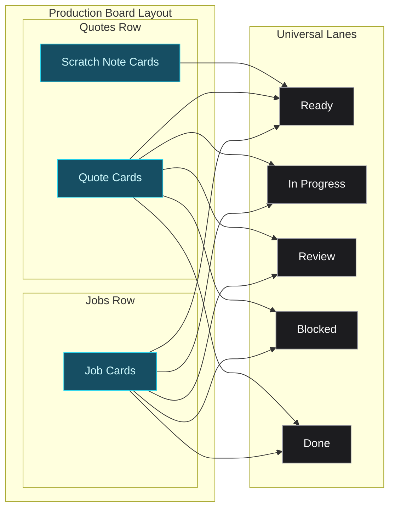
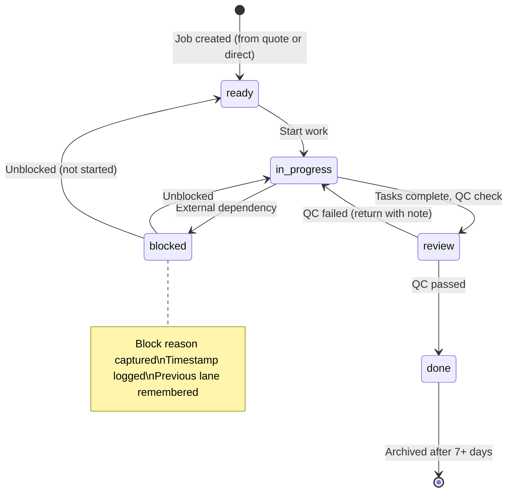
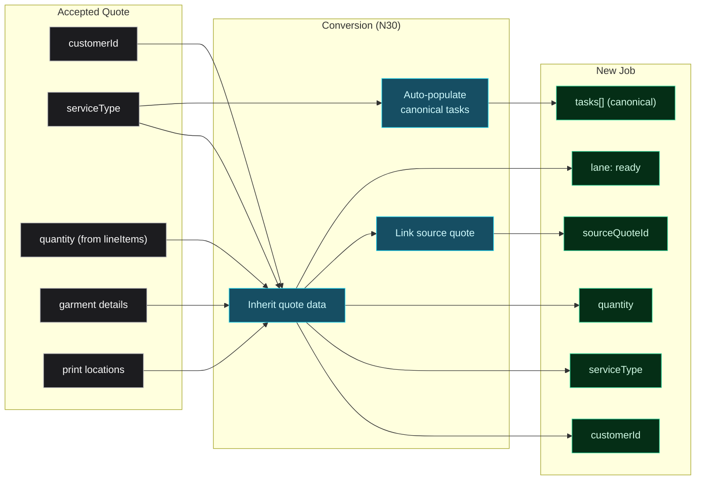

# Jobs & Production — Breadboard

**Purpose**: Map all UI affordances, code affordances, and wiring for the Jobs & Production vertical before building
**Input**: Scope definition (CORE/PERIPHERAL/INTERCONNECTIONS), improved journey design (10 principles, board architecture, card design), APP_FLOW (routes, navigation, page-level details), existing schemas (job, quote)
**Status**: Complete

---

## Schema Gaps (Pre-Build)

Before building, create/update these schemas:

1. **Revise `job.ts`** — Major expansion from current minimal schema. Replace `status` (6-stage pipeline: design/approval/burning/press/finishing/shipped) with `lane` (5 universal lanes: ready/in_progress/review/blocked/done). Add: `serviceType`, `startDate`, `customerDueDate?`, `createdAt`, `updatedAt`, `completedAt?`, `riskLevel` (on_track/getting_tight/at_risk), `quantity`, `garmentDetails[]`, expanded `printLocations[]`, `complexity {}`, `tasks: JobTask[]`, `blockReason?`, `blockedAt?`, `blockedBy?`, `assigneeId?`, `assigneeName?`, `assigneeInitials?`, `sourceQuoteId?`, `invoiceId?`, `artworkIds[]`, `history[]`, `notes: JobNote[]`, `isArchived`.
2. **New `jobTaskSchema`** — Task within a job: `id`, `label`, `detail?`, `isCompleted`, `completedAt?`, `isCanonical`, `sortOrder`.
3. **New `jobNoteSchema`** — Note on a job: `id`, `type` (internal/customer/system), `content`, `author`, `createdAt`.
4. **New `boardCardSchema`** — Discriminated union view model: `scratchNoteCard` (type: "scratch_note"), `quoteCard` (type: "quote"), `jobCard` (type: "job"). Not stored — projected from underlying entities.
5. **New `scratchNoteSchema`** — Lightweight capture: `id`, `content`, `createdAt`, `isArchived`.
6. **New `laneEnum`** — `"ready" | "in_progress" | "review" | "blocked" | "done"` (replaces old `productionStateEnum`).
7. **Update `constants.ts`** — Add: `LANE_LABELS`, `LANE_COLORS`, `LANE_BADGE_COLORS`, `RISK_LABELS`, `RISK_COLORS`, `CANONICAL_TASKS` (per service type templates), `SERVICE_TYPE_BORDER_COLORS`, `SERVICE_TYPE_ICONS`.
8. **Update `mock-data.ts`** — Add 10-12 jobs across all lanes/service types/risk levels, 5-6 quote board cards, 2-3 scratch notes. Each job includes: full canonical tasks (partially completed), 2-4 history entries, 1-3 notes, linked entities.

---

## Places

| ID   | Place                       | Type           | Entry Point                                        | Description                                                                                         |
| ---- | --------------------------- | -------------- | -------------------------------------------------- | --------------------------------------------------------------------------------------------------- |
| P1   | Production Board            | Page           | `/jobs/board` sidebar "Jobs" link                  | Two-section Kanban (Quotes row + Jobs row), 5 universal lanes, drag-and-drop, filters, capacity bar |
| P1.1 | Scratch Note Capture        | Inline/Popover | "+" button in Quotes Ready lane (P1)               | Quick text input for capturing a new lead or request                                                |
| P1.2 | Block Reason Input          | Dialog         | Drop card on Blocked lane (P1)                     | Text input for why a card is blocked                                                                |
| P1.3 | Move Lane Dialog            | Dialog         | "Move Lane" quick action on card (P1)              | Select target lane, with optional block reason if Blocked                                           |
| P2   | Jobs List                   | Page           | `/jobs` via view toggle on P1                      | DataTable of all jobs with search, filter, sort, quick actions                                      |
| P3   | Job Detail / Command Center | Page           | `/jobs/[id]` via card click (P1) or row click (P2) | Full job view: header, quick actions, tasks, details, notes, linked entities, block banner          |
| P3.1 | Block Reason Input (Detail) | Dialog         | "Mark Blocked" button on P3                        | Text input for block reason, triggered from job detail                                              |
| P3.2 | Add Custom Task Input       | Inline         | "Add Custom Task" button on P3 Tasks section       | Inline text input to add a user-defined task                                                        |
| P3.3 | Add Note Input              | Inline         | Note input at top of P3 Notes section              | Text input + type selector for adding a note                                                        |
| P3.4 | Move Lane Dropdown (Detail) | Dropdown       | "Move Lane" button on P3 Quick Actions Bar         | Select target lane from dropdown                                                                    |

**Blocking test**: P1.1 (popover/inline — may not block board, but captures focus), P1.2 (dialog blocks board), P1.3 (dialog blocks board), P3.1 (dialog blocks detail), P3.2 (inline within P3), P3.3 (inline within P3), P3.4 (dropdown, non-blocking).

**Not Places** (local state within a Place): Done lane expand/collapse (P1), filter bar state (P1), card hover/drag states (P1), task checkbox toggle (P3), note type filter tabs (P3), sort direction on column headers (P2).

---

## Visual Overview

### Diagram 1: Places & Navigation Flow

```mermaid
flowchart TD
    DASH["Dashboard\n/"]
    P1["P1: Production Board\n/jobs/board"]
    P11["P1.1: Scratch Note\nCapture"]
    P12["P1.2: Block Reason\nInput (Board)"]
    P13["P1.3: Move Lane\nDialog (Board)"]
    P2["P2: Jobs List\n/jobs"]
    P3["P3: Job Detail\n/jobs/[id]"]
    P31["P3.1: Block Reason\nInput (Detail)"]
    P32["P3.2: Add Custom\nTask"]
    P33["P3.3: Add Note"]
    P34["P3.4: Move Lane\nDropdown"]
    QD["Quote Detail\n/quotes/[id]"]
    QN["New Quote\n/quotes/new"]
    ID["Invoice Detail\n/invoices/[id]"]
    CD["Customer Detail\n/customers/[id]"]

    DASH -- "View Board" --> P1
    DASH -- "Click blocked/in-progress job" --> P3

    P1 -- "Click job card" --> P3
    P1 -- "Click quote card" --> QD
    P1 -- "'+ button'" --> P11
    P1 -- "Drop on Blocked" --> P12
    P1 -- "Card quick action" --> P13
    P1 -- "View toggle: List" --> P2
    P1 -- "New Quote btn" --> QN

    P11 -- "Enter / Cancel" --> P1
    P12 -- "Confirm / Cancel" --> P1
    P13 -- "Select lane / Cancel" --> P1

    P2 -- "Row click" --> P3
    P2 -- "View toggle: Board" --> P1

    P3 -- "Mark Blocked" --> P31
    P3 -- "Add Custom Task" --> P32
    P3 -- "Add note" --> P33
    P3 -- "Move Lane" --> P34
    P3 -- "View Quote" --> QD
    P3 -- "View Invoice" --> ID
    P3 -- "Customer name link" --> CD
    P3 -- "Back / breadcrumb" --> P2
    P3 -- "View on Board" --> P1

    P31 -- "Confirm / Cancel" --> P3
    P32 -- "Add / Cancel" --> P3
    P33 -- "Submit" --> P3
    P34 -- "Select lane" --> P3

    QD -- "Create Job from Quote" --> P3

    SC1([StatusBadge]):::shared -.-> P1
    SC1 -.-> P2
    SC1 -.-> P3
    SC2([ServiceTypeBadge]):::shared -.-> P1
    SC2 -.-> P2
    SC2 -.-> P3
    SC3([RiskIndicator]):::shared -.-> P1
    SC3 -.-> P2
    SC3 -.-> P3

    classDef shared fill:#164e63,stroke:#22d3ee,color:#22d3ee
```



### Diagram 2: Board Card Types & Sections



### Diagram 3: Job Lane State Machine



### Diagram 4: Quote-to-Job Conversion Data Flow



---

## UI Affordances

### P1 — Production Board

**Capacity Summary Bar (above filters)**

| ID  | Affordance                                                  | Control | Wires Out                      | Returns To |
| --- | ----------------------------------------------------------- | ------- | ------------------------------ | ---------- |
| U1  | Rush orders count card                                      | display | <- N1 computeCapacitySummary() |            |
| U2  | Total quantity card (sum of all visible garment quantities) | display | <- N1 computeCapacitySummary() |            |
| U3  | Card count by lane distribution                             | display | <- N1 computeCapacitySummary() |            |

**Filter Bar**

| ID  | Affordance                                                          | Control | Wires Out                        | Returns To                             |
| --- | ------------------------------------------------------------------- | ------- | -------------------------------- | -------------------------------------- |
| U4  | "Today" toggle (filters to cards with startDate <= today, not done) | toggle  | -> N2 filterBoard('today')       | -> S1 URL ?today, filtered board       |
| U5  | Service Type multi-select (Screen Printing / DTF / Embroidery)      | select  | -> N3 filterBoard('serviceType') | -> S2 URL ?serviceType, filtered board |
| U6  | Section filter (All / Quotes Only / Jobs Only)                      | select  | -> N4 filterBoard('section')     | -> S3 URL ?section, filtered board     |
| U7  | Risk filter (All / At Risk / Blocked)                               | select  | -> N5 filterBoard('risk')        | -> S4 URL ?risk, filtered board        |
| U8  | Time Horizon selector (1 week / 2 weeks / 1 month)                  | select  | -> N6 filterBoard('horizon')     | -> S5 URL ?horizon, filtered board     |

**Board Header Actions**

| ID  | Affordance                           | Control | Wires Out                        | Returns To |
| --- | ------------------------------------ | ------- | -------------------------------- | ---------- |
| U9  | "New Quote" button                   | click   | -> navigate to `/quotes/new`     |            |
| U10 | View toggle: Board (active) / List   | click   | -> navigate to `/jobs` (P2)      |            |
| U11 | Breadcrumb: Dashboard > Jobs > Board | click   | -> navigate to Dashboard or Jobs |            |

**Lane Headers**

| ID  | Affordance                                                        | Control | Wires Out                      | Returns To             |
| --- | ----------------------------------------------------------------- | ------- | ------------------------------ | ---------------------- |
| U12 | Lane header label (Ready / In Progress / Review / Blocked / Done) | display | <- lane definition             |                        |
| U13 | Card count per section per lane (Quotes: X, Jobs: Y)              | display | <- N1 computeCapacitySummary() |                        |
| U14 | "+" button in Quotes Ready lane header                            | click   | -> open P1.1                   |                        |
| U15 | Done lane collapse/expand toggle                                  | toggle  | -> N7 toggleDoneLane()         | -> S6 doneLaneExpanded |

**Board Cards — Job Card (in Jobs row)**

| ID  | Affordance                                                                            | Control | Wires Out                                 | Returns To                            |
| --- | ------------------------------------------------------------------------------------- | ------- | ----------------------------------------- | ------------------------------------- |
| U16 | Service type left-border color + icon (blue=screen print, gold=DTF, green=embroidery) | display | <- S8 job.serviceType                     |                                       |
| U17 | Assignee initials badge (top-right corner)                                            | display | <- S8 job.assigneeInitials                |                                       |
| U18 | Customer name + job nickname                                                          | display | <- S8 job.customerId + job.title          |                                       |
| U19 | Quantity + complexity indicator ("200 shirts . 2 locations")                          | display | <- S8 job.quantity, job.complexity        |                                       |
| U20 | Due date text                                                                         | display | <- S8 job.dueDate                         |                                       |
| U21 | Risk dot (none / orange / red)                                                        | display | <- N8 computeRiskLevel(job)               |                                       |
| U22 | Task progress bar (X/Y tasks)                                                         | display | <- N9 computeTaskProgress(job.tasks)      |                                       |
| U23 | Card click -> navigate to job detail                                                  | click   | -> navigate to `/jobs/[id]` (P3)          |                                       |
| U24 | Card drag handle (drag between lanes, within Jobs row only)                           | drag    | -> N10 handleDragEnd()                    | -> S8 update job.lane, S9 board state |
| U25 | Card hover lift effect                                                                | display | <- CSS hover state                        |                                       |
| U26 | Payment status badge (on Done lane cards, if invoice exists)                          | display | <- S8 job.invoiceId -> S11 invoice.status |                                       |

**Board Cards — Quote Card (in Quotes row)**

| ID  | Affordance                                                            | Control | Wires Out                          | Returns To                        |
| --- | --------------------------------------------------------------------- | ------- | ---------------------------------- | --------------------------------- |
| U27 | Quote card service type indicator                                     | display | <- S10 quote data                  |                                   |
| U28 | Customer name + quote description                                     | display | <- S10 quote.customerId            |                                   |
| U29 | Quantity estimate + due date                                          | display | <- S10 quote data                  |                                   |
| U30 | Quote total                                                           | display | <- S10 quote.total                 |                                   |
| U31 | "New" badge (on accepted quotes in Done lane)                         | display | <- S10 quote.status === "accepted" |                                   |
| U32 | "Create Job from Quote" button (on accepted quote cards in Done lane) | click   | -> N30 createJobFromQuote(quoteId) | -> toast, new card in Jobs Ready  |
| U33 | Quote card click -> navigate to quote detail                          | click   | -> navigate to `/quotes/[id]`      |                                   |
| U34 | Quote card drag (between lanes, within Quotes row only)               | drag    | -> N11 handleQuoteDragEnd()        | -> S10 update quote lane position |

**Board Cards — Scratch Note Card (in Quotes row, Ready lane only)**

| ID  | Affordance                                                   | Control | Wires Out                                         | Returns To                |
| --- | ------------------------------------------------------------ | ------- | ------------------------------------------------- | ------------------------- |
| U35 | Scratch note text content                                    | display | <- S12 scratchNote.content                        |                           |
| U36 | Distinct scratch note visual (handwritten/sticky note style) | display | <- card type = scratch_note                       |                           |
| U37 | "Create Quote from this" button                              | click   | -> navigate to `/quotes/new` with note pre-filled |                           |
| U38 | Dismiss/archive button (X or archive icon)                   | click   | -> N12 dismissScratchNote(id)                     | -> remove from board, S12 |

**Drag-and-Drop Interactions**

| ID  | Affordance                                               | Control | Wires Out                         | Returns To                       |
| --- | -------------------------------------------------------- | ------- | --------------------------------- | -------------------------------- |
| U39 | Drag preview (card lifts with shadow)                    | drag    | <- dnd-kit drag state             |                                  |
| U40 | Ghost card in original position during drag              | display | <- dnd-kit drag state             |                                  |
| U41 | Lane drop target highlight (accent color on lane header) | display | <- dnd-kit droppable active state |                                  |
| U42 | Drop on Blocked lane -> open block reason input (P1.2)   | drag    | -> N10 handleDragEnd()            | -> open P1.2 if target = blocked |

**Empty States**

| ID  | Affordance                                                                                       | Control | Wires Out           | Returns To |
| --- | ------------------------------------------------------------------------------------------------ | ------- | ------------------- | ---------- |
| U43 | Empty lane placeholder ("No cards")                                                              | display | <- lane has 0 cards |            |
| U44 | Empty board state ("No active quotes or jobs. Create a quote or capture a note to get started.") | display | <- all lanes empty  |            |

### P1.1 — Scratch Note Capture

| ID  | Affordance                                       | Control | Wires Out                         | Returns To                                       |
| --- | ------------------------------------------------ | ------- | --------------------------------- | ------------------------------------------------ |
| U45 | Text input field (single line or small textarea) | type    |                                   | -> S13 scratchNote.content                       |
| U46 | Submit (Enter key or button)                     | click   | -> N13 createScratchNote(content) | -> add to S12, card appears in board, close P1.1 |
| U47 | Cancel / close (Escape or click away)            | click   | -> close P1.1                     | -> return to P1                                  |

### P1.2 — Block Reason Input (Board)

| ID  | Affordance                  | Control | Wires Out                           | Returns To                                              |
| --- | --------------------------- | ------- | ----------------------------------- | ------------------------------------------------------- |
| U48 | Block reason textarea       | type    |                                     | -> S14 blockReason                                      |
| U49 | "Block" confirmation button | click   | -> N14 confirmBlock(cardId, reason) | -> update card lane to blocked, add history, close P1.2 |
| U50 | Cancel button               | click   | -> N15 cancelBlock()                | -> return card to original lane, close P1.2             |

### P1.3 — Move Lane Dialog (Board)

| ID  | Affordance                                                    | Control | Wires Out                           | Returns To                                   |
| --- | ------------------------------------------------------------- | ------- | ----------------------------------- | -------------------------------------------- |
| U51 | Lane selector (Ready / In Progress / Review / Blocked / Done) | select  |                                     | -> S15 targetLane                            |
| U52 | Block reason input (shown only if targetLane = Blocked)       | type    |                                     | -> S14 blockReason                           |
| U53 | "Move" confirmation button                                    | click   | -> N16 moveLane(cardId, targetLane) | -> update card lane, add history, close P1.3 |
| U54 | Cancel button                                                 | click   | -> close P1.3                       | -> return to P1                              |

### P2 — Jobs List

**Toolbar**

| ID  | Affordance                                                                 | Control | Wires Out                         | Returns To                              |
| --- | -------------------------------------------------------------------------- | ------- | --------------------------------- | --------------------------------------- |
| U55 | Search input (job #, customer name, job name)                              | type    | -> N17 searchJobs(query)          | -> S16 URL ?q, filtered table           |
| U56 | Lane filter dropdown (All / Ready / In Progress / Review / Blocked / Done) | select  | -> N18 filterJobs('lane')         | -> S17 URL ?lane, filtered table        |
| U57 | Service Type filter (Screen Printing / DTF / Embroidery)                   | select  | -> N19 filterJobs('serviceType')  | -> S18 URL ?serviceType, filtered table |
| U58 | Risk filter (All / At Risk / On Track)                                     | select  | -> N20 filterJobs('risk')         | -> S19 URL ?risk, filtered table        |
| U59 | View toggle: List (active) / Board                                         | click   | -> navigate to `/jobs/board` (P1) |                                         |
| U60 | "New Job" button                                                           | click   | -> N21 createDirectJob()          | -> placeholder (Phase 2 form)           |
| U61 | Breadcrumb: Dashboard > Jobs                                               | click   | -> navigate to Dashboard          |                                         |

**Table**

| ID  | Affordance                                                                                             | Control | Wires Out                            | Returns To                                    |
| --- | ------------------------------------------------------------------------------------------------------ | ------- | ------------------------------------ | --------------------------------------------- |
| U62 | Column headers: Job #, Service Type, Customer, Job Name, Quantity, Due Date, Lane, Risk, Task Progress | click   | -> N22 sortJobs(column, direction)   | -> S20 sort state                             |
| U63 | Service type icon + label per row                                                                      | display | <- S8 job.serviceType                |                                               |
| U64 | Lane badge per row (color-coded)                                                                       | display | <- S8 job.lane                       |                                               |
| U65 | Risk dot in Due Date column                                                                            | display | <- N8 computeRiskLevel(job)          |                                               |
| U66 | Task progress mini bar per row                                                                         | display | <- N9 computeTaskProgress(job.tasks) |                                               |
| U67 | Row click -> navigate to job detail                                                                    | click   | -> navigate to `/jobs/[id]` (P3)     |                                               |
| U68 | Quick action: Move Lane                                                                                | click   | -> open P1.3 (or inline dropdown)    | -> update job.lane                            |
| U69 | Quick action: Mark Blocked / Unblock                                                                   | click   | -> N23 toggleBlock(jobId)            | -> open block reason if blocking, update lane |
| U70 | Quick action: View Detail                                                                              | click   | -> navigate to `/jobs/[id]` (P3)     |                                               |
| U71 | Empty state ("No jobs yet -- jobs will appear here when quotes are accepted")                          | display | <- jobs array empty                  |                                               |

### P3 — Job Detail / Command Center

**Header Section**

| ID  | Affordance                                                         | Control | Wires Out                                        | Returns To        |
| --- | ------------------------------------------------------------------ | ------- | ------------------------------------------------ | ----------------- |
| U72 | Service type color bar + icon (prominent, full-width accent)       | display | <- S21 job.serviceType                           |                   |
| U73 | Customer name + company (clickable link)                           | click   | -> navigate to `/customers/[customerId]`         |                   |
| U74 | Job name/nickname + Job number (e.g., "Company Tees -- J-1024")    | display | <- S21 job.title, job.jobNumber                  |                   |
| U75 | Primary contact: name, email, phone                                | display | <- S22 customer.contacts (primary)               |                   |
| U76 | Click-to-copy on email and phone                                   | click   | -> N24 copyToClipboard(value)                    | -> toast "Copied" |
| U77 | Date row: Due Date + Start Date + Created Date                     | display | <- S21 job.dueDate, job.startDate, job.createdAt |                   |
| U78 | Risk indicator with label (On Track / Getting Tight / At Risk)     | display | <- N8 computeRiskLevel(job)                      |                   |
| U79 | Current lane badge (Ready / In Progress / Review / Blocked / Done) | display | <- S21 job.lane                                  |                   |
| U80 | Breadcrumb: Dashboard > Jobs > J-1024                              | click   | -> navigate to Dashboard or Jobs list            |                   |

**Quick Actions Bar**

| ID  | Affordance                                                  | Control | Wires Out                                                       | Returns To                                            |
| --- | ----------------------------------------------------------- | ------- | --------------------------------------------------------------- | ----------------------------------------------------- |
| U81 | "Move Lane" dropdown (next logical lane + all options)      | select  | -> N25 moveLaneFromDetail(jobId, targetLane)                    | -> open P3.1 if blocked, else update S21, add history |
| U82 | "Mark Blocked" / "Unblock" toggle button                    | click   | -> if blocking: open P3.1; if unblocking: N26 unblockJob(jobId) | -> update lane, add history                           |
| U83 | "View Quote" button (visible if sourceQuoteId exists)       | click   | -> navigate to `/quotes/[sourceQuoteId]`                        |                                                       |
| U84 | "View Invoice" button (visible if invoiceId exists)         | click   | -> navigate to `/invoices/[invoiceId]`                          |                                                       |
| U85 | "Edit Job" button                                           | click   | -> N27 toggleEditMode()                                         | -> S23 editMode (Phase 2: inline editing)             |
| U86 | Overflow menu (Archive, Duplicate, Print Summary — Phase 2) | click   | -> Phase 2 actions                                              |                                                       |

**Tasks Section**

| ID  | Affordance                                                | Control | Wires Out                               | Returns To                              |
| --- | --------------------------------------------------------- | ------- | --------------------------------------- | --------------------------------------- |
| U87 | Progress bar above task list (X/Y tasks complete)         | display | <- N9 computeTaskProgress(job.tasks)    |                                         |
| U88 | "Ready for next lane" indicator (when all tasks complete) | display | <- N9 allTasksComplete flag             |                                         |
| U89 | Task checkbox per task (click to complete/uncomplete)     | toggle  | -> N28 toggleTask(jobId, taskId)        | -> update S21.tasks, recompute progress |
| U90 | Task label (e.g., "Screens burned")                       | display | <- S21.tasks[].label                    |                                         |
| U91 | Task detail inline (e.g., "4 screens, 230 mesh")          | display | <- S21.tasks[].detail                   |                                         |
| U92 | Completed task strikethrough + timestamp                  | display | <- S21.tasks[].isCompleted, completedAt |                                         |
| U93 | "Add Custom Task" button                                  | click   | -> open P3.2                            |                                         |

**Details Section**

| ID  | Affordance                                                                         | Control | Wires Out                         | Returns To |
| --- | ---------------------------------------------------------------------------------- | ------- | --------------------------------- | ---------- |
| U94 | Quantity: total garment count                                                      | display | <- S21 job.quantity               |            |
| U95 | Garment info: Brand + Style + Color + Size breakdown (S:10, M:50, L:80...)         | display | <- S21 job.garmentDetails         |            |
| U96 | Print locations: Position + color count per location (Front 4-color, Back 1-color) | display | <- S21 job.printLocations         |            |
| U97 | Screen count (for screen printing jobs)                                            | display | <- S21 job.complexity.screenCount |            |
| U98 | Service type label + special instructions                                          | display | <- S21 job.serviceType            |            |

**Notes & History Section**

| ID   | Affordance                                                | Control | Wires Out                            | Returns To                          |
| ---- | --------------------------------------------------------- | ------- | ------------------------------------ | ----------------------------------- |
| U99  | Quick-add note input at top of section                    | type    |                                      | -> P3.3 content                     |
| U100 | Note type selector (Internal / Customer) for quick-add    | select  |                                      | -> S24 noteType                     |
| U101 | Submit note button (or Enter)                             | click   | -> N29 addNote(jobId, type, content) | -> add to S21.notes, re-render feed |
| U102 | Chronological notes feed (newest first or oldest first)   | display | <- S21.notes                         |                                     |
| U103 | Note type badge [Internal] / [Customer] / [System]        | display | <- note.type                         |                                     |
| U104 | Note timestamp + author                                   | display | <- note.createdAt, note.author       |                                     |
| U105 | Note content                                              | display | <- note.content                      |                                     |
| U106 | Filter notes by type (All / Internal / Customer / System) | click   | -> N31 filterNotes(type)             | -> S25 noteFilter                   |

**Linked Entities Section**

| ID   | Affordance                                                         | Control | Wires Out                                | Returns To |
| ---- | ------------------------------------------------------------------ | ------- | ---------------------------------------- | ---------- |
| U107 | Source quote link (link to `/quotes/[id]` with quote total)        | click   | -> navigate to `/quotes/[sourceQuoteId]` |            |
| U108 | Linked invoice link (link to `/invoices/[id]` with payment status) | click   | -> navigate to `/invoices/[invoiceId]`   |            |
| U109 | Customer link (link to `/customers/[id]`)                          | click   | -> navigate to `/customers/[customerId]` |            |
| U110 | Attached files count (Phase 2: actual file management)             | display | <- S21 job.artworkIds.length             |            |

**Block Reason Banner (when lane = Blocked)**

| ID   | Affordance                         | Control | Wires Out                             | Returns To                                           |
| ---- | ---------------------------------- | ------- | ------------------------------------- | ---------------------------------------------------- |
| U111 | Prominent block reason banner      | display | <- S21 job.blockReason, job.blockedAt |                                                      |
| U112 | Block timestamp and who blocked it | display | <- S21 job.blockedAt, job.blockedBy   |                                                      |
| U113 | "Unblock" button on banner         | click   | -> N26 unblockJob(jobId)              | -> update lane to previous, clear block, add history |

**Error State**

| ID   | Affordance                                  | Control | Wires Out                  | Returns To |
| ---- | ------------------------------------------- | ------- | -------------------------- | ---------- |
| U114 | "Job not found" page with link to jobs list | display | <- invalid job ID in route |            |

### P3.1 — Block Reason Input (Detail)

| ID   | Affordance                  | Control | Wires Out                          | Returns To                                         |
| ---- | --------------------------- | ------- | ---------------------------------- | -------------------------------------------------- |
| U115 | Block reason textarea       | type    |                                    | -> S14 blockReason                                 |
| U116 | "Block" confirmation button | click   | -> N14 confirmBlock(jobId, reason) | -> update lane to blocked, add history, close P3.1 |
| U117 | Cancel button               | click   | -> close P3.1                      | -> return to P3                                    |

### P3.2 — Add Custom Task Input

| ID   | Affordance                   | Control | Wires Out                                  | Returns To                          |
| ---- | ---------------------------- | ------- | ------------------------------------------ | ----------------------------------- |
| U118 | Task label input             | type    |                                            | -> S26 newTask.label                |
| U119 | Task detail input (optional) | type    |                                            | -> S26 newTask.detail               |
| U120 | "Add" button                 | click   | -> N32 addCustomTask(jobId, label, detail) | -> add to S21.tasks, re-render list |
| U121 | Cancel / close               | click   | -> close P3.2                              | -> return to P3 tasks               |

### P3.3 — Add Note Input

| ID   | Affordance                               | Control | Wires Out                            | Returns To                       |
| ---- | ---------------------------------------- | ------- | ------------------------------------ | -------------------------------- |
| U122 | Note content input                       | type    |                                      | -> S27 newNote.content           |
| U123 | Note type selector (Internal / Customer) | select  |                                      | -> S24 noteType                  |
| U124 | "Add Note" submit button                 | click   | -> N29 addNote(jobId, type, content) | -> add to S21.notes, clear input |

### P3.4 — Move Lane Dropdown (Detail)

| ID   | Affordance                                      | Control | Wires Out                                      | Returns To                               |
| ---- | ----------------------------------------------- | ------- | ---------------------------------------------- | ---------------------------------------- |
| U125 | Next logical lane option (prominent, suggested) | click   | -> N25 moveLaneFromDetail(jobId, nextLane)     | -> update S21.lane, add history          |
| U126 | All lane options dropdown                       | click   | -> N25 moveLaneFromDetail(jobId, selectedLane) | -> update S21.lane, open P3.1 if blocked |

---

## Code Affordances

| ID  | Place     | Affordance                               | Phase | Trigger                        | Wires Out                                                                                                                                                                                                                                     | Returns To                         |
| --- | --------- | ---------------------------------------- | ----- | ------------------------------ | --------------------------------------------------------------------------------------------------------------------------------------------------------------------------------------------------------------------------------------------- | ---------------------------------- |
| N1  | P1        | computeCapacitySummary(cards[], filters) | 1     | P1 mount, filter change        | -> count rush orders, sum quantities, count cards per lane                                                                                                                                                                                    | -> U1-U3, U13                      |
| N2  | P1        | filterBoard('today', value)              | 1     | U4 toggle                      | -> update S1 URL param, re-filter cards: startDate <= today AND lane !== done                                                                                                                                                                 | -> re-render filtered board        |
| N3  | P1        | filterBoard('serviceType', values[])     | 1     | U5 change                      | -> update S2 URL param, filter by service type                                                                                                                                                                                                | -> re-render filtered board        |
| N4  | P1        | filterBoard('section', value)            | 1     | U6 change                      | -> update S3 URL param, show/hide Quotes or Jobs row                                                                                                                                                                                          | -> re-render filtered board        |
| N5  | P1        | filterBoard('risk', value)               | 1     | U7 change                      | -> update S4 URL param, filter to at-risk or blocked only                                                                                                                                                                                     | -> re-render filtered board        |
| N6  | P1        | filterBoard('horizon', value)            | 1     | U8 change                      | -> update S5 URL param, filter cards by dueDate within window from today                                                                                                                                                                      | -> re-render filtered board        |
| N7  | P1        | toggleDoneLane()                         | 1     | U15 toggle                     | -> toggle S6                                                                                                                                                                                                                                  | -> expand/collapse Done lane       |
| N8  | P1/P2/P3  | computeRiskLevel(job)                    | 1     | Card/row render, P3 mount      | -> compare dueDate vs remaining tasks vs today: no dot (>3 days buffer), orange (getting tight), red (at risk/overdue)                                                                                                                        | -> U21, U65, U78                   |
| N9  | P1/P2/P3  | computeTaskProgress(tasks[])             | 1     | Card/row render, P3 mount      | -> count completed / total, compute percentage, allComplete flag                                                                                                                                                                              | -> U22, U66, U87, U88              |
| N10 | P1        | handleDragEnd(event)                     | 1     | dnd-kit onDragEnd (jobs row)   | -> get card ID + new lane from event; if newLane = blocked -> open P1.2; else update S8 job.lane, add to S8 job.history, add system note                                                                                                      | -> re-render board, U42            |
| N11 | P1        | handleQuoteDragEnd(event)                | 1     | dnd-kit onDragEnd (quotes row) | -> update quote lane position in S10 (client-side state)                                                                                                                                                                                      | -> re-render board                 |
| N12 | P1        | dismissScratchNote(noteId)               | 1     | U38 click                      | -> set isArchived in S12, remove from board                                                                                                                                                                                                   | -> re-render board                 |
| N13 | P1.1      | createScratchNote(content)               | 1     | U46 submit                     | -> create new scratch note in S12 with content + createdAt, place in Quotes Ready                                                                                                                                                             | -> close P1.1, re-render board     |
| N14 | P1.2/P3.1 | confirmBlock(cardId, reason)             | 1     | U49/U116 click                 | -> update card lane to "blocked", set blockReason + blockedAt + blockedBy, add history entry, add system note                                                                                                                                 | -> close dialog, re-render         |
| N15 | P1.2      | cancelBlock()                            | 1     | U50 click                      | -> return card to its pre-drag position                                                                                                                                                                                                       | -> close P1.2                      |
| N16 | P1.3      | moveLane(cardId, targetLane)             | 1     | U53 click                      | -> if blocked: include blockReason; update card lane, add history entry, add system note                                                                                                                                                      | -> close P1.3, re-render           |
| N17 | P2        | searchJobs(query)                        | 1     | U55 type (debounced 300ms)     | -> update S16 URL param, filter S8 by jobNumber, customer name, job title                                                                                                                                                                     | -> re-render table                 |
| N18 | P2        | filterJobs('lane', value)                | 1     | U56 change                     | -> update S17 URL param, filter S8 by lane                                                                                                                                                                                                    | -> re-render table                 |
| N19 | P2        | filterJobs('serviceType', value)         | 1     | U57 change                     | -> update S18 URL param, filter S8 by serviceType                                                                                                                                                                                             | -> re-render table                 |
| N20 | P2        | filterJobs('risk', value)                | 1     | U58 change                     | -> update S19 URL param, filter S8 by riskLevel                                                                                                                                                                                               | -> re-render table                 |
| N21 | P2        | createDirectJob()                        | 1     | U60 click                      | -> placeholder navigation / toast (Phase 2: full job creation form)                                                                                                                                                                           |                                    |
| N22 | P2        | sortJobs(column, direction)              | 1     | U62 click                      | -> update S20 sort state, re-sort table                                                                                                                                                                                                       | -> re-render table                 |
| N23 | P2/P3     | toggleBlock(jobId)                       | 1     | U69/U82 click                  | -> if not blocked: open block reason input; if blocked: call N26 unblock                                                                                                                                                                      | -> update lane, re-render          |
| N24 | P3        | copyToClipboard(value)                   | 1     | U76 click                      | -> navigator.clipboard.writeText(value)                                                                                                                                                                                                       | -> toast "Copied to clipboard"     |
| N25 | P3        | moveLaneFromDetail(jobId, targetLane)    | 1     | U81/U125/U126 click            | -> if blocked: open P3.1; else update S21.lane, add history + system note                                                                                                                                                                     | -> re-render header, badge         |
| N26 | P3        | unblockJob(jobId)                        | 1     | U82/U113 click (when blocked)  | -> set lane to previous lane (from last history entry), clear blockReason/blockedAt/blockedBy, add history + system note                                                                                                                      | -> re-render P3                    |
| N27 | P3        | toggleEditMode()                         | 1     | U85 click                      | -> toggle S23 editMode (Phase 2: inline edit)                                                                                                                                                                                                 | -> Phase 2                         |
| N28 | P3        | toggleTask(jobId, taskId)                | 1     | U89 toggle                     | -> flip isCompleted, set/clear completedAt, add system note ("Task 'X' completed"), recompute N9                                                                                                                                              | -> re-render tasks + progress      |
| N29 | P3        | addNote(jobId, type, content)            | 1     | U101/U124 click                | -> create new note {id, type, content, author: "Gary", createdAt: now()}, append to S21.notes                                                                                                                                                 | -> re-render feed, clear input     |
| N30 | P1        | createJobFromQuote(quoteId)              | 1     | U32 click                      | -> read quote from S10, create new job in S8: inherit customer/serviceType/quantity/garments/printLocations, auto-populate canonical tasks for serviceType, set lane="ready", link sourceQuoteId, add system note "Created from Quote Q-XXXX" | -> toast, new card on board        |
| N31 | P3        | filterNotes(type)                        | 1     | U106 click                     | -> set S25 noteFilter                                                                                                                                                                                                                         | -> re-render filtered notes feed   |
| N32 | P3.2      | addCustomTask(jobId, label, detail)      | 1     | U120 click                     | -> create task {id, label, detail, isCompleted: false, isCanonical: false, sortOrder: next}, append to S21.tasks                                                                                                                              | -> re-render task list, close P3.2 |
| N33 | P1        | computeFilteredCards(allCards, filters)  | 1     | Any filter change              | -> apply all active filters (today, serviceType, section, risk, horizon) to card arrays                                                                                                                                                       | -> filtered cards for board render |
| N34 | P3        | getPreviousLane(job)                     | 1     | N26 unblock                    | -> read job.history, find last non-blocked lane entry                                                                                                                                                                                         | -> target lane for unblock         |

**Phase 2 extensions**: N10/N11 become server actions with optimistic updates. N8 uses historical productivity data for smarter risk calculation. New: N35 assignJob(jobId, userId), N36 reorderWithinLane(cardId, newIndex), N37 autoMoveLane(jobId) (automation rules), N38 whatIfDatePicker(date), N39 computeOverbooking(horizon), N40 endOfDaySummary().

---

## Data Stores

| ID  | Place          | Store                                                       | Type                                          | Read By                                                                                     | Written By                                                                                                             |
| --- | -------------- | ----------------------------------------------------------- | --------------------------------------------- | ------------------------------------------------------------------------------------------- | ---------------------------------------------------------------------------------------------------------------------- |
| S1  | P1             | `?today` URL param (boolean)                                | URL state                                     | N2, N33, U4 active state                                                                    | U4 toggle -> N2                                                                                                        |
| S2  | P1             | `?serviceType` URL param (comma-separated)                  | URL state                                     | N3, N33, U5 active state                                                                    | U5 change -> N3                                                                                                        |
| S3  | P1             | `?section` URL param (all/quotes/jobs)                      | URL state                                     | N4, N33, U6 active state                                                                    | U6 change -> N4                                                                                                        |
| S4  | P1             | `?risk` URL param (all/at-risk/blocked)                     | URL state                                     | N5, N33, U7 active state                                                                    | U7 change -> N5                                                                                                        |
| S5  | P1             | `?horizon` URL param (1w/2w/1m)                             | URL state                                     | N6, N33, U8 active state                                                                    | U8 change -> N6                                                                                                        |
| S6  | P1             | Done lane expanded state (boolean)                          | React state                                   | U15 toggle state, N7                                                                        | U15 toggle -> N7                                                                                                       |
| S7  | P1             | Board drag state (active card, source lane, ghost position) | React state                                   | U39-U42 drag visuals                                                                        | dnd-kit drag handlers                                                                                                  |
| S8  | Global         | Jobs array (mock data, mutated client-side)                 | Mock data                                     | P1 job cards, P2 table, P3 detail, N1 stats, N8 risk, N9 progress, N22 sort, N17-N20 filter | N10/N16 move lane, N14 block, N25/N26 move/unblock, N28 toggle task, N29 add note, N30 create from quote, N32 add task |
| S9  | P1             | Board layout state (card positions per lane per section)    | Derived from S8+S10+S12                       | Board render                                                                                | N10, N11, N13, N30                                                                                                     |
| S10 | Global         | Quotes array (mock data, client-side lane state)            | Mock data                                     | P1 quote cards, N30 create job from quote, U27-U34                                          | N11 drag, N30 (mark converted)                                                                                         |
| S11 | Global         | Invoices array (mock data, read-only)                       | Mock data (import)                            | U26 payment badge on Done cards, U108 linked invoice                                        | -- (read-only)                                                                                                         |
| S12 | Global         | Scratch notes array (mock data, mutated client-side)        | Mock data                                     | P1 scratch note cards, U35-U38                                                              | N12 dismiss, N13 create                                                                                                |
| S13 | P1.1           | Scratch note form content                                   | React state (local)                           | U45 input, N13 submit                                                                       | U45 type                                                                                                               |
| S14 | P1.2/P1.3/P3.1 | Block reason text                                           | React state (local)                           | U48/U52/U115 input, N14/N16 confirm                                                         | U48/U52/U115 type                                                                                                      |
| S15 | P1.3           | Target lane selection                                       | React state (local)                           | U51 selector, N16 confirm                                                                   | U51 select                                                                                                             |
| S16 | P2             | `?q` URL param (search query)                               | URL state                                     | N17, U55 input value                                                                        | U55 type -> N17                                                                                                        |
| S17 | P2             | `?lane` URL param (lane filter)                             | URL state                                     | N18, U56 active state                                                                       | U56 change -> N18                                                                                                      |
| S18 | P2             | `?serviceType` URL param (service type filter)              | URL state                                     | N19, U57 active state                                                                       | U57 change -> N19                                                                                                      |
| S19 | P2             | `?risk` URL param (risk filter)                             | URL state                                     | N20, U58 active state                                                                       | U58 change -> N20                                                                                                      |
| S20 | P2             | Sort column + direction                                     | React state                                   | N22, U62 header indicators                                                                  | U62 click -> N22                                                                                                       |
| S21 | P3             | Current job (derived from S8 by route `[id]`)               | Derived from S8                               | All P3 displays, P3.1-P3.4                                                                  | N25/N26 move/unblock, N28 toggle task, N29 add note, N32 add custom task, N14 block                                    |
| S22 | P3             | Customer data for current job                               | Derived from customers mock by S21.customerId | U73 customer link, U75 contact info, U109                                                   | -- (read-only lookup)                                                                                                  |
| S23 | P3             | Edit mode flag                                              | React state                                   | U85 toggle, Phase 2 edit UI                                                                 | N27 toggleEditMode                                                                                                     |
| S24 | P3             | Note type for new note input                                | React state                                   | U100/U123 selector                                                                          | U100/U123 select                                                                                                       |
| S25 | P3             | Note type filter (All / Internal / Customer / System)       | React state                                   | N31, U106 active tab, notes feed render                                                     | U106 click -> N31                                                                                                      |
| S26 | P3.2           | New custom task form { label, detail }                      | React state (local)                           | U118-U119 inputs, N32 submit                                                                | U118-U119 type                                                                                                         |
| S27 | P3.3           | New note content                                            | React state (local)                           | U122 input, N29 submit                                                                      | U122 type                                                                                                              |
| S28 | Global         | Customers array (mock data, read-only)                      | Mock data (import)                            | S22 lookup, P2 customer name display                                                        | -- (read-only)                                                                                                         |

---

## Wiring Verification

- [x] Every interactive U has at least one Wires Out or Returns To
- [x] Every N has a trigger (from a U or another N)
- [x] Every S has at least one reader and one writer (S11, S22, S28 are read-only mock data lookups -- acceptable for Phase 1)
- [x] Every "Wires Out" target exists in the tables
- [x] Every "Returns To" target exists in the tables
- [x] No orphan affordances
- [x] Every CORE feature from scope definition has corresponding affordances (see Scope Coverage below)

**Cross-Place wiring**:

- P1 card click -> P3: Job card navigates to `/jobs/[id]`, loads S21 from S8
- P1 quote card click -> Quote Detail: navigates to `/quotes/[id]` (external vertical)
- P1 "New Quote" -> New Quote: navigates to `/quotes/new` (external vertical)
- P1 scratch note "Create Quote" -> New Quote: navigates to `/quotes/new` with note content pre-filled
- P1 <-> P2: View toggle switches between board and list, sharing same S8 data
- P2 row click -> P3: navigates to `/jobs/[id]`
- P3 -> Quote Detail: "View Quote" navigates to `/quotes/[sourceQuoteId]`
- P3 -> Invoice Detail: "View Invoice" navigates to `/invoices/[invoiceId]`
- P3 -> Customer Detail: customer name link navigates to `/customers/[customerId]`
- Quote Detail "Create Job from Quote" -> P3: N30 creates job, navigates to `/jobs/[newJobId]`
- Dashboard -> P1: "View Board" link
- Dashboard -> P3: click blocked/in-progress job rows

---

## Component Boundaries

| Component                 | Place(s)   | Contains Affordances                           | Location                                                     | Shared?                                |
| ------------------------- | ---------- | ---------------------------------------------- | ------------------------------------------------------------ | -------------------------------------- |
| **ProductionBoard**       | P1         | U1-U44, all P1 layout orchestration            | `app/(dashboard)/jobs/board/page.tsx`                        | No -- page-level                       |
| **CapacitySummaryBar**    | P1         | U1-U3, N1                                      | `app/(dashboard)/jobs/_components/CapacitySummaryBar.tsx`    | No -- jobs-specific                    |
| **BoardFilterBar**        | P1         | U4-U8, N2-N6, N33, S1-S5                       | `app/(dashboard)/jobs/_components/BoardFilterBar.tsx`        | No -- jobs-specific                    |
| **BoardSection**          | P1         | Row container (Quotes or Jobs) with lane slots | `app/(dashboard)/jobs/_components/BoardSection.tsx`          | No -- jobs-specific                    |
| **BoardLane**             | P1         | U12-U15, U43, droppable container per lane     | `app/(dashboard)/jobs/_components/BoardLane.tsx`             | No -- jobs-specific                    |
| **JobBoardCard**          | P1         | U16-U26, N8 risk, N9 progress                  | `app/(dashboard)/jobs/_components/JobBoardCard.tsx`          | No -- jobs-specific                    |
| **QuoteBoardCard**        | P1         | U27-U34                                        | `app/(dashboard)/jobs/_components/QuoteBoardCard.tsx`        | No -- jobs-specific                    |
| **ScratchNoteCard**       | P1         | U35-U38                                        | `app/(dashboard)/jobs/_components/ScratchNoteCard.tsx`       | No -- jobs-specific                    |
| **ScratchNoteCapture**    | P1.1       | U45-U47, N13, S13                              | `app/(dashboard)/jobs/_components/ScratchNoteCapture.tsx`    | No -- jobs-specific                    |
| **BlockReasonDialog**     | P1.2, P3.1 | U48-U50, U115-U117, N14, S14                   | `app/(dashboard)/jobs/_components/BlockReasonDialog.tsx`     | No -- shared within vertical           |
| **MoveLaneDialog**        | P1.3       | U51-U54, N16, S15                              | `app/(dashboard)/jobs/_components/MoveLaneDialog.tsx`        | No -- shared within vertical           |
| **JobsDataTable**         | P2         | U55-U71, N17-N22, S16-S20                      | `app/(dashboard)/jobs/_components/JobsDataTable.tsx`         | No -- extends shared DataTable pattern |
| **JobDetailView**         | P3         | U72-U114, all P3 section orchestration         | `app/(dashboard)/jobs/[id]/page.tsx`                         | No -- page-level                       |
| **JobHeader**             | P3         | U72-U80                                        | `app/(dashboard)/jobs/_components/JobHeader.tsx`             | No -- jobs-specific                    |
| **QuickActionsBar**       | P3         | U81-U86, N25-N27                               | `app/(dashboard)/jobs/_components/QuickActionsBar.tsx`       | No -- jobs-specific                    |
| **TaskChecklist**         | P3         | U87-U93, N9, N28, S21.tasks                    | `app/(dashboard)/jobs/_components/TaskChecklist.tsx`         | No -- jobs-specific                    |
| **TaskItem**              | P3         | U89-U92 per task                               | `app/(dashboard)/jobs/_components/TaskItem.tsx`              | No -- jobs-specific                    |
| **AddCustomTaskInput**    | P3.2       | U118-U121, N32, S26                            | `app/(dashboard)/jobs/_components/AddCustomTaskInput.tsx`    | No -- jobs-specific                    |
| **JobDetailsSection**     | P3         | U94-U98                                        | `app/(dashboard)/jobs/_components/JobDetailsSection.tsx`     | No -- jobs-specific                    |
| **NotesFeed**             | P3         | U99-U106, N29, N31, S24-S25, S27               | `app/(dashboard)/jobs/_components/NotesFeed.tsx`             | No -- jobs-specific (pattern reusable) |
| **NoteItem**              | P3         | U103-U105 per note                             | `app/(dashboard)/jobs/_components/NoteItem.tsx`              | No -- jobs-specific                    |
| **LinkedEntitiesSection** | P3         | U107-U110                                      | `app/(dashboard)/jobs/_components/LinkedEntitiesSection.tsx` | No -- jobs-specific                    |
| **BlockReasonBanner**     | P3         | U111-U113, N26                                 | `app/(dashboard)/jobs/_components/BlockReasonBanner.tsx`     | No -- jobs-specific                    |
| **ServiceTypeBadge**      | P1, P2, P3 | U16, U63, U72, service type color + icon       | `components/features/ServiceTypeBadge.tsx`                   | Yes -- new shared component            |
| **RiskIndicator**         | P1, P2, P3 | U21, U65, U78, risk dot display                | `components/features/RiskIndicator.tsx`                      | Yes -- new shared component            |
| **LaneBadge**             | P1, P2, P3 | U64, U79, lane color badge                     | `components/features/LaneBadge.tsx`                          | Yes -- new shared component            |
| **TaskProgressBar**       | P1, P2, P3 | U22, U66, U87, mini progress bar               | `components/features/TaskProgressBar.tsx`                    | Yes -- new shared component            |
| **StatusBadge**           | P1, P2     | Extend existing for lane status variants       | `components/features/StatusBadge.tsx`                        | Yes -- extend existing                 |

**File structure**:

```text
components/features/
  StatusBadge.tsx             <- extend for lane status variants
  ServiceTypeBadge.tsx        <- NEW shared component (color border + icon)
  RiskIndicator.tsx           <- NEW shared component (dot: none/orange/red)
  LaneBadge.tsx               <- NEW shared component (colored badge per lane)
  TaskProgressBar.tsx          <- NEW shared component (X/Y mini bar)
  CustomerCombobox.tsx         <- existing, no changes
  OverdueBadge.tsx             <- existing, no changes

app/(dashboard)/jobs/
  page.tsx                     <- P2: Jobs List
  board/
    page.tsx                   <- P1: Production Board
  [id]/
    page.tsx                   <- P3: Job Detail / Command Center
  _components/
    CapacitySummaryBar.tsx
    BoardFilterBar.tsx
    BoardSection.tsx
    BoardLane.tsx
    JobBoardCard.tsx
    QuoteBoardCard.tsx
    ScratchNoteCard.tsx
    ScratchNoteCapture.tsx
    BlockReasonDialog.tsx      <- shared within vertical (P1.2 + P3.1)
    MoveLaneDialog.tsx
    JobsDataTable.tsx
    JobHeader.tsx
    QuickActionsBar.tsx
    TaskChecklist.tsx
    TaskItem.tsx
    AddCustomTaskInput.tsx
    JobDetailsSection.tsx
    NotesFeed.tsx
    NoteItem.tsx
    LinkedEntitiesSection.tsx
    BlockReasonBanner.tsx

lib/schemas/
  job.ts                       <- MAJOR REVISION (new lane model, tasks, notes, history)
  board-card.ts                <- NEW (discriminated union view model)
  scratch-note.ts              <- NEW

lib/
  constants.ts                 <- UPDATE (lane labels/colors, risk labels/colors, canonical tasks, service type borders/icons)
  mock-data.ts                 <- UPDATE (10-12 jobs, 5-6 quote board cards, 2-3 scratch notes)
```

---

## Build Order

| #   | Component/Screen                                                                                                                                                                                                                                                                                                                                                                             | Depends On | Blocks            | Est. Complexity |
| --- | -------------------------------------------------------------------------------------------------------------------------------------------------------------------------------------------------------------------------------------------------------------------------------------------------------------------------------------------------------------------------------------------- | ---------- | ----------------- | --------------- |
| 1   | **Job Schema + Constants** — Revise `job.ts` (new lane model, tasks, notes, history, board-card union, scratch-note schema), update `constants.ts` (lane labels/colors, risk labels/colors, canonical task templates, service type border colors/icons)                                                                                                                                      | --         | All build items   | Low-Medium      |
| 2   | **Mock Data** — 10-12 jobs across all lanes/service types/risk levels with tasks (partially completed), history, notes. 5-6 quote board cards with lane positions. 2-3 scratch notes.                                                                                                                                                                                                        | Step 1     | All UI components | Medium          |
| 3   | **Shared Components** — ServiceTypeBadge, RiskIndicator, LaneBadge, TaskProgressBar. Extend StatusBadge for lane variants.                                                                                                                                                                                                                                                                   | Step 1     | Steps 4-7         | Low             |
| 4   | **Board Card Components** — JobBoardCard, QuoteBoardCard, ScratchNoteCard. Card design with all visual elements (service type border, assignee initials, customer+name, quantity, due date, risk dot, task progress bar).                                                                                                                                                                    | Steps 2-3  | Steps 5-6         | Medium          |
| 5   | **Production Board Layout** — ProductionBoard page, BoardSection (Quotes/Jobs rows), BoardLane (5 lanes per section), BoardFilterBar, CapacitySummaryBar. Static layout rendering cards from mock data.                                                                                                                                                                                      | Steps 2-4  | Steps 6, 8        | High            |
| 6   | **Drag-and-Drop** — dnd-kit integration for lane transitions. DragOverlay, droppable lanes, drop-on-blocked -> block reason dialog. Cards drag within their row only.                                                                                                                                                                                                                        | Step 5     | --                | Medium          |
| 7   | **Job Detail / Command Center** — JobDetailView page, JobHeader, QuickActionsBar, TaskChecklist + TaskItem, JobDetailsSection, NotesFeed + NoteItem, LinkedEntitiesSection, BlockReasonBanner. All 7 sections with full interactivity.                                                                                                                                                       | Steps 1-3  | Step 9            | High            |
| 8   | **Jobs List (Table View)** — JobsDataTable with TanStack Table, search, filter dropdowns, sort, quick actions per row, row click navigation. View toggle to board.                                                                                                                                                                                                                           | Steps 1-3  | --                | Medium          |
| 9   | **Scratch Note Capture + Block/Move Dialogs** — ScratchNoteCapture (P1.1), BlockReasonDialog (P1.2/P3.1), MoveLaneDialog (P1.3), AddCustomTaskInput (P3.2).                                                                                                                                                                                                                                  | Steps 5, 7 | --                | Low             |
| 10  | **Quote-to-Job Conversion** — "Create Job from Quote" button on accepted quote cards (N30 logic), toast notification, new card appears in Jobs Ready.                                                                                                                                                                                                                                        | Steps 5, 7 | --                | Low             |
| 11  | **Polish + Integration** — Cross-link verification (quote/invoice/customer links navigate correctly), empty states for all lanes and all sections, keyboard accessibility (tab to cards, Enter to open), ARIA labels on lanes/cards/drag handles, view toggle wiring, sidebar "Jobs" link update to `/jobs/board`, breadcrumb trails, hover/focus/active states on all interactive elements. | All        | --                | Medium          |

**Parallelization**: Steps 3 and 2 can partially overlap. Steps 7 and 8 can run in parallel (after steps 1-3). Step 9 depends on 5 + 7 but is low complexity. Steps 10 and 11 run after the core is built.

**Critical path**: 1 -> 2 -> 4 -> 5 -> 6 (Board with drag-and-drop is highest complexity path)

---

## Scope Coverage

Verify every CORE feature from the scope definition is represented:

| Scope Feature                                                              | Affordances                                                   | Covered? |
| -------------------------------------------------------------------------- | ------------------------------------------------------------- | -------- |
| Two horizontal sections: Quotes row + Jobs row                             | BoardSection (x2), U27-U34 (quote cards), U16-U26 (job cards) | Yes      |
| Five universal lanes: Ready, In Progress, Review, Blocked, Done            | BoardLane (x5), U12-U13 lane headers, LANE constants          | Yes      |
| Lane headers with card counts per section                                  | U12, U13, N1                                                  | Yes      |
| Drag-and-drop cards between lanes (same row only)                          | U24, U34, U39-U42, N10, N11, dnd-kit integration              | Yes      |
| Card design: service type, customer, quantity, risk, progress              | U16-U22 (job), U27-U31 (quote), U35-U36 (scratch note)        | Yes      |
| Filter bar: Today, Service Type, Section, Risk                             | U4-U7, N2-N5, S1-S4                                           | Yes      |
| Time horizon selector (1 week / 2 weeks / 1 month)                         | U8, N6, S5                                                    | Yes      |
| Basic capacity summary bar                                                 | U1-U3, N1                                                     | Yes      |
| "+" button for scratch notes                                               | U14, U45-U47, N13                                             | Yes      |
| "New Quote" button                                                         | U9 -> `/quotes/new`                                           | Yes      |
| View toggle: Board / List                                                  | U10, U59                                                      | Yes      |
| Done lane auto-collapse                                                    | U15, N7, S6                                                   | Yes      |
| Breadcrumb navigation                                                      | U11, U61, U80                                                 | Yes      |
| Jobs List: DataTable with all columns                                      | U55-U71, N17-N22                                              | Yes      |
| Jobs List: search, filter, sort                                            | U55-U58, U62, N17-N22, S16-S20                                | Yes      |
| Jobs List: quick actions per row                                           | U68-U70                                                       | Yes      |
| Job Detail: header with service type, customer, dates, risk, lane          | U72-U80                                                       | Yes      |
| Job Detail: Quick Actions Bar                                              | U81-U86, N25-N27                                              | Yes      |
| Job Detail: Tasks Section with checkboxes, progress, custom tasks          | U87-U93, N9, N28, N32                                         | Yes      |
| Job Detail: Details Section (quantity, garments, print locations, screens) | U94-U98                                                       | Yes      |
| Job Detail: Notes & History with type filtering                            | U99-U106, N29, N31                                            | Yes      |
| Job Detail: Linked Entities (quote, invoice, customer)                     | U107-U110                                                     | Yes      |
| Job Detail: Block Reason Banner                                            | U111-U113, N26                                                | Yes      |
| Scratch Note Quick Capture (< 5 seconds)                                   | P1.1, U45-U47, N13                                            | Yes      |
| Scratch Note: "Create Quote from this"                                     | U37 -> `/quotes/new`                                          | Yes      |
| Scratch Note: dismiss/archive                                              | U38, N12                                                      | Yes      |
| Canonical Task Lists (Screen Printing: 8, DTF: 6, Embroidery: 7)           | N30 auto-populate, constants CANONICAL_TASKS, U87-U92         | Yes      |
| Task checkbox toggle                                                       | U89, N28                                                      | Yes      |
| Add custom task                                                            | U93, P3.2, U118-U121, N32                                     | Yes      |
| All tasks complete indicator                                               | U88, N9 allComplete flag                                      | Yes      |
| Review Lane (QC gate): mandatory before Done                               | Lane model, N10 drag validation                               | Yes      |
| Review Lane: QC fail returns to In Progress with note                      | N10/N25 logic, system note via N29                            | Yes      |
| Due date risk indicators (none / orange / red)                             | U21, U65, U78, N8                                             | Yes      |
| Block/unblock with reason                                                  | P1.2, P3.1, U48-U50, U82, U111-U113, N14, N26                 | Yes      |
| Quote-to-Job conversion                                                    | U32, N30                                                      | Yes      |
| Assignee initials display                                                  | U17                                                           | Yes      |
| Payment status on Done lane cards                                          | U26 (reads from S11 invoices)                                 | Yes      |
| Customer links on cards and detail                                         | U33, U73, U109                                                | Yes      |
| Job not found error state                                                  | U114                                                          | Yes      |
| Empty states (lanes, board, tables, sections)                              | U43, U44, U71, plus per-section empties in P3                 | Yes      |

---

## Phase 2 Extensions

Code affordances that will be added/replaced in Phase 2:

| ID  | Place  | Affordance                            | Replaces   | Description                                                        |
| --- | ------ | ------------------------------------- | ---------- | ------------------------------------------------------------------ |
| N35 | P3     | assignJob(jobId, userId)              | -- (new)   | Assignment UI with team member picker                              |
| N36 | P1     | reorderWithinLane(cardId, newIndex)   | -- (new)   | Manual priority ordering via drag within lane                      |
| N37 | P1/P3  | autoMoveLane(jobId)                   | -- (new)   | Automation rules: task completion triggers lane transition         |
| N38 | P1     | whatIfDatePicker(date)                | -- (new)   | Visualize work landscape between now and potential due date        |
| N39 | P1     | computeOverbooking(horizon)           | N1 (basic) | Intelligent overbooking warnings based on historical daily output  |
| N40 | P1     | endOfDaySummary()                     | -- (new)   | "Today: 5 jobs completed (450 shirts)" celebratory summary         |
| N41 | P1     | handleBoardSettings()                 | -- (new)   | Configure Review lane toggle, service type colors, canonical tasks |
| N42 | P1     | keyboardShortcuts()                   | -- (new)   | T=Today, 1-5=jump to lane, N=new note, F=focus filter, ?=help      |
| N43 | P3     | reorderTasks(jobId, taskId, newIndex) | -- (new)   | Drag-to-reorder tasks within task list                             |
| N44 | Global | notificationBell()                    | -- (new)   | In-app notification bell with event feed                           |
| N45 | Global | sendEmail(templateId, data)           | -- (new)   | Email notifications for quote accepted, overdue, etc.              |
| N46 | P3     | fileManager(jobId)                    | -- (new)   | Actual file upload/management for artworkIds                       |

---

## Integration Touchpoints

### Quoting Vertical -> Jobs

**Quote Cards on Production Board (P1)**:

- Quotes appear in the Quotes row on the board, positioned in lanes based on their workflow state
- Quote status maps to lanes: draft -> In Progress, sent -> Review or Blocked, accepted -> Done, declined -> Done (archived)
- Quote cards show: customer, quantity estimate, due date, quote total (U27-U31)
- Click quote card navigates to `/quotes/[id]` (U33)
- "Create Job from Quote" button on accepted quotes in Done lane (U32, N30)
- Scratch notes in Quotes Ready lane with "Create Quote from this" action (U37)

**Quote Detail -> Job Creation**:

- "Create Job from Quote" button on Quote Detail page creates job via N30
- Job auto-inherits: customer, service type, quantity, garment details, print locations
- System navigates to `/jobs/[newJobId]` after creation

### Invoicing Vertical -> Jobs

**Payment Status on Job Cards**:

- Job cards in Done lane show payment status badge if invoice exists (U26)
- Reads from S11 invoices array (read-only lookup by S8 job.invoiceId)
- Badge shows: Paid / Partial / Sent / Draft

**Job Detail -> Invoice**:

- "View Invoice" button on Quick Actions Bar (U84) navigates to `/invoices/[invoiceId]`
- Linked Entities section shows invoice reference with payment status (U108)

### Customer Management -> Jobs

**Customer Links**:

- Board card detail shows customer name (U18, U28)
- Job Detail shows customer name + company linked to `/customers/[customerId]` (U73)
- Primary contact info displayed with click-to-copy (U75, U76)
- Linked Entities section links to customer (U109)

**Customer Detail -> Jobs**:

- Customer Detail page shows linked jobs table with lane/priority/due date
- Row click navigates to `/jobs/[jobId]`

### Screen Room -> Jobs

**Task References**:

- Screen printing canonical tasks reference screen preparation ("Screens burned (mesh count: \_\_\_)")
- Task detail field can reference screen-specific info (U91)
- No deep integration in Phase 1 -- Phase 2 will link screen records to job tasks

### Dashboard -> Jobs

**Status Overview**:

- Dashboard summary cards reference job lanes (Blocked count, In Progress count, At Risk count)
- Dashboard "Needs Attention" shows blocked jobs with block reason + service type
- Dashboard "In Progress" shows active jobs with task progress + risk indicator
- Click any job row navigates to `/jobs/[id]` (P3)
- "View Board" link navigates to `/jobs/board` (P1)

### Sidebar Navigation

Update sidebar "Jobs" link:

```text
Dashboard    /
Quotes       /quotes
Invoices     /invoices
Jobs         /jobs/board     <- UPDATE from /jobs to /jobs/board (board is primary)
Screen Room  /screens
Customers    /customers
Garments     /garments
```

---

## Related Documents

- `docs/strategy/jobs-scope-definition.md` (CORE/PERIPHERAL/INTERCONNECTIONS scope)
- `docs/strategy/jobs-improved-journey.md` (10 principles, board architecture, card design)
- `docs/competitive-analysis/jobs-vertical-synthesis.md` (Printavo + PrintLife analysis)
- `docs/competitive-analysis/jobs-journey-map.md` (current journey friction map)
- `docs/APP_FLOW.md` (routes, navigation, page-level details)
- `docs/breadboards/invoicing-breadboard.md` (invoicing vertical -- reference for format)
- `docs/breadboards/quoting-breadboard.md` (quoting vertical -- upstream)
- `CLAUDE.md` (design system, quality checklist, coding standards)
