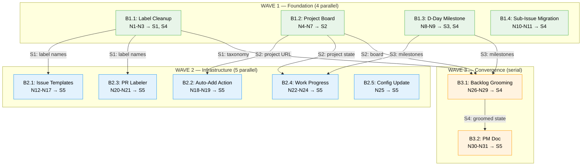

# PM Overhaul — Breadboard

**Purpose**: Map all affordances and wiring for Shape B (Wave-Parallel Execution) — PM infrastructure including label cleanup, GitHub project board, milestones, sub-issue migration, issue templates, GitHub Actions, `work progress` command, backlog grooming, and canonical PM doc.

**Input**: Shaping doc (Shape B selected — wave-parallel execution across 4 waves), frame (problem: no structural memory, no visual tracking, taxonomy drift), spike (issue types not viable on personal repos — keep `type/*` labels).

**Status**: Draft

**Infrastructure note**: This is an infrastructure breadboard, not a UI feature. "Places" are system contexts (GitHub Labels, Project Board, etc.) — bounded contexts where distinct sets of operations are available. Affordances are primarily Code (N) — `gh` commands, file writes, GraphQL mutations, shell functions. UI affordances (U) are the visible outputs that humans and agents consume.

---

## Places

| # | Place | Type | Context | Description |
|---|-------|------|---------|-------------|
| P1 | GitHub Labels | GitHub API | `gh label` CLI | Label taxonomy — list, create, delete, edit labels on the repo |
| P2 | GitHub Project Board | GitHub API | `gh project` CLI + GraphQL | Projects v2 — user-owned project with custom fields, views, auto-status |
| P3 | GitHub Milestones | GitHub API | `gh api milestones` | Milestone lifecycle — create, assign issues, track progress |
| P4 | GitHub Issues | GitHub API | `gh issue` CLI + GraphQL | Issue metadata — labels, milestones, bodies, sub-issue relationships |
| P5 | Repository | File system | Git-tracked files | Local artifacts committed to the repo |
| P5.1 | Templates | Subplace of P5 | `.github/ISSUE_TEMPLATE/` | Issue form YAMLs, PR template, config |
| P5.2 | Actions & Labeler | Subplace of P5 | `.github/workflows/`, `.github/labeler.yml` | Workflow YAMLs, labeler path mapping, repo secrets |
| P5.3 | Scripts | Subplace of P5 | `scripts/work.sh` | CLI extension — `work progress` subcommand |
| P5.4 | Docs | Subplace of P5 | `docs/PM.md`, `CLAUDE.md` | Canonical PM reference, doc table update |
| P5.5 | Config | Subplace of P5 | `.gitignore`, `config/tools.json` | Repository configuration files |
| P6 | Grooming Session | Interactive | Human + agent terminal | Guided issue-by-issue triage — human decides, agent applies |

**Bounded context note**: Each Place represents a distinct operational context with its own set of commands and affordances. P1-P4 operate through the GitHub API (different endpoints, different capabilities). P5.1-P5.5 share the file system but produce distinct artifact types. P6 is an interactive session requiring human input.

---

## Data Stores

| # | Place | Store | Description |
|---|-------|-------|-------------|
| S1 | P1 | GitHub Labels | Set of labels on the repo (currently 49, target ~37 after cleanup) |
| S2 | P2 | GitHub Project | Projects v2 project state: 8 custom fields, 4 views, item assignments, auto-status config |
| S3 | P3 | GitHub Milestones | Milestone definitions with due dates and issue assignments |
| S4 | P4 | GitHub Issues | Issue state: labels, milestone, body content, sub-issue parent/child relationships (67 open) |
| S5 | P5 | Repository Files | Git-tracked artifacts: `.github/`, `scripts/`, `docs/`, `config/`, `.gitignore` |

---

## Wave 1 — Foundation

All Wave 1 parts execute in **parallel** — no incoming dependencies. Wave 0 (issue type spike) is complete.

### B1.1: Label Cleanup

**Code Affordances**

| # | Place | Component | Affordance | Control | Wires Out | Returns To |
|---|-------|-----------|------------|---------|-----------|------------|
| N1 | P4 | `gh issue edit` | Re-label affected issues — for each ad-hoc label, find issues using it, replace with taxonomy equivalent (e.g., `enhancement` → `type/feature`, `meta` → `type/tooling`, `devx` → `vertical/devx`) | batch | → S4 | — |
| N2 | P1 | `gh label delete` | Delete 8 ad-hoc labels: enhancement, meta, devx, refactor (dup), data-quality, knowledge-base, polish, accessibility | batch | → S1 | — |
| N3 | P1 | `gh label delete` | Delete 4 unused GitHub defaults: documentation, good first issue, help wanted, question | batch | → S1 | — |

**Sequence**: N1 → N2, N3. Must re-label before deleting to preserve issue categorization.

**Decision**: `type/ux-review` — fold into `type/feedback` or `source/review` (resolve during grooming, B3.1).

**UI Affordances (Outputs)**

| # | Place | Affordance | Description |
|---|-------|------------|-------------|
| U1 | P1 | Clean label taxonomy | ~37 labels, all within `type/*`, `priority/*`, `vertical/*`, `phase/*`, `source/*` dimensions. No orphan labels. |

### B1.2: Project Board

**Code Affordances**

| # | Place | Component | Affordance | Control | Wires Out | Returns To |
|---|-------|-----------|------------|---------|-----------|------------|
| N4 | P2 | `gh auth` | Upgrade PAT scope — `gh auth refresh -s project` (prerequisite for all `gh project` commands) | call | — | — |
| N5 | P2 | `gh project create` | Create user-owned project — `--owner @me --title "Screen Print Pro"` | call | → S2 | → N6, N7, N18 |
| N6 | P2 | `gh project field-create` | Create 8 custom fields: Status (SINGLE_SELECT: Triage/Backlog/Ready/In Progress/In Review/Done), Priority, Product (from `config/products.json`), Tool (from `config/tools.json`), Pipeline ID (TEXT), Pipeline Stage (from `config/stages.json`), Effort (Trivial/Small/Medium/Large), Phase (Phase 1/2/3) | batch | → S2 | — |
| N7 | P2 | GraphQL / web UI | Configure 4 views: Board (group by Status), By Product (table, group by Product), Pipeline Tracker (table, group by Pipeline Stage, filter Pipeline ID not empty), Roadmap (timeline) | batch | → S2 | — |

**Sequence**: N4 → N5 → N6 → N7 (strictly serial — each depends on previous).

**UI Affordances (Outputs)**

| # | Place | Affordance | Description |
|---|-------|------------|-------------|
| U2 | P2 | Board view | Kanban columns: Triage, Backlog, Ready, In Progress, In Review, Done |
| U3 | P2 | By Product view | Table grouped by Product field — shows distribution across verticals |
| U4 | P2 | Pipeline Tracker view | Table grouped by Pipeline Stage — filtered to active pipelines only |
| U5 | P2 | Roadmap view | Timeline layout for open issues |

### B1.3: D-Day Milestone

**Code Affordances**

| # | Place | Component | Affordance | Control | Wires Out | Returns To |
|---|-------|-----------|------------|---------|-----------|------------|
| N8 | P3 | `gh api` | Create D-Day milestone — `POST repos/{owner}/{repo}/milestones` with `title: "D-Day"`, `due_on: "2026-02-21T00:00:00Z"`, `description: "Demo prep: Wizards, DTF Pricing, Pricing Mobile"` | call | → S3 | → N9 |
| N9 | P4 | `gh issue edit` | Assign 3 issues to D-Day — `--milestone "D-Day"` for #145 (Wizards), #144 (DTF Pricing), #177 (Pricing Mobile) | batch | → S4 | — |

**UI Affordances (Outputs)**

| # | Place | Affordance | Description |
|---|-------|------------|-------------|
| U6 | P3 | D-Day milestone | Feb 21 deadline, 3 assigned issues, progress bar visible in GitHub Milestones UI |

### B1.4: Sub-Issue Migration

**Code Affordances**

| # | Place | Component | Affordance | Control | Wires Out | Returns To |
|---|-------|-----------|------------|---------|-----------|------------|
| N10 | P4 | Script | Parse task-list bodies — scan all open issues for `- [ ] #N` and `- [x] #N` checkbox patterns. Extract parent→child pairs. Known tracking issues: #166, #192, #216 (may discover more). | call | reads S4 | → N11 |
| N11 | P4 | GraphQL | Create sub-issue relationships — `addSubIssue(issueId, subIssueId)` mutation for each parent→child pair (~23 relationships). Optionally clean checkbox lines from parent body after migration. | batch | → S4 | — |

**Sequence**: N10 → N11.

**UI Affordances (Outputs)**

| # | Place | Affordance | Description |
|---|-------|------------|-------------|
| U7 | P4 | Sub-issue trees | Parent issues display collapsible sub-issue lists in GitHub UI. Navigable parent↔child links replace checkbox text. |

---

## Wave 2 — Infrastructure

All Wave 2 parts execute in **parallel** after Wave 1 completes. Each part has specific Wave 1 dependencies.

### B2.1: Issue Templates

**Depends on**: B0.1 (spike result: keep `type/*` labels), B1.1 (label names finalized for auto-labels)

**Code Affordances**

| # | Place | Component | Affordance | Control | Wires Out | Returns To |
|---|-------|-----------|------------|---------|-----------|------------|
| N12 | P5.1 | YAML | Write `.github/ISSUE_TEMPLATE/feature-request.yml` — fields: Title (input, required), Description (textarea, required), Product/Tool (dropdown, required — combined from `config/products.json` + `config/tools.json`), Acceptance Criteria (textarea, required), Files to Read (textarea, optional), Priority (dropdown, optional — now/next/later/icebox), Phase (dropdown, optional — 1/2/3). Auto-labels: `type/feature` | write | → S5 | — |
| N13 | P5.1 | YAML | Write `.github/ISSUE_TEMPLATE/bug-report.yml` — fields: Title, What happened (required), Expected behavior (required), Steps to reproduce (required), Product/Tool (dropdown, required), Severity (dropdown, optional — Critical/High/Normal/Low). Auto-labels: `type/bug` | write | → S5 | — |
| N14 | P5.1 | YAML | Write `.github/ISSUE_TEMPLATE/research-task.yml` — fields: Title, Goal (required — "What are we trying to learn?"), Questions (required — "Specific questions to answer"), Product/Tool (dropdown, required), Files to Read (textarea, optional). Auto-labels: `type/research` | write | → S5 | — |
| N15 | P5.1 | YAML | Write `.github/ISSUE_TEMPLATE/tracking-issue.yml` — fields: Title, Goal (required — "What does completion look like?"), Sub-issues planned (textarea, optional), Product/Tool (dropdown, required), Milestone context (textarea, optional). Auto-labels: `type/tooling` | write | → S5 | — |
| N16 | P5.1 | YAML | Write `.github/ISSUE_TEMPLATE/config.yml` — `blank_issues_enabled: false` (forces template usage) | write | → S5 | — |
| N17 | P5.1 | Markdown | Write `.github/pull_request_template.md` — sections: Summary (1-3 bullets), Related Issues (`Closes #X`), Type checkboxes (Feature/Bug Fix/Refactor/Tooling/Docs), Product checkboxes (from `config/products.json`), Test Plan, Quality Checklist (from CLAUDE.md) | write | → S5 | — |

**UI Affordances (Outputs)**

| # | Place | Affordance | Description |
|---|-------|------------|-------------|
| U8 | P5.1 | Feature Request form | GitHub renders YAML → guided form with required fields and `type/feature` auto-label |
| U9 | P5.1 | Bug Report form | Structured bug report with reproduction steps and `type/bug` auto-label |
| U10 | P5.1 | Research Task form | Goal-oriented research template with questions section and `type/research` auto-label |
| U11 | P5.1 | Tracking Issue form | Epic/tracking template with sub-issue planning and `type/tooling` auto-label |
| U12 | P5.1 | PR template | Pre-filled PR body with summary, linked issues, type/product checkboxes, test plan, quality checklist |

### B2.2: Auto-Add Action

**Depends on**: B1.2 (project URL needed for workflow config)

**Code Affordances**

| # | Place | Component | Affordance | Control | Wires Out | Returns To |
|---|-------|-----------|------------|---------|-----------|------------|
| N18 | P5.2 | YAML | Write `.github/workflows/auto-project.yml` — triggers: `issues: [opened]`, `pull_request: [opened, ready_for_review]`. Uses `actions/add-to-project@v1.0.2` with project URL from N5 output. Uses `PROJECT_PAT` secret. | write | → S5 | — |
| N19 | P5.2 | `gh secret set` | Set `PROJECT_PAT` repository secret — requires human to provide PAT value with `project` scope. Separate from `gh auth` token used for CLI. | call | → S5 | — |

**Note**: N19 requires human interaction (PAT value). Can be done as part of the board setup (B1.2) or deferred to here.

### B2.3: PR Auto-Labeler

**Depends on**: B1.1 (label names finalized for path mapping)

**Code Affordances**

| # | Place | Component | Affordance | Control | Wires Out | Returns To |
|---|-------|-----------|------------|---------|-----------|------------|
| N20 | P5.2 | YAML | Write `.github/labeler.yml` — path-to-label mapping. Maps file paths to existing taxonomy labels: `app/(dashboard)/quotes/**` → `vertical/quoting`, `app/(dashboard)/jobs/**` → `vertical/jobs`, `app/(dashboard)/garments/**` → `vertical/garments`, `app/(dashboard)/settings/pricing/**` → `vertical/price-matrix`, `knowledge-base/**` → `vertical/devx`, `scripts/**` → `vertical/devx`, etc. Only maps to labels that exist in S1 after cleanup. | write | → S5 | — |
| N21 | P5.2 | YAML | Write `.github/workflows/labeler.yml` — triggers: `pull_request_target: [opened, synchronize]`. Uses `actions/labeler@v5` with `.github/labeler.yml` config. | write | → S5 | — |

### B2.4: Work Progress

**Depends on**: B1.2 (project board for board queries), B1.3 (milestones for progress queries)

**Code Affordances**

| # | Place | Component | Affordance | Control | Wires Out | Returns To |
|---|-------|-----------|------------|---------|-----------|------------|
| N22 | P5.3 | `work.sh` | Add `progress` case to dispatcher — `progress) shift; _work_progress "$@" ;;` in the `work()` function's case statement | write | → S5 | — |
| N23 | P5.3 | `work.sh` | Write `_work_progress()` function — queries GitHub API via `gh`: milestones with progress (`gh api milestones`), priority/now issues (`gh issue list -l priority/now`), priority/next issues, blocked items (sub-issue dependency queries), recent merged PRs (`gh pr list --state merged --limit 10`), stale issues. Assembles markdown sections. Writes output to `PROGRESS.md` in current working directory. | write | → S5, reads S2/S3/S4 | → U13 |
| N24 | P5.5 | `.gitignore` | Add `PROGRESS.md` to `.gitignore` — converts from tracked hot file to gitignored compiled artifact (Interview Decision #4) | write | → S5 | — |

**Note**: Existing `PROGRESS.md` on main must be `git rm --cached` when this merges (one-time migration from tracked to gitignored).

**UI Affordances (Outputs)**

| # | Place | Affordance | Description |
|---|-------|------------|-------------|
| U13 | P5.3 | PROGRESS.md output | Generated markdown: Milestones (with close/total counts), Now priorities, Next priorities (~8-10 items), Blocked items, Recent PRs (last 7 days), Stale issues. Timestamp header. |

### B2.5: Config Update

**No dependencies** — trivial file edit, included in Wave 2 for convenience.

**Code Affordances**

| # | Place | Component | Affordance | Control | Wires Out | Returns To |
|---|-------|-----------|------------|---------|-----------|------------|
| N25 | P5.5 | JSON | Update `config/tools.json` — add `{ "slug": "pm-system", "label": "PM System" }` to the tools array | write | → S5 | — |

---

## Wave 3 — Convergence

Wave 3 is **serial**. Grooming requires human interaction. PM doc requires everything to be complete and reflects the final state.

### B3.1: Backlog Grooming

**Depends on**: B1.1 (clean taxonomy to enforce), B1.2 (board to add issues), B1.3 (milestones to assign)

**Code Affordances**

| # | Place | Component | Affordance | Control | Wires Out | Returns To |
|---|-------|-----------|------------|---------|-----------|------------|
| N26 | P6 | `gh issue list` | Present issue to human — display title, current labels, milestone, last updated, body excerpt. Human decides per issue: keep (with label corrections), icebox (`priority/icebox`), or close. | call | reads S4 | — |
| N27 | P6 | `gh issue edit` | Apply grooming decisions — add/remove labels to match taxonomy, set milestone, set correct priority | batch | → S4 | — |
| N28 | P6 | `gh issue close` | Close stale/duplicate issues with reason comment. Known candidates: #85 (superseded by #216), #63 (likely resolved), #73 (duplicate of #15). | batch | → S4 | — |
| N29 | P6 | `gh project item-add` | Add all surviving issues to project board (bulk add) | batch | → S2, → S4 | — |

**Grooming checklist per issue:**
1. Has correct `type/*` label
2. Has correct `priority/*` label (hard triage: `priority/next` down to ~8-10 truly-next items)
3. Has correct `vertical/*` label
4. Assigned to milestone or explicitly `priority/icebox`
5. Added to project board
6. Stale/duplicate closed with reason comment

**Target**: ~40-45 clean open issues (from current 67).

**UI Affordances (Outputs)**

| # | Place | Affordance | Description |
|---|-------|------------|-------------|
| U14 | P6 | Groomed backlog | ~40-45 open issues. Every issue: correct type + priority + vertical labels, milestoned or icebox'd, on the project board. |

### B3.2: PM Doc

**Depends on**: Everything — all infrastructure must exist for the PM doc to accurately describe the system.

**Code Affordances**

| # | Place | Component | Affordance | Control | Wires Out | Returns To |
|---|-------|-----------|------------|---------|-----------|------------|
| N30 | P5.4 | Markdown | Write `docs/PM.md` — 10 sections: (1) Quick Reference — 4 common agent workflows as `gh` commands, (2) Issue Lifecycle — status flow mapping to board, (3) Label Taxonomy — complete reference with rules, (4) Issue Templates — when to use each, what fields mean, (5) Dependency Patterns — hierarchy/dependency/context with `gh` commands, (6) Epic Pattern — parent/sub-issue structure (describes post-D-Day pattern), (7) Pipeline Flow — pipeline ID, stage tracking, issue creation, (8) Agent Conventions — find work, create issues, comment routing (`@cmbays` for human), (9) Milestones & Cycles — Shape Up rhythm, three human touchpoints, (10) Automation — what Actions handle vs agents vs humans. Design: each section starts with 2-line agent quick-scan summary then expands. | write | → S5 | → U15 |
| N31 | P5.4 | Markdown | Update CLAUDE.md canonical doc table — add `docs/PM.md` row with purpose: "PM workflows, labels, templates, dependencies, agent conventions" and update trigger: "PM infrastructure changes" | write | → S5 | — |

**UI Affordances (Outputs)**

| # | Place | Affordance | Description |
|---|-------|------------|-------------|
| U15 | P5.4 | PM doc | Standalone canonical reference. Agents read at session start alongside CLAUDE.md. Humans reference for workflow questions. "How we work" complement to CLAUDE.md's "how we build." |

---

## Dependency Wiring

### Narrative

**Wave 1 → Wave 2:**

| Source | Store | Consumer | Why |
|--------|-------|----------|-----|
| B1.1 (label cleanup) | S1: labels | B2.1 (templates) | Templates reference label names in auto-labels field |
| B1.1 (label cleanup) | S1: labels | B2.3 (PR labeler) | Labeler maps file paths to existing label names |
| B1.2 (project board) | S2: project | B2.2 (auto-add) | Workflow needs project URL |
| B1.2 (project board) | S2: project | B2.4 (work progress) | Progress queries read board state |
| B1.3 (milestone) | S3: milestones | B2.4 (work progress) | Progress queries read milestone progress |
| B1.4 (sub-issues) | — | — | No downstream dependencies (independent) |

**Wave 1+2 → Wave 3:**

| Source | Store | Consumer | Why |
|--------|-------|----------|-----|
| B1.1 | S1: labels | B3.1 (grooming) | Grooming enforces clean taxonomy |
| B1.2 | S2: project | B3.1 (grooming) | Grooming adds issues to board |
| B1.3 | S3: milestones | B3.1 (grooming) | Grooming assigns milestones |
| B2.* | S5: files | B3.2 (PM doc) | PM doc describes all infrastructure |
| B3.1 | S4: issues | B3.2 (PM doc) | PM doc reflects final groomed state |

### Mermaid Diagram

---

## Vertical Slices

### V1: Foundation (Wave 1)

**Demo**: "Labels are clean (`gh label list` shows ~37 taxonomy-compliant labels), board exists with 4 views and 8 fields, D-Day milestone has 3 issues assigned, sub-issues are navigable (click parent → see children)."

**Parallelization window**: B1.1, B1.2, B1.3, B1.4 — **all 4 run concurrently** (no mutual dependencies).

| Part | Affordances | Demo Statement |
|------|-------------|----------------|
| B1.1 | N1-N3, U1 | `gh label list` shows ~37 clean labels — no ad-hoc, no unused defaults |
| B1.2 | N4-N7, U2-U5 | Project board has 4 views with 8 custom fields; open in browser |
| B1.3 | N8-N9, U6 | D-Day milestone shows 3 assigned issues with Feb 21 due date |
| B1.4 | N10-N11, U7 | Tracking issues (#166, #192, #216) show sub-issue trees instead of checkbox text |

### V2: Infrastructure (Wave 2)

**Demo**: "New Issue button shows 4 template options (no blank issue), PRs auto-labeled on file paths, new issue auto-added to board, `work progress` generates PROGRESS.md with live data."

**Parallelization window**: B2.1, B2.2, B2.3, B2.4, B2.5 — **all 5 run concurrently** (after V1 gate; each has independent Wave 1 deps already satisfied).

| Part | Affordances | Demo Statement |
|------|-------------|----------------|
| B2.1 | N12-N17, U8-U12 | "New Issue" shows 4 template forms; PR template pre-fills on `gh pr create` |
| B2.2 | N18-N19 | Create test issue → it auto-appears on project board within seconds |
| B2.3 | N20-N21 | Open PR touching `app/(dashboard)/quotes/` → gets `vertical/quoting` label |
| B2.4 | N22-N24, U13 | Run `work progress` → PROGRESS.md appears with milestones, priorities, blocked items |
| B2.5 | N25 | `config/tools.json` includes `pm-system` entry |

### V3: Convergence (Wave 3)

**Demo**: "Backlog has ~40-45 clean issues (all labeled, milestoned, on board). `docs/PM.md` describes the complete system in 10 sections. CLAUDE.md doc table references PM.md."

**Serialization**: B3.1 → B3.2. Grooming is human-interactive (cannot parallelize). PM doc must describe the final state after grooming.

| Part | Affordances | Demo Statement |
|------|-------------|----------------|
| B3.1 | N26-N29, U14 | `gh issue list --state open` shows ~40-45 issues, all correctly labeled and milestoned |
| B3.2 | N30-N31, U15 | `docs/PM.md` covers all 10 sections; CLAUDE.md canonical doc table includes PM.md |

### Slice Summary

| # | Slice | Parts | Parallel Sessions | Demo |
|---|-------|-------|-------------------|------|
| V1 | Foundation | B1.1, B1.2, B1.3, B1.4 | **4 concurrent** | Labels clean, board live, milestone set, sub-issues linked |
| V2 | Infrastructure | B2.1, B2.2, B2.3, B2.4, B2.5 | **5 concurrent** (after V1 gate) | Templates work, Actions fire, progress generates |
| V3 | Convergence | B3.1, B3.2 | **Serial** (human-interactive → doc write) | Backlog groomed, PM doc complete |

---

## Scope Coverage Verification

| Req | Requirement | Affordances | Covered? |
|-----|-------------|-------------|----------|
| R0 | Agent autonomy — self-orient, find work, consistent artifacts | N30 (PM doc), U15 | Yes |
| R1 | Issue structure — templates + sub-issues | N12-N17 (templates), N10-N11 (sub-issues), U8-U12, U7 | Yes |
| R1.1 | 4 YAML forms with required fields, auto-labels | N12-N16, U8-U11 | Yes |
| R1.2 | PR template with summary, linked issues, test plan | N17, U12 | Yes |
| R1.3 | Sub-issues replace task-list checkboxes (23 migrated) | N10-N11, U7 | Yes |
| R2 | Visual tracking — board + milestones | N5-N7 (board), N8-N9 (milestone), U2-U6 | Yes |
| R2.1 | User-owned project with fields and views | N4-N7, U2-U5 | Yes |
| R2.2 | D-Day milestone with 3 assigned issues | N8-N9, U6 | Yes |
| R3 | Dependency visibility — blocked items identifiable | N11 (sub-issues with blocked-by), N7 (board views), U7 | Yes |
| R4 | Clean taxonomy — one mechanism per dimension | N1-N3 (label cleanup), U1 | Yes |
| R4.1 | Fold 8 ad-hoc, remove 4 defaults | N2-N3 | Yes |
| R4.2 | Issue type strategy decided | B0.1 spike (resolved: keep `type/*` labels) | Yes |
| R5 | Canonical PM doc — lifecycle, taxonomy, dependencies, templates, agent conventions | N30-N31, U15 | Yes |
| R6 | Automated sync — Tier 1 Actions | N18-N21 (auto-add + labeler) | Yes |
| R7 | Progress generation — `work progress` produces PROGRESS.md | N22-N24, U13 | Yes |
| R8 | Clean backlog — ~40-45 issues, all correctly labeled | N26-N29, U14 | Yes |

---

## Quality Gate

- [x] Every Place represents a bounded operational context with distinct affordance sets
- [x] Every R from shaping has corresponding affordances (scope coverage table — all Yes)
- [x] Every U has at least one N that produces it
- [x] Every N has either Wires Out (→ store) or Returns To (→ downstream affordance)
- [x] Every S has at least one writer (Wave 1) and one reader (Wave 2/3)
- [x] No dangling wire references — all N→S→N chains verified
- [x] Slices defined with demo statements and parallelization markers
- [x] Mermaid diagram matches dependency wiring narrative
- [x] Parallelization windows explicitly marked per CLAUDE.md requirement
