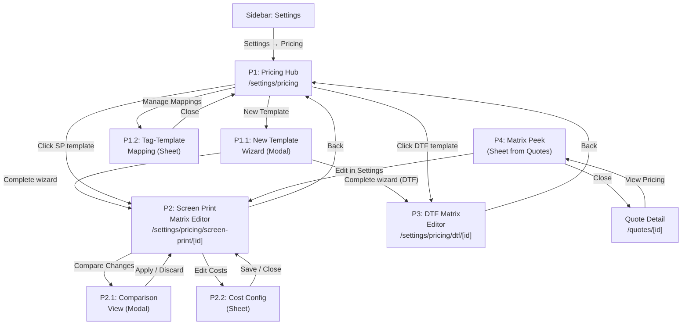
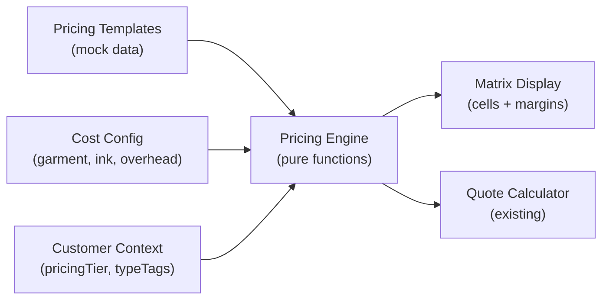

# Price Matrix — Breadboard

**Purpose**: Map all UI affordances, code affordances, and wiring for the Price Matrix vertical before building
**Input**: Owner interview findings, competitive research (80+ sources), DTF pricing research, existing schemas, APP_FLOW
**Status**: Draft

---

## Context

The Price Matrix is a centralized pricing engine that feeds all quote calculations. It lives under Settings (full configuration) with a peek/shortcut accessible from within Quotes. Two service types in Phase 1: Screen Print (multi-dimensional matrix) and DTF (sheet-size-based pricing). The engine supports multiple templates mapped to customer type tags.

**Demo Must-Haves (all P0)**:
1. Margin visibility — green/yellow/red per cell with cost breakdown tooltip
2. 5-minute setup — wizard with industry template defaults
3. What-if scenarios — sandbox mode + side-by-side comparison
4. Quote integration — matrix feeds quotes automatically

---

## Schema Gaps (Pre-Build)

Before building, create these new schemas and extend existing ones:

1. **New `lib/schemas/price-matrix.ts`** — Core pricing schemas:
   - `screenPrintMatrixSchema` — Template with quantity tiers, color pricing, location upcharges, garment type pricing
   - `quantityTierSchema` — `{ minQty, maxQty, label }` (default tiers: 12, 24, 48, 72, 144+)
   - `colorPricingSchema` — Per-color-hit rate by quantity tier (1–8+ colors)
   - `locationUpchargeSchema` — `{ location, upcharge }` (front=base, back, sleeves, pocket)
   - `garmentTypePricingSchema` — `{ garmentCategory, baseMarkup, setupFeeOverride }`
   - `setupFeeConfigSchema` — Per-screen fee, bulk waiver threshold, reorder discount window
   - `costConfigSchema` — `{ garmentCostSource, inkCostPerHit, shopOverheadRate, laborRate? }`
   - `pricingTemplateSchema` — `{ id, name, serviceType, pricingTier, matrix, costConfig, isIndustryDefault, createdAt, updatedAt }`
   - `marginIndicator` enum: `"healthy" | "caution" | "unprofitable"` (≥30%, 15–30%, <15%)

2. **New `lib/schemas/dtf-pricing.ts`** — DTF-specific schemas:
   - `dtfSheetTierSchema` — `{ width: 22, length, retailPrice, contractPrice? }`
   - `dtfRushFeeSchema` — `{ turnaround, percentageUpcharge, flatFee? }`
   - `dtfFilmTypeSchema` — `{ type, multiplier }` (standard=1.0, metallic=1.3, glow=1.5)
   - `dtfCostConfigSchema` — `{ filmCostPerSqFt, inkCostPerSqIn, powderCostPerSqFt, laborRatePerHour, equipmentOverheadPerSqFt }`
   - `dtfPricingTemplateSchema` — `{ id, name, sheetTiers, rushFees, filmTypes, costConfig, customerTierDiscounts }`

3. **New `lib/schemas/tag-template-mapping.ts`**:
   - `tagTemplateMappingSchema` — `{ customerTypeTag, templateId, serviceType }`

4. **Extend `lib/mock-data.ts`** — Add:
   - 3 screen print templates (Standard, Contract, Schools/Non-Profit)
   - 2 DTF templates (Retail, Contract)
   - Realistic industry pricing data (from research)
   - Tag→template mappings for existing customers
   - Cost configurations with realistic production costs

5. **New `lib/pricing-engine.ts`** — Pure calculation functions:
   - `calculateScreenPrintPrice(qty, colors, locations, garmentType, template)` → price + margin
   - `calculateDTFPrice(sheetLength, customerTier, rushType, filmType, template)` → price + margin
   - `calculateMargin(revenue, costs)` → `{ percentage, indicator, breakdown }`
   - `applyCustomerTierDiscount(basePrice, customer)` → discounted price

---

## Places

| ID | Place | Type | Entry Point | Description |
|----|-------|------|-------------|-------------|
| P1 | Pricing Hub | Page | `/settings/pricing` via sidebar Settings section | Browse all pricing templates grouped by service type, manage tag→template mappings |
| P1.1 | New Template Wizard | Modal | "New Template" button in P1 | 5-step guided setup with industry defaults and live preview |
| P1.2 | Tag-Template Mapping Sheet | Sheet | "Manage Tag Mapping" button in P1 | Map customer type tags to pricing templates |
| P2 | Screen Print Matrix Editor | Page | `/settings/pricing/screen-print/[id]` via template card click in P1 | Full matrix editor with Simple/Power modes, margin indicators, sandbox mode |
| P2.1 | Comparison View | Modal | "Compare Changes" button in P2 sandbox mode | Side-by-side current vs. proposed pricing with margin impact |
| P2.2 | Cost Configuration Sheet | Sheet | "Edit Costs" button in P2 | Configure garment, ink, overhead, labor costs for margin calculations |
| P3 | DTF Matrix Editor | Page | `/settings/pricing/dtf/[id]` via DTF template card click in P1 | Sheet-size pricing tiers, customer discounts, rush fees, margin indicators |
| P4 | Matrix Peek Sheet | Sheet | "View Pricing" button from Quote Detail (P3 of quoting breadboard) | Read-only pricing matrix view with quick-adjust options |

**Blocking test**: P1.1 (modal blocks hub), P1.2 (sheet blocks hub interaction), P2.1 (modal blocks editor), P2.2 (sheet blocks editor), P4 (sheet blocks quote detail).

**Not Places** (local state within a Place): Simple/Power mode toggle (P2), sandbox mode toggle (P2), accordion sections for quantity/color/location (P2), tooltip popovers for margin breakdown, inline cell editing.

---

## Visual Overview

### Diagram 1: Places & Navigation Flow



### Diagram 2: Data Flow



---

## UI Affordances

### P1 — Pricing Hub

| ID | Affordance | Control | Wires Out | Returns To |
|----|------------|---------|-----------|------------|
| U1 | Service Type Tabs (Screen Print / DTF) | click | → N1 filterTemplatesByServiceType() | → P1 template list display |
| U2 | "New Template" button | click | → open P1.1 | |
| U3 | Template Card (per template) | click | → navigate to P2 or P3 based on serviceType | |
| U4 | Template Card Duplicate action | click | → N2 duplicateTemplate() | → P1 template list (new card appears) |
| U5 | Template Card Delete action | click | → N3 deleteTemplate() with confirmation | → P1 template list (card removed) |
| U6 | Template Card "Set as Default" action | click | → N4 setDefaultTemplate() | → P1 template card (default badge) |
| U7 | "Manage Tag Mapping" button | click | → open P1.2 | |
| U8 | Template Search input | type | → N5 filterTemplatesBySearch() | → P1 template list (filtered) |
| U9 | Template Margin Health badge (per card) | display | | ← N6 calculateTemplateHealth() |
| U10 | Customers Using count (per card) | display | | ← N7 countCustomersUsingTemplate() |
| U11 | Industry Template banner | display | | ← S3 industry default template data |

### P1.1 — New Template Wizard

| ID | Affordance | Control | Wires Out | Returns To |
|----|------------|---------|-----------|------------|
| U20 | Step 1: Service Type selector (Screen Print / DTF) | click | → N8 setWizardServiceType() | → wizard step 2 content |
| U21 | Step 2: Template Name input | type | → update S5 wizard form state | |
| U22 | Step 2: Pricing Tier selector | select | → update S5 wizard form state | |
| U23 | Step 2: "Start from Industry Template" toggle | toggle | → N9 loadIndustryDefaults() | → pre-fill steps 3–4 |
| U24 | Step 3: Quantity Tier breakpoints | type | → update S5 wizard form state | → step 3 preview |
| U25 | Step 3: Add/Remove breakpoint buttons | click | → N10 addQuantityTier() / removeQuantityTier() | → step 3 tier list |
| U26 | Step 3: Base price per tier | type | → update S5 wizard form state | → step 3 preview |
| U27 | Step 4: Color hit rate | type | → update S5 wizard form state | → step 4 preview |
| U28 | Step 4: Location upcharges | type | → update S5 wizard form state | → step 4 preview |
| U29 | Step 4: Garment type markups | type | → update S5 wizard form state | → step 4 preview |
| U30 | Step 4: Setup fee configuration | type | → update S5 wizard form state | → step 4 preview |
| U31 | Step 5: Live pricing preview table | display | | ← N11 calculateWizardPreview() |
| U32 | Step 5: Margin indicators in preview | display | | ← N12 calculatePreviewMargins() |
| U33 | Step 5: Sample order calculator | type | → N13 calculateSampleOrder() | → sample order result display |
| U34 | "Next" / "Back" navigation buttons | click | → N14 wizardNavigation() | → next/previous step |
| U35 | "Save Template" button (step 5) | click | → N15 saveNewTemplate() | → close modal, navigate to P2/P3 |
| U36 | "Cancel" button | click | → close P1.1 | → return to P1 |
| U37 | Step progress indicator | display | | ← S5 wizard currentStep |

### P1.2 — Tag-Template Mapping Sheet

| ID | Affordance | Control | Wires Out | Returns To |
|----|------------|---------|-----------|------------|
| U40 | Tag-Template mapping table | display | | ← S6 tag-template mappings |
| U41 | Customer Type Tag column (read-only) | display | | ← customer.ts customerTypeTagEnum values |
| U42 | Screen Print Template dropdown (per tag) | select | → N16 updateTagMapping(tag, templateId, "screen-print") | → mapping row update |
| U43 | DTF Template dropdown (per tag) | select | → N17 updateTagMapping(tag, templateId, "dtf") | → mapping row update |
| U44 | "Save Mappings" button | click | → N18 saveTagMappings() | → close P1.2, return to P1 |
| U45 | "Cancel" button | click | → close P1.2 | → return to P1 |
| U46 | Unmapped tag warning indicator | display | | ← N19 checkUnmappedTags() |

### P2 — Screen Print Matrix Editor

| ID | Affordance | Control | Wires Out | Returns To |
|----|------------|---------|-----------|------------|
| U50 | Page header (template name, tier badge, service type) | display | | ← S7 current template data |
| U51 | Template Name inline edit | type | → N20 updateTemplateName() | → header display |
| U52 | Simple Mode / Power Mode toggle | click | → N21 toggleEditorMode() | → S8 editorMode, re-render grid |
| U53 | Sandbox Mode toggle | click | → N22 enterSandboxMode() / exitSandboxMode() | → S9 sandboxState, UI indicator |
| U54 | Sandbox "Discard Changes" button | click | → N23 discardSandboxChanges() | → restore S7 to pre-sandbox state |
| U55 | Sandbox "Save Changes" button | click | → N24 applySandboxChanges() | → commit sandbox to S7, exit sandbox |
| U56 | Sandbox "Compare" button | click | → open P2.1 | |
| U57 | "Edit Costs" button | click | → open P2.2 | |
| U58 | "Back to Pricing" breadcrumb/button | click | → navigate to P1 | |
| **Quantity Tiers Section** | | | | |
| U60 | Quantity tier breakpoints list | display | | ← S7 template.quantityTiers |
| U61 | Tier min/max quantity inputs | type | → N25 updateQuantityTier() | → recalculate matrix |
| U62 | "Add Tier" button | click | → N26 addQuantityTier() | → S7 tiers list, recalculate |
| U63 | "Remove Tier" button (per tier) | click | → N27 removeQuantityTier() | → S7 tiers list, recalculate |
| **Color Pricing Section** | | | | |
| U65 | Color pricing grid (tiers × colors 1–8+) | display | | ← N28 calculateColorPricing() |
| U66 | Per-color hit rate input | type | → N29 updateColorHitRate() | → recalculate all cells |
| U67 | Cell-level margin indicator (dot) | display | | ← N30 calculateCellMargin() |
| U68 | Cell hover margin tooltip | display | | ← N31 getCellBreakdown() |
| **Location Upcharges Section** | | | | |
| U70 | Location upcharge table (front/back/sleeves/pocket) | display | | ← S7 template.locationUpcharges |
| U71 | Per-location upcharge input | type | → N32 updateLocationUpcharge() | → recalculate affected cells |
| U72 | "Add Location" button | click | → N33 addLocation() | → S7 locations list |
| U73 | "Remove Location" button (per location) | click | → N34 removeLocation() | → S7 locations list |
| **Garment Type Pricing Section** | | | | |
| U75 | Garment type pricing table | display | | ← S7 template.garmentTypePricing |
| U76 | Garment category selector (from garmentCategoryEnum) | select | → N35 addGarmentType() | → S7 garment types list |
| U77 | Base markup % input (per garment type) | type | → N36 updateGarmentMarkup() | → recalculate affected cells |
| **Setup Fees Section** | | | | |
| U80 | Per-screen setup fee input | type | → N37 updateSetupFee() | → S7 setup config |
| U81 | Bulk waiver threshold input (qty) | type | → N38 updateWaiverThreshold() | → S7 setup config |
| U82 | Reorder discount window input (months) | type | → N39 updateReorderWindow() | → S7 setup config |
| **Power Mode Grid (only visible when Power Mode active)** | | | | |
| U85 | TanStack Table full matrix grid | display | | ← N40 buildFullMatrixData() |
| U86 | Inline cell editing | type | → N41 updateCell() | → recalculate margins |
| U87 | Column sort headers | click | → N42 sortMatrix() | → grid re-sort |
| U88 | Bulk select cells | click+drag | → N43 selectCellRange() | → S10 selectedCells |
| U89 | Bulk edit selected cells | type | → N44 bulkUpdateCells() | → recalculate all selected |
| **Actions** | | | | |
| U90 | "Save Template" button | click | → N45 saveTemplate() | → toast confirmation |
| U91 | "Duplicate Template" button | click | → N46 duplicateTemplate() | → navigate to new template P2 |
| U92 | "Delete Template" button | click | → N47 deleteTemplate() with confirmation dialog | → navigate to P1 |
| U93 | Last saved timestamp display | display | | ← S7 template.updatedAt |

### P2.1 — Comparison View

| ID | Affordance | Control | Wires Out | Returns To |
|----|------------|---------|-----------|------------|
| U100 | Current pricing column | display | | ← S7 pre-sandbox template data |
| U101 | Proposed pricing column | display | | ← S9 sandbox changes |
| U102 | Diff highlighting (changed cells) | display | | ← N48 calculateDiff() |
| U103 | Margin impact summary | display | | ← N49 calculateMarginImpact() |
| U104 | "Apply Changes" button | click | → N24 applySandboxChanges() | → close P2.1, exit sandbox |
| U105 | "Keep Editing" button | click | → close P2.1 | → return to P2 in sandbox mode |
| U106 | "Discard All" button | click | → N23 discardSandboxChanges() | → close P2.1, exit sandbox |
| U107 | Change count summary | display | | ← N48 calculateDiff() |

### P2.2 — Cost Configuration Sheet

| ID | Affordance | Control | Wires Out | Returns To |
|----|------------|---------|-----------|------------|
| U110 | Garment cost source (from catalog / manual override) | select | → N50 setCostSource() | → S11 cost config |
| U111 | Ink cost per hit input | type | → N51 updateInkCost() | → S11 cost config |
| U112 | Shop overhead rate input | type | → N52 updateOverheadRate() | → S11 cost config |
| U113 | Labor rate per hour input (optional) | type | → N53 updateLaborRate() | → S11 cost config |
| U114 | Cost preview table (sample order) | display | | ← N54 calculateCostPreview() |
| U115 | Margin preview with costs applied | display | | ← N55 calculateMarginPreview() |
| U116 | "Save Costs" button | click | → N56 saveCostConfig() | → close P2.2, recalculate all margins in P2 |
| U117 | "Cancel" button | click | → close P2.2 | → return to P2 |

### P3 — DTF Matrix Editor

| ID | Affordance | Control | Wires Out | Returns To |
|----|------------|---------|-----------|------------|
| U120 | Page header (template name, "DTF" badge) | display | | ← S12 DTF template data |
| U121 | Template Name inline edit | type | → N57 updateDTFTemplateName() | → header display |
| U122 | "Back to Pricing" breadcrumb/button | click | → navigate to P1 | |
| **Sheet Size Tiers Section** | | | | |
| U125 | Sheet size tier table (length → price) | display | | ← S12 template.sheetTiers |
| U126 | Sheet length input (per tier) | type | → N58 updateSheetTier() | → recalculate margins |
| U127 | Retail price input (per tier) | type | → N59 updateSheetRetailPrice() | → recalculate margins |
| U128 | "Add Size" button | click | → N60 addSheetTier() | → S12 tiers list |
| U129 | "Remove Size" button (per tier) | click | → N61 removeSheetTier() | → S12 tiers list |
| U130 | Per-tier margin indicator | display | | ← N62 calculateDTFTierMargin() |
| U131 | Per-tier margin tooltip | display | | ← N63 getDTFTierBreakdown() |
| **Customer Tier Discounts Section** | | | | |
| U135 | Discount table (retail/bulk/contract/wholesale) | display | | ← S12 template.customerTierDiscounts |
| U136 | Discount percentage input (per tier) | type | → N64 updateCustomerTierDiscount() | → recalculate |
| **Rush Fees Section** | | | | |
| U140 | Rush fee table (standard/2-day/next-day/same-day) | display | | ← S12 template.rushFees |
| U141 | Rush percentage input | type | → N65 updateRushFee() | → recalculate |
| U142 | Rush flat fee input (for same-day) | type | → N66 updateRushFlatFee() | → recalculate |
| **Film Type Multipliers Section** | | | | |
| U145 | Film type table (standard/glossy/metallic/glow) | display | | ← S12 template.filmTypes |
| U146 | Film type multiplier input | type | → N67 updateFilmMultiplier() | → recalculate |
| **Production Costs Section** | | | | |
| U150 | Film cost per sq.ft. input | type | → N68 updateDTFCost("film") | → S13 DTF cost config |
| U151 | Ink cost per sq.in. input | type | → N69 updateDTFCost("ink") | → S13 DTF cost config |
| U152 | Powder cost per sq.ft. input | type | → N70 updateDTFCost("powder") | → S13 DTF cost config |
| U153 | Labor rate per hour input | type | → N71 updateDTFCost("labor") | → S13 DTF cost config |
| U154 | Equipment overhead per sq.ft. input | type | → N72 updateDTFCost("equipment") | → S13 DTF cost config |
| **Actions** | | | | |
| U155 | "Save Template" button | click | → N73 saveDTFTemplate() | → toast confirmation |
| U156 | "Duplicate Template" button | click | → N74 duplicateDTFTemplate() | → navigate to new DTF template |
| U157 | "Delete Template" button | click | → N75 deleteDTFTemplate() with confirmation | → navigate to P1 |
| U158 | Pricing Calculator preview (enter sheet size → see price) | type | → N76 calculateDTFPreviewPrice() | → price + margin display |

### P4 — Matrix Peek Sheet (from Quotes)

| ID | Affordance | Control | Wires Out | Returns To |
|----|------------|---------|-----------|------------|
| U160 | Applicable template name + tier | display | | ← N77 resolveCustomerTemplate() |
| U161 | Read-only pricing matrix (relevant subset) | display | | ← N78 getRelevantMatrixSlice() |
| U162 | Current line item pricing highlight | display | | ← N79 highlightCurrentPricing() |
| U163 | Margin indicator per visible cell | display | | ← N30 calculateCellMargin() |
| U164 | "Override This Quote Only" button | click | → N80 enableQuoteOverride() | → close P4, enable inline price editing in quote |
| U165 | "Edit Template in Settings" link | click | → navigate to P2/P3 (opens in new context) | |
| U166 | "Close" button | click | → close P4 | → return to quote view |
| U167 | Customer pricing context display (tier, discount %) | display | | ← customer.pricingTier, customer.discountPercentage |

---

## Code Affordances

| ID | Place | Affordance | Phase | Trigger | Wires Out | Returns To |
|----|-------|------------|-------|---------|-----------|------------|
| **Hub (P1)** | | | | | | |
| N1 | P1 | filterTemplatesByServiceType(type) | 1 | U1 tab click | | → filtered template list display |
| N2 | P1 | duplicateTemplate(templateId) | 1 | U4 click | → add to S3 templates | → P1 template list (new card) |
| N3 | P1 | deleteTemplate(templateId) | 1 | U5 click (after confirm) | → remove from S3 | → P1 template list |
| N4 | P1 | setDefaultTemplate(templateId) | 1 | U6 click | → update S3 | → P1 card badge |
| N5 | P1 | filterTemplatesBySearch(query) | 1 | U8 type | | → filtered template list |
| N6 | P1 | calculateTemplateHealth(template) | 1 | S3 template data load | | → U9 health badge |
| N7 | P1 | countCustomersUsingTemplate(templateId) | 1 | S3/S6 data load | | → U10 customer count |
| **Wizard (P1.1)** | | | | | | |
| N8 | P1.1 | setWizardServiceType(type) | 1 | U20 click | → update S5 | → step 2 content |
| N9 | P1.1 | loadIndustryDefaults(serviceType) | 1 | U23 toggle on | → pre-fill S5 | → steps 3–4 pre-filled |
| N10 | P1.1 | addQuantityTier() / removeQuantityTier(index) | 1 | U25 click | → update S5 tiers | → U24 tier list |
| N11 | P1.1 | calculateWizardPreview(wizardState) | 1 | S5 any change | | → U31 preview table |
| N12 | P1.1 | calculatePreviewMargins(wizardState) | 1 | N11 output | | → U32 margin indicators |
| N13 | P1.1 | calculateSampleOrder(qty, colors, locations) | 1 | U33 type | | → sample result display |
| N14 | P1.1 | wizardNavigation(direction) | 1 | U34 click | → update S5 currentStep | → U37 step indicator |
| N15 | P1.1 | saveNewTemplate(wizardState) | 1 | U35 click | → add to S3 templates | → close modal, navigate to P2/P3 |
| **Tag Mapping (P1.2)** | | | | | | |
| N16 | P1.2 | updateTagMapping(tag, templateId, "screen-print") | 1 | U42 select | → update S6 | → mapping row |
| N17 | P1.2 | updateTagMapping(tag, templateId, "dtf") | 1 | U43 select | → update S6 | → mapping row |
| N18 | P1.2 | saveTagMappings() | 1 | U44 click | → persist S6 | → close sheet |
| N19 | P1.2 | checkUnmappedTags() | 1 | S6 load/change | | → U46 warning indicator |
| **Screen Print Editor (P2)** | | | | | | |
| N20 | P2 | updateTemplateName(name) | 1 | U51 type | → update S7 | → U50 header |
| N21 | P2 | toggleEditorMode() | 1 | U52 click | → update S8 | → grid re-render |
| N22 | P2 | enterSandboxMode() / exitSandboxMode() | 1 | U53 click | → snapshot S7 → S9 | → sandbox UI indicator |
| N23 | P2 | discardSandboxChanges() | 1 | U54 click, U106 click | → restore S7 from snapshot | → exit sandbox mode |
| N24 | P2 | applySandboxChanges() | 1 | U55 click, U104 click | → commit S9 to S7 | → exit sandbox mode |
| N25 | P2 | updateQuantityTier(index, field, value) | 1 | U61 type | → update S7 tiers | → N28 recalculate |
| N26 | P2 | addQuantityTier() | 1 | U62 click | → update S7 tiers | → N28 recalculate |
| N27 | P2 | removeQuantityTier(index) | 1 | U63 click | → update S7 tiers | → N28 recalculate |
| N28 | P2 | calculateColorPricing(tiers, hitRate) | 1 | S7 tier/rate change | | → U65 color pricing grid |
| N29 | P2 | updateColorHitRate(colors, rate) | 1 | U66 type | → update S7 | → N28 recalculate |
| N30 | P2, P4 | calculateCellMargin(revenue, costs) | 1 | N28 output | | → U67/U163 margin dot |
| N31 | P2 | getCellBreakdown(cell) | 1 | U68 hover | | → tooltip content |
| N32 | P2 | updateLocationUpcharge(location, amount) | 1 | U71 type | → update S7 | → recalculate |
| N33 | P2 | addLocation() | 1 | U72 click | → update S7 | → U70 location table |
| N34 | P2 | removeLocation(index) | 1 | U73 click | → update S7 | → U70 location table |
| N35 | P2 | addGarmentType(category) | 1 | U76 select | → update S7 | → U75 garment table |
| N36 | P2 | updateGarmentMarkup(category, markup) | 1 | U77 type | → update S7 | → recalculate |
| N37 | P2 | updateSetupFee(amount) | 1 | U80 type | → update S7 | → setup config |
| N38 | P2 | updateWaiverThreshold(qty) | 1 | U81 type | → update S7 | → setup config |
| N39 | P2 | updateReorderWindow(months) | 1 | U82 type | → update S7 | → setup config |
| N40 | P2 | buildFullMatrixData(template) | 1 | S7/S8 change (Power Mode) | | → U85 TanStack Table data |
| N41 | P2 | updateCell(row, col, value) | 1 | U86 inline edit | → update S7 | → N30 recalculate |
| N42 | P2 | sortMatrix(column, direction) | 1 | U87 click | | → U85 re-sort |
| N43 | P2 | selectCellRange(start, end) | 1 | U88 click+drag | → update S10 | → visual selection |
| N44 | P2 | bulkUpdateCells(cells, value) | 1 | U89 type | → update S7 | → N30 recalculate all |
| N45 | P2 | saveTemplate(template) | 1 | U90 click | → persist S7 | → toast |
| N46 | P2 | duplicateTemplate(templateId) | 1 | U91 click | → add to S3 | → navigate new P2 |
| N47 | P2 | deleteTemplate(templateId) | 1 | U92 click (after confirm) | → remove from S3 | → navigate P1 |
| **Comparison (P2.1)** | | | | | | |
| N48 | P2.1 | calculateDiff(original, proposed) | 1 | P2.1 open | | → U102 diff highlights, U107 change count |
| N49 | P2.1 | calculateMarginImpact(original, proposed) | 1 | P2.1 open | | → U103 margin impact summary |
| **Cost Config (P2.2)** | | | | | | |
| N50 | P2.2 | setCostSource(source) | 1 | U110 select | → update S11 | → cost inputs |
| N51 | P2.2 | updateInkCost(amount) | 1 | U111 type | → update S11 | → N54 recalculate |
| N52 | P2.2 | updateOverheadRate(rate) | 1 | U112 type | → update S11 | → N54 recalculate |
| N53 | P2.2 | updateLaborRate(rate) | 1 | U113 type | → update S11 | → N54 recalculate |
| N54 | P2.2 | calculateCostPreview(costConfig) | 1 | S11 any change | | → U114 cost preview |
| N55 | P2.2 | calculateMarginPreview(costConfig, template) | 1 | N54 output | | → U115 margin preview |
| N56 | P2.2 | saveCostConfig(config) | 1 | U116 click | → update S7.costConfig | → close sheet, recalculate P2 margins |
| **DTF Editor (P3)** | | | | | | |
| N57 | P3 | updateDTFTemplateName(name) | 1 | U121 type | → update S12 | → header |
| N58 | P3 | updateSheetTier(index, field, value) | 1 | U126 type | → update S12 | → N62 recalculate |
| N59 | P3 | updateSheetRetailPrice(index, price) | 1 | U127 type | → update S12 | → N62 recalculate |
| N60 | P3 | addSheetTier() | 1 | U128 click | → update S12 | → U125 tier table |
| N61 | P3 | removeSheetTier(index) | 1 | U129 click | → update S12 | → U125 tier table |
| N62 | P3 | calculateDTFTierMargin(tier, costConfig) | 1 | S12/S13 change | | → U130 margin indicator |
| N63 | P3 | getDTFTierBreakdown(tier) | 1 | U131 hover | | → tooltip content |
| N64 | P3 | updateCustomerTierDiscount(tier, percentage) | 1 | U136 type | → update S12 | → recalculate |
| N65 | P3 | updateRushFee(turnaround, percentage) | 1 | U141 type | → update S12 | → recalculate |
| N66 | P3 | updateRushFlatFee(amount) | 1 | U142 type | → update S12 | → recalculate |
| N67 | P3 | updateFilmMultiplier(type, multiplier) | 1 | U146 type | → update S12 | → recalculate |
| N68–72 | P3 | updateDTFCost(category, amount) | 1 | U150–154 type | → update S13 | → N62 recalculate |
| N73 | P3 | saveDTFTemplate(template) | 1 | U155 click | → persist S12 | → toast |
| N74 | P3 | duplicateDTFTemplate(templateId) | 1 | U156 click | → add to S3 | → navigate new P3 |
| N75 | P3 | deleteDTFTemplate(templateId) | 1 | U157 click (after confirm) | → remove from S3 | → navigate P1 |
| N76 | P3 | calculateDTFPreviewPrice(length, tier, rush, film) | 1 | U158 type | | → price + margin display |
| **Matrix Peek (P4)** | | | | | | |
| N77 | P4 | resolveCustomerTemplate(customer) | 1 | P4 open | reads S6 tag mappings, customer.typeTags | → U160 template display |
| N78 | P4 | getRelevantMatrixSlice(template, lineItem) | 1 | P4 open | | → U161 matrix display |
| N79 | P4 | highlightCurrentPricing(lineItem) | 1 | P4 open | | → U162 highlight |
| N80 | P4 | enableQuoteOverride() | 1 | U164 click | → set quote override flag | → close P4, enable price editing |

---

## Data Stores

| ID | Place | Store | Type | Read By | Written By |
|----|-------|-------|------|---------|------------|
| S1 | P1 | URL ?tab=screen-print\|dtf | URL state | N1 | U1 tab click |
| S2 | P1 | URL ?q=search | URL state | N5 | U8 type |
| S3 | P1, P2, P3 | Pricing templates (all) | Mock data (React state in Phase 1) | N1, N2, N5, N6, N7, U3 | N2, N3, N4, N15, N45, N46, N47, N73, N74, N75 |
| S4 | P1 | Industry default templates | Mock data (read-only) | N9, U11 | (pre-seeded) |
| S5 | P1.1 | Wizard form state | React state | N8–N15, U20–U37 | U20–U30 type/click |
| S6 | P1.2, P4 | Tag→template mappings | Mock data (React state) | N7, N16–N19, N77 | N16, N17, N18 |
| S7 | P2 | Current screen print template | React state | N20–N47, U50–U93 | N20–N41, N44, N45, N56 |
| S8 | P2 | Editor mode (simple/power) | React state | N40, U52, U85–U89 | N21 |
| S9 | P2, P2.1 | Sandbox state (snapshot + changes) | React state | N22–N24, N48, N49, U100–U107 | N22 (snapshot), N25–N44 (changes) |
| S10 | P2 | Selected cells (Power Mode) | React state | N43, N44, U88 | N43 |
| S11 | P2.2 | Cost configuration (editing) | React state | N50–N56, U110–U117 | N50–N53 |
| S12 | P3 | Current DTF template | React state | N57–N76, U120–U158 | N57–N72, N73 |
| S13 | P3 | DTF cost configuration | React state | N62, N63, N68–N72 | N68–N72 |
| S14 | P4 | Quote context (customer, line items) | Props from quote view | N77–N80 | (passed from quote) |

---

## Wiring Verification

- [x] Every U has at least one Wires Out or Returns To
- [x] Every N has a trigger (from a U or another N)
- [x] Every S has at least one reader and one writer
- [x] No dangling wire references
- [x] Every CORE feature from interview findings has corresponding affordances (see Scope Coverage)

---

## Component Boundaries

| Component | Place(s) | Contains Affordances | Location | Shared? |
|-----------|----------|---------------------|----------|---------|
| **MarginIndicator** | P2, P3, P4 | U67, U130, U163 + tooltips U68, U131 | `components/features/MarginIndicator.tsx` | Yes — reusable across any pricing display |
| **CostBreakdownTooltip** | P2, P2.2, P3, P4 | U68, U115, U131 | `components/features/CostBreakdownTooltip.tsx` | Yes — reusable |
| **PricingTemplateCard** | P1 | U3, U4, U5, U6, U9, U10 | `components/features/PricingTemplateCard.tsx` | Yes — shared card component |
| **SetupWizard** | P1.1 | U20–U37 | `app/(dashboard)/settings/pricing/_components/SetupWizard.tsx` | No — pricing-specific |
| **TagTemplateMapper** | P1.2 | U40–U46 | `app/(dashboard)/settings/pricing/_components/TagTemplateMapper.tsx` | No — pricing-specific |
| **ScreenPrintMatrixEditor** | P2 | U50–U93 (orchestrator) | `app/(dashboard)/settings/pricing/screen-print/[id]/page.tsx` | No — page component |
| **QuantityTierEditor** | P2, P1.1 | U60–U63, U24–U26 | `app/(dashboard)/settings/pricing/_components/QuantityTierEditor.tsx` | No — shared within pricing vertical |
| **ColorPricingGrid** | P2 | U65–U68 | `app/(dashboard)/settings/pricing/_components/ColorPricingGrid.tsx` | No — pricing-specific |
| **LocationUpchargeEditor** | P2, P1.1 | U70–U73, U28 | `app/(dashboard)/settings/pricing/_components/LocationUpchargeEditor.tsx` | No — shared within pricing vertical |
| **GarmentTypePricingEditor** | P2, P1.1 | U75–U77, U29 | `app/(dashboard)/settings/pricing/_components/GarmentTypePricingEditor.tsx` | No — shared within pricing vertical |
| **SetupFeeEditor** | P2, P1.1 | U80–U82, U30 | `app/(dashboard)/settings/pricing/_components/SetupFeeEditor.tsx` | No — shared within pricing vertical |
| **PowerModeGrid** | P2 | U85–U89 | `app/(dashboard)/settings/pricing/_components/PowerModeGrid.tsx` | No — pricing-specific |
| **ComparisonView** | P2.1 | U100–U107 | `app/(dashboard)/settings/pricing/_components/ComparisonView.tsx` | No — pricing-specific |
| **CostConfigSheet** | P2.2 | U110–U117 | `app/(dashboard)/settings/pricing/_components/CostConfigSheet.tsx` | No — pricing-specific |
| **DTFMatrixEditor** | P3 | U120–U158 (orchestrator) | `app/(dashboard)/settings/pricing/dtf/[id]/page.tsx` | No — page component |
| **DTFSheetTierEditor** | P3 | U125–U131 | `app/(dashboard)/settings/pricing/_components/DTFSheetTierEditor.tsx` | No — DTF-specific |
| **DTFPricingCalculator** | P3 | U158 | `app/(dashboard)/settings/pricing/_components/DTFPricingCalculator.tsx` | No — DTF-specific |
| **MatrixPeekSheet** | P4 | U160–U167 | `app/(dashboard)/quotes/_components/MatrixPeekSheet.tsx` | No — quote integration point |
| **PricingEngine** | All | N28–N31, N48–N49, N54–N55, N62–N63, N76–N79 | `lib/pricing-engine.ts` | Yes — pure functions, no UI |

---

## Build Order

| # | Component/Screen | Depends On | Blocks | Est. Complexity |
|---|-----------------|------------|--------|-----------------|
| 1 | **Zod schemas** (`price-matrix.ts`, `dtf-pricing.ts`, `tag-template-mapping.ts`) | Existing schemas | Everything | Medium |
| 2 | **Pricing Engine** (`lib/pricing-engine.ts`) — pure calculation functions | #1 schemas | #4–#10 | High |
| 3 | **Mock data** — 3 SP templates, 2 DTF templates, tag mappings, cost configs | #1 schemas | #4–#10 | Medium |
| 4 | **MarginIndicator** + **CostBreakdownTooltip** shared components | #2 engine | #6, #8, #10 | Low |
| 5 | **Sidebar update** — add Settings section with Pricing link | Nothing | #6 (needs route) | Low |
| 6 | **Pricing Hub** (P1) — template cards, service type tabs, search | #3 mock data, #4 margin badge, #5 sidebar | #7, #8, #9 | Medium |
| 7 | **Setup Wizard** (P1.1) — 5-step modal with industry defaults + preview | #2 engine, #3 mock data, #6 hub | Nothing (enhances hub) | High |
| 8 | **Screen Print Matrix Editor** (P2) — Simple Mode with all sections | #2 engine, #3 mock data, #4 indicators, #6 hub | #8a, #8b, #8c |  High |
| 8a | **Sandbox Mode + Comparison View** (P2 toggle + P2.1 modal) | #8 editor | Nothing | Medium |
| 8b | **Power Mode Grid** (P2 toggle) | #8 editor | Nothing | High |
| 8c | **Cost Configuration Sheet** (P2.2) | #8 editor, #2 engine | Nothing | Medium |
| 9 | **DTF Matrix Editor** (P3) | #2 engine, #3 mock data, #4 indicators, #6 hub | Nothing | Medium |
| 10 | **Matrix Peek Sheet** (P4) — quote integration | #2 engine, #3 mock data, #4 indicators | Nothing | Medium |
| 11 | **Tag-Template Mapping Sheet** (P1.2) | #3 mock data, #6 hub | Nothing | Low |

### Critical Path

```
Schemas (#1) → Engine (#2) + Mock Data (#3) → Shared Components (#4)
  → Sidebar (#5) → Hub (#6) → Editor (#8) → Sandbox (#8a)
                             → Wizard (#7)
                             → DTF Editor (#9)
                             → Quote Peek (#10)
```

The wizard (#7) and DTF editor (#9) can be built in parallel after the hub (#6). The sandbox (#8a), power mode (#8b), and cost config (#8c) can be built in parallel after the base editor (#8).

---

## Scope Coverage

Verify every CORE feature from the owner interview is represented:

| Interview Finding | Affordances | Covered? |
|-------------------|-------------|----------|
| **Margin visibility** (green/yellow/red per cell) | U67, U130, U163, N30, N62, MarginIndicator | Yes |
| **5-minute setup wizard** with industry defaults | U20–U37, N8–N15, P1.1 wizard | Yes |
| **What-if scenarios** (sandbox + comparison) | U53–U56, U100–U107, N22–N24, N48–N49, P2.1 | Yes |
| **Quote integration** (matrix feeds quotes) | U160–U167, N77–N80, P4, PricingEngine | Yes |
| **Screen print pricing** (qty × colors × locations × garment) | U60–U77, N25–N36, P2 | Yes |
| **DTF pricing** (sheet size tiers) | U125–U131, N58–N63, P3 | Yes |
| **Separate matrices** for SP and DTF | P2 vs P3 separate pages, U1 tabs | Yes |
| **Quantity tiers** (12, 24, 48, 72, 144+ customizable) | U60–U63, N25–N27 | Yes |
| **Color count pricing** (1–8+ per-color hit rate) | U65–U68, N28–N29 | Yes |
| **Print location upcharges** (front/back/sleeves/pocket) | U70–U73, N32–N34 | Yes |
| **Garment type pricing** (t-shirts vs hoodies vs hats) | U75–U77, N35–N36 | Yes |
| **Setup fees** (per-screen, bulk waiver, reorder discount) | U80–U82, N37–N39 | Yes |
| **Cost breakdown** (garment + ink + overhead, labor optional) | U110–U115, N50–N55, P2.2 | Yes |
| **Template system** (save multiple templates) | U3–U6, S3, N2–N4, N45–N47 | Yes |
| **Tag→template mapping** (customer type → pricing template) | U40–U46, N16–N19, S6, P1.2 | Yes |
| **Customer pricing tiers** (standard/contract/schools/loyalty) | U135–U136, N64, pricingTierEnum integration | Yes |
| **Auto-fill quotes** from matrix | N77–N78, PricingEngine consumed by quote form | Yes |
| **Manual override on any quote** | U164, N80 enableQuoteOverride() | Yes |
| **Manual discounts** (% or flat) | Existing discountSchema in quote.ts, unchanged | Yes (existing) |
| **Quick adjust** ("this quote" OR "update matrix") | U164 (this quote), U165 (edit template) | Yes |
| **Matrix peek from quotes** (internal view) | U161, P4 MatrixPeekSheet | Yes |
| **DTF customer tier discounts** (retail/bulk/contract) | U135–U136, N64 | Yes |
| **DTF rush fees** (standard/2-day/next-day/same-day) | U140–U142, N65–N66 | Yes |
| **DTF film types** (standard/glossy/metallic/glow) | U145–U146, N67 | Yes |
| **DTF production costs** for margins | U150–U154, N68–N72, S13 | Yes |
| **Industry template** always viewable/selectable | U11 banner, U23 toggle, S4 | Yes |
| **Duplicate templates** for seasonal variations | U4, U91, U156, N2, N46, N74 | Yes |
| **Simple Mode / Power Mode** | U52, N21, S8 | Yes |
| **Nav: Settings for config, Quotes for peek** | P1 under /settings/pricing, P4 from quotes | Yes |

---

## Phase 2 Extensions

Code affordances that will be added in Phase 2:

| ID | Place | Affordance | Replaces | Description |
|----|-------|------------|----------|-------------|
| N-P2-1 | P2 | importCSV(file) | (new) | CSV import with column mapping wizard |
| N-P2-2 | P2 | exportCSV(template) | (new) | Export pricing template as CSV |
| N-P2-3 | P2 | loadVersionHistory(templateId) | (new) | Audit trail with timestamp and diff view |
| N-P2-4 | P2 | restoreVersion(versionId) | (new) | Rollback to previous pricing version |
| N-P2-5 | P1 | calculateProfitabilityDashboard() | (new) | Margin by job, customer, product type |
| N-P2-6 | P2 | syncVendorCosts(garmentId) | N50 (manual) | Auto-sync garment costs from S&S/SanMar APIs |
| N-P2-7 | P2 | calculateBreaklessPricing(formula) | (new) | Linear pricing without quantity break jumps |
| N-P2-8 | P3 | buildGangSheet(designs) | (new) | Drag-and-drop gang sheet layout tool for DTF |
| N-P2-9 | P4 | lockQuotePrice(quoteId) | (new) | Freeze pricing on quote approval |
| N-P2-10 | P1 | autoAssignLoyaltyTier(customerId) | (new) | Auto-promote customer tier based on lifetime volume |

---

## Sidebar Changes

The sidebar currently has no Settings section. Add:

```
── (existing items) ──
Dashboard       /
Jobs            /jobs
Quotes          /quotes
Customers       /customers
Screen Room     /screens
Garments        /garments
── (new section divider) ──
Settings        /settings/pricing    [Settings icon from Lucide]
```

For Phase 1, Settings → Pricing is the only settings page. The sidebar link goes directly to `/settings/pricing`. Future settings (shop profile, user management) will expand this section.

---

## Route Structure

```
app/(dashboard)/settings/
  pricing/
    page.tsx                              # P1: Pricing Hub
    _components/
      SetupWizard.tsx                     # P1.1
      TagTemplateMapper.tsx               # P1.2
      QuantityTierEditor.tsx              # Shared within vertical
      LocationUpchargeEditor.tsx          # Shared within vertical
      GarmentTypePricingEditor.tsx        # Shared within vertical
      SetupFeeEditor.tsx                  # Shared within vertical
      ColorPricingGrid.tsx                # SP-specific
      PowerModeGrid.tsx                   # SP-specific
      ComparisonView.tsx                  # P2.1
      CostConfigSheet.tsx                 # P2.2
      DTFSheetTierEditor.tsx              # DTF-specific
      DTFPricingCalculator.tsx            # DTF-specific
    screen-print/
      [id]/
        page.tsx                          # P2: Screen Print Matrix Editor
    dtf/
      [id]/
        page.tsx                          # P3: DTF Matrix Editor

app/(dashboard)/quotes/
  _components/
    MatrixPeekSheet.tsx                   # P4: Matrix Peek (added to existing quotes)

lib/
  schemas/
    price-matrix.ts                       # Screen print pricing schemas
    dtf-pricing.ts                        # DTF pricing schemas
    tag-template-mapping.ts               # Tag→template mapping schema
  pricing-engine.ts                       # Pure calculation functions
  mock-data.ts                            # Extended with pricing templates

components/
  features/
    MarginIndicator.tsx                   # Shared margin dot + tooltip
    CostBreakdownTooltip.tsx              # Shared cost breakdown tooltip
    PricingTemplateCard.tsx               # Shared template card
```

---

## Related Documents

- `docs/research/06-owner-interview-findings.md` (all interview decisions)
- `docs/research/price-matrix-research.md` (80+ source synthesis, competitive analysis)
- `docs/research/05-dtf-gang-sheet-pricing.md` (DTF pricing research)
- `docs/research/01-industry-practices.md` (industry pricing dimensions)
- `docs/research/04-ux-patterns.md` (UX strategy, progressive disclosure)
- `docs/APP_FLOW.md` (routes and navigation — needs update for settings routes)
- `lib/schemas/customer.ts` (customerTypeTagEnum, pricingTierEnum — existing hooks)
- `lib/schemas/quote.ts` (discountSchema, quoteLineItemSchema — existing hooks)
- `lib/schemas/garment.ts` (garmentCatalogSchema with basePrice — existing hook)
- `docs/breadboards/quoting-breadboard.md` (P4 integrates with quoting vertical)
- `CLAUDE.md` (design system, quality checklist)
