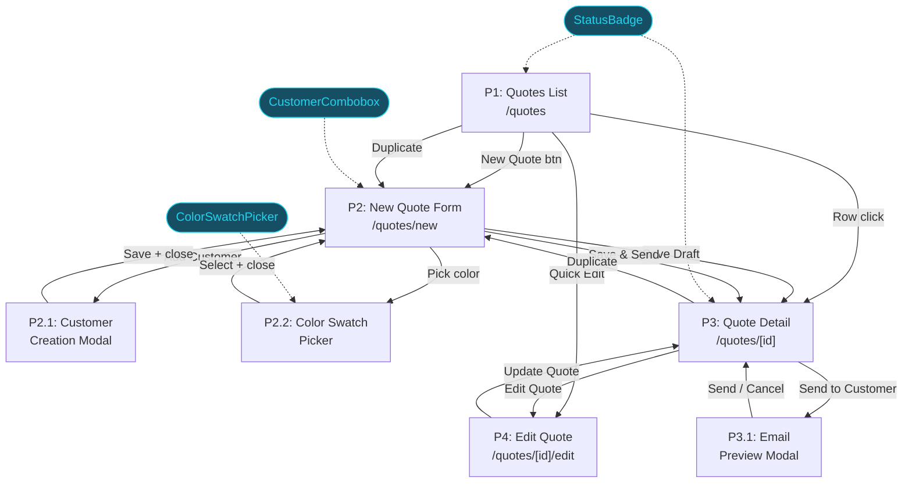
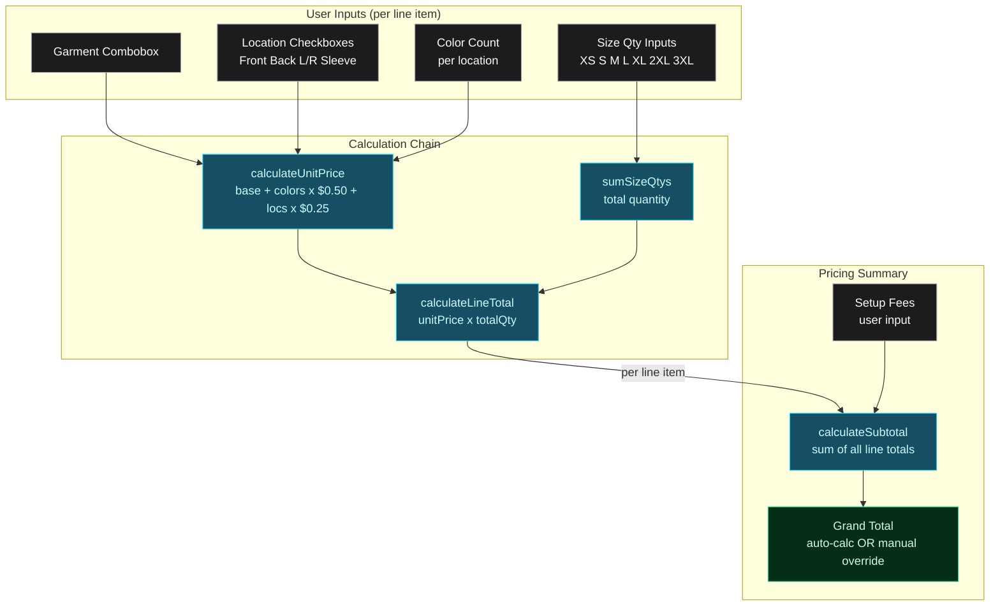

# Quoting — Breadboard

**Purpose**: Map all UI affordances, code affordances, and wiring for the Quoting vertical before building
**Input**: Scope definition, improved journey design, APP_FLOW, S&S API reference, existing schemas
**Status**: Complete

---

## Schema Gaps (Pre-Build)

Before building, update these schemas to match discovery findings:

1. **`quote.ts`** — Status enum needs: `"draft" | "sent" | "accepted" | "declined" | "revised"` (currently has `"approved" | "rejected"`). Line item schema needs: `garmentId`, `colorId`, `sizes` record, `printLocations` array, `colorsPerLocation`. Quote needs: `subtotal`, `priceOverride`, `internalNotes`, `customerNotes`, `updatedAt`, `sentAt`.
2. **New `color.ts`** — Mock color schema mirroring S&S API: `name`, `hex`, `hex2`, `swatchTextColor`, `family`, `isFavorite`.
3. **`garment.ts`** — Needs `id`, `basePrice`, `availableColors`, `availableSizes` with `sizeOrder` and `priceAdjustment`. Current schema is per-job-instance; we need a catalog-style schema for the garment selector.
4. **`mock-data.ts`** — Expand with ~40 colors, 6+ garment styles, 6 quotes with full line items in new schema shape.

---

## Places

| ID | Place | Type | Entry Point | Description |
|----|-------|------|-------------|-------------|
| P1 | Quotes List | Page | `/quotes` sidebar link | Browse, filter, search, sort all quotes |
| P2 | New Quote Form | Page | `/quotes/new` via "New Quote" button (P1) | Single-page form with customer, line items, pricing, notes |
| P2.1 | Customer Creation Modal | Modal | "Add New Customer" link in customer combobox (P2) | Quick-add customer (name + email) |
| P2.2 | Color Swatch Picker | Popover | Color field click in line item (P2) | S&S-style dense grid with search + favorites |
| P3 | Quote Detail | Page | `/quotes/[id]` via row click (P1) or after save (P2) | Read-only quote view with action buttons |
| P3.1 | Email Preview Modal | Modal | "Send to Customer" button (P3) or auto-open after "Save & Send" (P2) | Mockup email preview with send button |
| P4 | Edit Quote Form | Page | `/quotes/[id]/edit` via "Edit Quote" (P3, Draft only) | Reuses P2 form component with pre-filled data |

**Blocking test**: P2.1 (modal overlay blocks form), P2.2 (popover blocks line item interaction), P3.1 (modal overlay blocks detail page). P4 is a separate route/page, not a Place within P3.

**Not Places** (local state within a Place): Notes accordion (P2), Artwork accordion (P2), dropdown menus (P1 quick actions), tooltips.

---

## Visual Overview

### Diagram 1: Places & Navigation Flow

How users move between the 7 Places. Pages are rectangular, modals/popovers are rounded. Shared components (dashed lines) feed into multiple Places.



### Diagram 2: New Quote Form — Pricing Data Flow

How user inputs flow through the calculation chain inside the New Quote Form (P2). Every calculation is instant and client-side — never blocks input.



---

## UI Affordances

### P1 — Quotes List

| ID | Affordance | Control | Wires Out | Returns To |
|----|------------|---------|-----------|------------|
| U1 | Status filter tabs (All / Draft / Sent / Accepted / Declined / Revised) | click | → N1 filterQuotes() | → S1 URL ?status, filtered table |
| U2 | Search input (quote # or customer name) | type | → N2 searchQuotes() | → S2 URL ?q, filtered table |
| U3 | "New Quote" button (primary CTA) | click | → navigate to P2 | |
| U4 | Column sort headers (Quote #, Customer, Status, Items, Total, Date) | click | → N3 sortQuotes() | → S3 sort state, sorted table |
| U5 | Quote row click | click | → navigate to P3 (`/quotes/[id]`) | |
| U6 | Quick action: Edit (Draft only) | click | → navigate to P4 (`/quotes/[id]/edit`) | |
| U7 | Quick action: Duplicate | click | → N4 duplicateQuote() | → navigate to P2 (pre-filled) |
| U8 | Quick action: Send (Draft only) | click | → N5 quickSendQuote() | → toast, update status badge |
| U9 | Quick action: View | click | → navigate to P3 | |
| U10 | Empty state "Create your first quote" link | click | → navigate to P2 | |
| U11 | Status badge per row (Draft/Sent/Accepted/Declined/Revised) | display | ← S4 quote.status | |

### P2 — New Quote Form

**Section 1: Customer**

| ID | Affordance | Control | Wires Out | Returns To |
|----|------------|---------|-----------|------------|
| U12 | Customer combobox (type-ahead search) | type | → N6 filterCustomers() | → dropdown options list |
| U13 | Customer combobox selection | select | → N7 selectCustomer() | → S5 selectedCustomer, customer info card |
| U14 | "Add New Customer" link (bottom of dropdown) | click | → open P2.1 | |
| U15 | Customer info card (name, company, email, past quote count) | display | ← S5 selectedCustomer | |

**Section 2: Line Items (repeatable)**

| ID | Affordance | Control | Wires Out | Returns To |
|----|------------|---------|-----------|------------|
| U16 | Garment combobox (search by brand/SKU/style) | type/select | → N8 filterGarments(), N9 selectGarment() | → S7 lineItem.garmentId, load colors for U17 |
| U17 | Color selector button (shows selected color swatch + name) | click | → open P2.2 for this line item | |
| U18 | Size qty inputs (XS, S, M, L, XL, 2XL, 3XL inline grid) | type | → N10 updateSizeQty() | → S7 sizes, total qty display, → N11 |
| U19 | Print location checkboxes (Front, Back, L Sleeve, R Sleeve, Neck Label) | toggle | → N12 updateLocations() | → S7 printLocations, → N11 |
| U20 | Color count per location input | type | → N13 updateColorCount() | → S7 colorsPerLocation, → N11 |
| U21 | Unit price display (per line) | display | ← N11 calculateLineTotal() | |
| U22 | Total qty display (per line, sum of sizes) | display | ← N10 updateSizeQty() | |
| U23 | Line total display (per line) | display | ← N11 calculateLineTotal() | |
| U24 | "Add Another Line Item" button | click | → N14 addLineItem() | → new row in S6 |
| U25 | "Remove" line item button (if >1 rows) | click | → N15 removeLineItem() | → remove from S6, → N16 |

**Section 3: Pricing Summary**

| ID | Affordance | Control | Wires Out | Returns To |
|----|------------|---------|-----------|------------|
| U26 | Subtotal display (read-only, sum of line totals) | display | ← N16 calculateSubtotal() | |
| U27 | Setup fees input | type | → N17 updateSetupFees() | → S8, → N16 |
| U28 | Grand total (editable for price override) | type | → N18 overrideTotal() | → S9 grandTotal, S10 override flag |
| U29 | "Price adjusted from $X" indicator (conditional) | display | ← S10 priceOverride flag | |

**Section 4: Notes (collapsed accordion)**

| ID | Affordance | Control | Wires Out | Returns To |
|----|------------|---------|-----------|------------|
| U30 | Notes accordion toggle | toggle | → local expand/collapse | |
| U31 | Internal notes textarea | type | → N19 updateNotes('internal') | → S11 |
| U32 | Customer notes textarea | type | → N19 updateNotes('customer') | → S12 |

**Section 5: Artwork (collapsed accordion, PERIPHERAL)**

| ID | Affordance | Control | Wires Out | Returns To |
|----|------------|---------|-----------|------------|
| U33 | Artwork accordion toggle | toggle | → local expand/collapse | |
| U34 | Artwork drag-drop zone (placeholder) | — | → shows "Upload coming in Phase 2" placeholder | |

**Actions**

| ID | Affordance | Control | Wires Out | Returns To |
|----|------------|---------|-----------|------------|
| U35 | "Save as Draft" button (secondary) | click | → N20 saveQuote('draft') | → navigate to P3, toast |
| U36 | "Save & Send to Customer" button (primary CTA, neobrutalist shadow) | click | → N21 saveAndSend() | → navigate to P3 (auto-open P3.1) |
| U37 | "Cancel" text link | click | → navigate to P1 | |
| U38 | Inline validation error messages | display | ← N22 validateForm() | |

### P2.1 — Customer Creation Modal

| ID | Affordance | Control | Wires Out | Returns To |
|----|------------|---------|-----------|------------|
| U39 | Name input | type | | → S13 newCustomer.name |
| U40 | Email input | type | | → S13 newCustomer.email |
| U41 | "Save Customer" button | click | → N23 saveNewCustomer() | → add to S15, auto-select in U12, close P2.1 |
| U42 | "Cancel" / close button | click | → close P2.1 | → return to P2 |

### P2.2 — Color Swatch Picker

| ID | Affordance | Control | Wires Out | Returns To |
|----|------------|---------|-----------|------------|
| U43 | Search/filter input | type | → N24 filterColors() | → filtered swatch grid |
| U44 | Favorites row (starred colors at top) | click | → N25 selectColor() | → S7 lineItem.colorId, close P2.2 |
| U45 | Color swatch grid (dense ~32-40px squares, color name overlaid) | click | → N25 selectColor() | → S7 lineItem.colorId, close P2.2 |
| U46 | Favorite star toggle per swatch | click | → N26 toggleFavorite() | → S14 favorites |
| U47 | Selected checkmark overlay | display | ← S7 lineItem.colorId match | |

### P3 — Quote Detail

| ID | Affordance | Control | Wires Out | Returns To |
|----|------------|---------|-----------|------------|
| U48 | Quote header (Quote #, status badge, date) | display | ← S18 quote data | |
| U49 | Customer name link | click | → navigate to `/customers/[customerId]` | |
| U50 | Line items table (garment, color swatch, qty, locations, unit price, total) | display | ← S18 quote.lineItems | |
| U51 | Totals section (subtotal, setup fees, grand total, override indicator) | display | ← S18 quote totals | |
| U52 | Internal notes display | display | ← S18 quote.internalNotes | |
| U53 | Customer notes display | display | ← S18 quote.customerNotes | |
| U54 | "Edit Quote" button (visible only if Draft) | click | → navigate to P4 | |
| U55 | "Duplicate Quote" button | click | → N27 duplicateQuote() | → navigate to P2 (pre-filled) |
| U56 | "Send to Customer" button (visible only if Draft) | click | → open P3.1 | |
| U57 | "Convert to Invoice" button (non-functional) | click | → N28 showPhase2Toast('invoice') | → toast |
| U58 | "Download PDF" button (non-functional) | click | → N28 showPhase2Toast('pdf') | → toast |
| U59 | Breadcrumb: Dashboard > Quotes > Q-XXXX | click | → navigate to P1 or Dashboard | |
| U60 | Back link to `/quotes` | click | → navigate to P1 | |

### P3.1 — Email Preview Modal

| ID | Affordance | Control | Wires Out | Returns To |
|----|------------|---------|-----------|------------|
| U61 | Email preview (To, Subject, Body with quote summary + portal link) | display | ← S18 quote + customer data | |
| U62 | "Send Email" button | click | → N29 mockSendEmail() | → toast "Email sent", update status to Sent, close P3.1 |
| U63 | "Cancel" / close button | click | → close P3.1 | → return to P3 |

### P4 — Edit Quote Form

Reuses the exact same form component as P2 with these differences:

| ID | Affordance | Control | Wires Out | Returns To |
|----|------------|---------|-----------|------------|
| — | All P2 affordances (U12-U38) | — | — | Pre-filled from existing quote data |
| U64 | "Update Quote" button (replaces U35 "Save as Draft") | click | → N30 updateQuote() | → navigate to P3, toast |
| U65 | Page title: "Edit Quote Q-XXXX" (replaces "New Quote") | display | ← route param quote number | |

---

## Code Affordances

| ID | Place | Affordance | Phase | Trigger | Wires Out | Returns To |
|----|-------|------------|-------|---------|-----------|------------|
| N1 | P1 | filterQuotes(status) | 1 | U1 tab click | → update S1 URL param | → re-render filtered rows |
| N2 | P1 | searchQuotes(query) | 1 | U2 type (debounced) | → update S2 URL param | → re-render filtered rows |
| N3 | P1 | sortQuotes(column, dir) | 1 | U4 header click | → update S3 sort state | → re-render sorted rows |
| N4 | P1 | duplicateQuote(quoteId) | 1 | U7 click | → copy line items/customer into form state | → navigate to P2 pre-filled |
| N5 | P1 | quickSendQuote(quoteId) | 1 | U8 click | → update quote.status in S4 | → toast notification |
| N6 | P2 | filterCustomers(query) | 1 | U12 type | → filter S15 by name/company | → combobox dropdown options |
| N7 | P2 | selectCustomer(customerId) | 1 | U13 select | → set S5 | → render customer info card |
| N8 | P2 | filterGarments(query) | 1 | U16 type | → filter S16 by brand/sku/style | → combobox dropdown options |
| N9 | P2 | selectGarment(garmentId, lineIdx) | 1 | U16 select | → set S7.garmentId, load available colors | → enable U17 color selector |
| N10 | P2 | updateSizeQty(lineIdx, size, qty) | 1 | U18 type | → update S7.sizes, compute total qty | → U22 total qty, trigger N11 |
| N11 | P2 | calculateLineTotal(lineIdx) | 1 | N10, N12, N13, N9 | → unitPrice = N32 result × totalQty | → U21, U23 display, trigger N16 |
| N12 | P2 | updateLocations(lineIdx, locations[]) | 1 | U19 toggle | → update S7.printLocations | → trigger N11 |
| N13 | P2 | updateColorCount(lineIdx, count) | 1 | U20 type | → update S7.colorsPerLocation | → trigger N11 |
| N14 | P2 | addLineItem() | 1 | U24 click | → append empty item to S6 | → render new row |
| N15 | P2 | removeLineItem(lineIdx) | 1 | U25 click | → splice from S6 | → trigger N16 |
| N16 | P2 | calculateSubtotal() | 1 | N11, N14, N15, N17 | → sum line totals + S8 setup fees | → U26, U28 (if not overridden) |
| N17 | P2 | updateSetupFees(amount) | 1 | U27 type | → set S8 | → trigger N16 |
| N18 | P2 | overrideTotal(amount) | 1 | U28 type | → set S9 override value, S10 flag | → U29 "adjusted from" indicator |
| N19 | P2 | updateNotes(type, text) | 1 | U31, U32 type | → set S11 or S12 | |
| N20 | P2 | saveQuote(status='draft') | 1 | U35 click | → N22 validate, add to S4 | → navigate to P3, toast |
| N21 | P2 | saveAndSend() | 1 | U36 click | → N22 validate, add to S4 as 'sent' | → navigate to P3, auto-open P3.1 |
| N22 | P2 | validateForm() | 1 | N20, N21 (before save) | → check required: customer, ≥1 line item, garment+qty per line | → U38 errors or proceed |
| N23 | P2.1 | saveNewCustomer(data) | 1 | U41 click | → add to S15 mock customers | → auto-select in U12, close P2.1 |
| N24 | P2.2 | filterColors(query) | 1 | U43 type | → filter S17 by name/family | → render filtered grid |
| N25 | P2.2 | selectColor(colorId) | 1 | U44, U45 click | → set S7.colorId for current line | → update U17 display, close P2.2 |
| N26 | P2.2 | toggleFavorite(colorId) | 1 | U46 click | → toggle in S14 | → re-render favorites row |
| N27 | P3 | duplicateQuote(quoteId) | 1 | U55 click | → copy quote data into form state | → navigate to P2 pre-filled |
| N28 | P3 | showPhase2Toast(feature) | 1 | U57, U58 click | → show toast "[feature] coming in Phase 2" | |
| N29 | P3.1 | mockSendEmail(quoteId) | 1 | U62 click | → update quote.status='sent' in S4 | → toast, close P3.1 |
| N30 | P4 | updateQuote(quoteId, data) | 1 | U64 click | → N22 validate, update existing in S4 | → navigate to P3, toast |
| N31 | P2 | loadQuoteForEdit(quoteId) | 1 | P4 mount | → read from S4 by ID | → pre-fill all form fields |
| N32 | P2 | calculateUnitPrice(garment, colors, locations) | 1 | N9, N12, N13 | → `basePrice + (colors × 0.50) + (locations × 0.25)` | → feed into N11 |

**Phase 2 extensions**: N20/N21 become server actions. N23 calls API. N29 sends real email. N32 reads from pricing matrix DB. New affordances for real-time inventory (N33), PDF generation (N34), customer portal auth (N35).

---

## Data Stores

| ID | Place | Store | Type | Read By | Written By |
|----|-------|-------|------|---------|------------|
| S1 | P1 | `?status` URL param | URL state | N1, U1 active tab rendering | U1 click → N1 |
| S2 | P1 | `?q` URL param (search) | URL state | N2, U2 input value | U2 type → N2 |
| S3 | P1 | Sort column + direction | React state | N3, table header indicators | U4 click → N3 |
| S4 | Global | Quotes array (mock data) | Mock data (import, mutated client-side) | P1 table, P3 detail, N4, N27 | N5, N20, N21, N29, N30 |
| S5 | P2 | Selected customer | React state | U15 info card, N20/N21 save | U13 select → N7, U41 → N23 |
| S6 | P2 | Line items array | React state (array of S7) | N16, all line item UIs | N14 add, N15 remove |
| S7 | P2 | Line item fields: `{ garmentId, colorId, sizes, printLocations, colorsPerLocation }` | React state (nested in S6) | N11, N32, line item displays | U16-U20 changes, N25 color select |
| S8 | P2 | Setup fees (number) | React state | N16, U27 display | U27 type → N17 |
| S9 | P2 | Grand total (computed or overridden) | React state | U28 display | N16 auto-calc, U28 type → N18 |
| S10 | P2 | Price override flag + original total | React state | U29 conditional indicator | N18 set flag, N16 clear flag on recalc |
| S11 | P2 | Internal notes (string) | React state | U31, N20/N21 | U31 type → N19 |
| S12 | P2 | Customer notes (string) | React state | U32, N20/N21 | U32 type → N19 |
| S13 | P2.1 | New customer form `{ name, email }` | React state (local) | U39-U40 inputs, N23 | U39, U40 type |
| S14 | Global | Favorite color IDs | React state (or localStorage) | U44 favorites row, N24 filter | U46 → N26 |
| S15 | Global | Customers array (mock data) | Mock data (import) | N6 filter, U12 dropdown | N23 add new |
| S16 | Global | Garment styles array (mock data) | Mock data (import, read-only) | N8 filter, U16 dropdown | — |
| S17 | Global | Colors array (mock data) | Mock data (import, read-only) | N24 filter, U44/U45 render | — |
| S18 | P3 | Current quote (derived) | Derived from S4 by route `[id]` | All P3/P3.1 displays | — |

---

## Wiring Verification

- [x] Every interactive U has at least one Wires Out or Returns To
- [x] Every N has a trigger (from a U or another N)
- [x] Every S has at least one reader and one writer (S16, S17 are read-only mock data — acceptable for Phase 1)
- [x] Every "Wires Out" target exists in the tables
- [x] Every "Returns To" target exists in the tables
- [x] No orphan affordances
- [x] Every CORE feature from scope definition has corresponding affordances (see Scope Coverage below)

**Cross-Place wiring**:
- P2.1 → P2: N23 saves customer, auto-selects in U12 (S5), closes P2.1
- P2.2 → P2: N25 sets color in S7, updates U17 display, closes P2.2
- P2 → P3: N20 saves quote (S4), navigates to P3
- P2 → P3 → P3.1: N21 saves quote, navigates to P3, auto-opens P3.1
- P3 → P2: N27 copies quote data, navigates to P2 (pre-filled via URL/state)
- P3 → P4: U54 navigates to edit route (P4 loads from S4 via N31)
- P1 → P2: N4 copies quote data, navigates to P2 (pre-filled)

---

## Component Boundaries

| Component | Place(s) | Contains Affordances | Location | Shared? |
|-----------|----------|---------------------|----------|---------|
| **ColorSwatchPicker** | P2.2 | U43-U47, N24-N26, S14, S17 | `components/features/ColorSwatchPicker.tsx` | Yes — reusable for garment catalog, job creation |
| **CustomerCombobox** | P2, P4 | U12-U14, N6-N7, S5, S15 | `components/features/CustomerCombobox.tsx` | Yes — reusable for invoicing, job creation |
| **QuoteForm** | P2, P4 | U16-U38, N8-N22, N32, S6-S12 | `app/(dashboard)/quotes/_components/QuoteForm.tsx` | No — quote-specific, but shared between new + edit |
| **LineItemRow** | P2, P4 | U16-U23 per row, N9-N13 | `app/(dashboard)/quotes/_components/LineItemRow.tsx` | No — quote-specific |
| **PricingSummary** | P2, P4 | U26-U29, N16-N18, S8-S10 | `app/(dashboard)/quotes/_components/PricingSummary.tsx` | No — quote-specific |
| **CustomerCreateModal** | P2.1 | U39-U42, N23, S13 | `app/(dashboard)/quotes/_components/CustomerCreateModal.tsx` | No — could promote to shared in Customer Management vertical |
| **QuotesDataTable** | P1 | U1-U11, N1-N5, S1-S4 | `app/(dashboard)/quotes/_components/QuotesDataTable.tsx` | Extends shared DataTable pattern |
| **QuoteDetailView** | P3 | U48-U60, N27-N28, S18 | `app/(dashboard)/quotes/[id]/page.tsx` | No — quote-specific |
| **EmailPreviewModal** | P3.1 | U61-U63, N29 | `app/(dashboard)/quotes/_components/EmailPreviewModal.tsx` | No — quote-specific |
| **StatusBadge** | P1, P3 | U11, U48 | `components/features/StatusBadge.tsx` | Yes — reusable for jobs, invoices |

**File structure**:
```
components/features/
  ColorSwatchPicker.tsx      ← shared, reusable
  CustomerCombobox.tsx       ← shared, reusable
  StatusBadge.tsx            ← shared, reusable

app/(dashboard)/quotes/
  page.tsx                   ← P1: Quotes List
  new/
    page.tsx                 ← P2: New Quote Form
  [id]/
    page.tsx                 ← P3: Quote Detail
    edit/
      page.tsx               ← P4: Edit Quote Form
  _components/
    QuoteForm.tsx            ← shared form for P2 + P4
    LineItemRow.tsx           ← single line item with garment/color/sizes/locations
    PricingSummary.tsx        ← subtotal/fees/total with override
    CustomerCreateModal.tsx   ← quick-add customer
    QuotesDataTable.tsx       ← quotes table with filters/search/sort
    EmailPreviewModal.tsx     ← send quote email mockup
```

---

## Build Order

| # | Component/Screen | Depends On | Blocks | Est. Complexity |
|---|-----------------|------------|--------|-----------------|
| 1 | Schema updates (quote.ts, new color.ts, garment.ts catalog variant) | — | All build items | Low |
| 2 | Mock data expansion (40 colors, 6+ garments, 6 quotes with new line item shape) | Step 1 schemas | All UI components | Medium |
| 3a | ColorSwatchPicker (shared component) | Step 2 mock colors | Step 6 (QuoteForm) | Medium |
| 3b | CustomerCombobox (shared component) | Existing mock customers | Step 6 (QuoteForm) | Low |
| 3c | StatusBadge (shared component) | Step 1 status enum | Steps 5, 7 | Low |
| 4 | Quotes List page (P1) | Steps 2, 3c | — | Medium |
| 5 | QuoteForm + LineItemRow + PricingSummary | Steps 3a, 3b | Steps 6, 7, 8 | High |
| 6 | New Quote Form page (P2 + P2.1) | Step 5 (QuoteForm) | — | Medium |
| 7 | Quote Detail page (P3) + EmailPreviewModal (P3.1) | Steps 2, 3c | Step 8 | Medium |
| 8 | Edit Quote Form page (P4) | Steps 5, 7 | — | Low (reuses QuoteForm) |

**Parallelization**: Steps 3a, 3b, 3c can run in parallel. Step 4 can run in parallel with step 5 (after steps 2 + 3c are done). Steps 6, 7 can run in parallel (after step 5 is done).

**Critical path**: 1 → 2 → 3a → 5 → 6 (New Quote Form is highest complexity, longest chain)

---

## Scope Coverage

| Scope Feature | Category | Affordances | Covered? |
|---------------|----------|-------------|----------|
| Quotes List with DataTable | CORE | U1-U11, N1-N5, S1-S4 | Yes |
| Search by quote # or customer | CORE | U2, N2, S2 | Yes |
| Filter by status | CORE | U1, N1, S1 | Yes |
| Sort by columns | CORE | U4, N3, S3 | Yes |
| Quick actions (Edit/Duplicate/Send/View) | CORE | U6-U9, N4-N5 | Yes |
| "Duplicate Quote" | CORE | U7, U55, N4, N27 | Yes |
| Quote Detail with line items + totals | CORE | U48-U53, S18 | Yes |
| Edit Quote (Draft only) | CORE | U54, P4, N30-N31 | Yes |
| New Quote Form (single-page) | CORE | U12-U38, P2 | Yes |
| Customer combobox (type-ahead) | CORE | U12-U13, N6-N7 | Yes |
| S&S-style color swatch grid | CORE | U43-U47, N24-N26, P2.2 | Yes |
| Size breakdown (qty per size) | CORE | U18, N10 | Yes |
| Print locations (checkboxes) | CORE | U19, N12 | Yes |
| Instant client-side pricing | CORE | N11, N16, N32 | Yes |
| Price override (editable grand total) | CORE | U28, N18, S9-S10 | Yes |
| Internal + customer notes | CORE | U31-U32, N19, S11-S12 | Yes |
| "Save as Draft" | CORE | U35, N20 | Yes |
| "Save & Send to Customer" | CORE | U36, N21 | Yes |
| Status badges (Draft/Sent/Accepted/Declined/Revised) | CORE | U11, U48, StatusBadge component | Yes |
| Empty state | CORE | U10 | Yes |
| Customer Creation Modal | PERIPHERAL | U39-U42, N23, P2.1 | Yes |
| Artwork upload area (placeholder) | PERIPHERAL | U33-U34 | Yes |
| "Download PDF" (non-functional) | PERIPHERAL | U58, N28 | Yes |
| Email Preview Modal | PERIPHERAL | U61-U63, N29, P3.1 | Yes |
| "Convert to Invoice" (non-functional) | INTERCONNECTION | U57, N28 | Yes |
| Pricing formula (hard-coded) | INTERCONNECTION | N32 | Yes |
| Customer link to customer detail | INTERCONNECTION | U49 | Yes |

---

## Phase 2 Extensions

Code affordances that will be added/replaced in Phase 2:

| ID | Place | Affordance | Replaces | Description |
|----|-------|------------|----------|-------------|
| N33 | P2 | fetchInventory(garmentId, colorId) | — (new) | Real-time stock levels from S&S API per size/color |
| N34 | P3 | generatePDF(quoteId) | N28 toast | Actual PDF generation (react-pdf or pdfkit) |
| N35 | P3.1 | sendRealEmail(quoteId) | N29 mock | Send via SMTP/email service (Resend, SendGrid) |
| N36 | — | Customer portal auth | — (new) | Customer login, quote view, accept/decline flow |
| N37 | P2 | calculateFromPricingMatrix(params) | N32 hard-coded | Read pricing rules from database |
| N38 | P2 | autoSaveDraft() | — (new) | Periodic auto-save to prevent data loss |
| N39 | P2 | processArtworkUpload(file) | U34 placeholder | Real file upload to storage (S3/R2) |

---

## Related Documents

- `docs/strategy/quoting-scope-definition.md` (scope boundaries)
- `docs/strategy/screen-print-pro-journey-quoting.md` (improved journey)
- `docs/reference/ss-activewear-api-reference.md` (S&S API field shapes for mock data)
- `docs/APP_FLOW.md` (routes and navigation)
- `CLAUDE.md` (design system, quality checklist)
