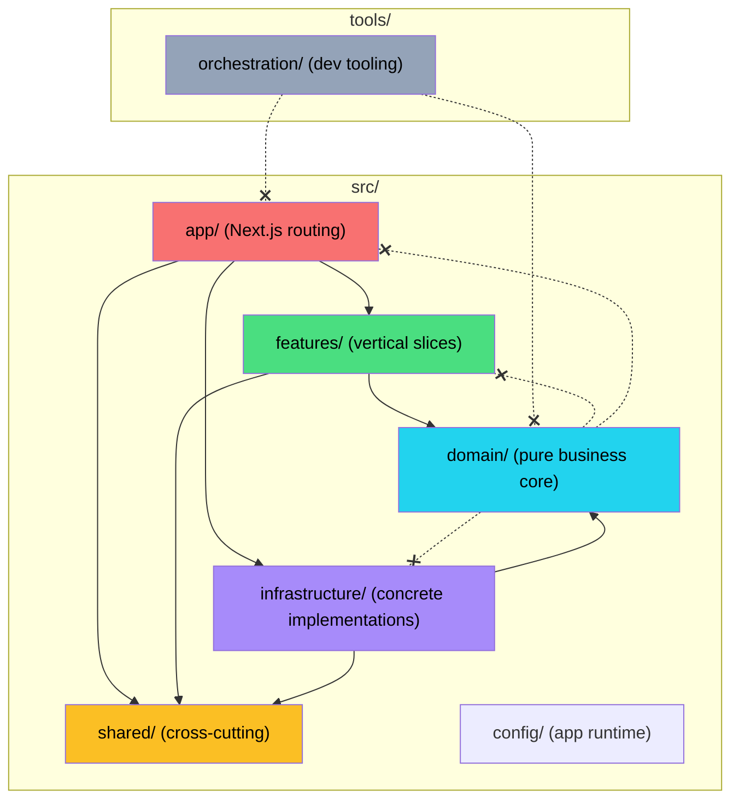

# Clean Architecture Migration — Implementation Plan

> **For Claude:** REQUIRED SUB-SKILL: Use superpowers:executing-plans to implement this plan task-by-task.

**Goal:** Migrate from flat `lib/` structure to Clean Architecture (DDD + vertical slices) under `src/`, separated from dev tooling in `tools/`.

**Architecture:** 5 sequential PRs (Phase 0–4), each passing CI independently. Additive path alias strategy — new aliases added alongside existing `@/*` during migration, then `@/*` re-pointed to `./src/*` in final phase. Import rewrites use `find + sed` in batch per move category.

**Tech Stack:** Next.js 16, TypeScript, Vitest, ESLint, `git mv` for history-preserving moves.

**Design Doc:** `docs/plans/2026-02-17-clean-architecture-migration-design.md`

**Epic:** #434

**Scope:** ~280 TS/TSX files + 30 JSON configs, ~1,229 import statements across 248 files.

---

## Migration Strategy: Additive Aliases

The current `@/*` maps to `./*` (project root). We cannot change it to `./src/*` until all files are moved. Strategy:

1. **Phase 0:** Add new layer-specific aliases (`@domain/*`, `@shared/*`, etc.) alongside existing `@/*`
2. **Phases 1–3:** Move files with `git mv`, rewrite imports to use new aliases
3. **Phase 4 (final):** Re-point `@/*` from `./*` to `./src/*`, rewrite remaining `@/` imports, delete old dirs

Each phase ends with `tsc --noEmit && npm test && npm run build` — zero regressions.

### Import Rewrite Script Pattern

Every move batch follows this pattern:

```bash
# 1. Move files (preserves git history)
git mv old/path/ new/path/

# 2. Rewrite imports (all .ts/.tsx files)
find src/ -name '*.ts' -o -name '*.tsx' | xargs sed -i '' 's|@/old/path/|@new/path/|g'

# 3. Verify
npx tsc --noEmit
```

For large batches, the plan provides exact sed commands. Always run `tsc --noEmit` after each batch — don't accumulate broken imports.

---

## Phase 0: Scaffold `src/` + Path Aliases (PR #1 — Issue #435)

**Effort:** ~1 hour. No file moves — just create empty directories and configure aliases.

### Task 0.1: Create directory skeleton

**Files:**
- Create: `src/domain/entities/`, `src/domain/value-objects/`, `src/domain/rules/`, `src/domain/services/`, `src/domain/ports/`, `src/domain/events/`, `src/domain/constants/`
- Create: `src/features/quotes/`, `src/features/jobs/`, `src/features/customers/`, `src/features/invoices/`, `src/features/garments/`, `src/features/screens/`, `src/features/pricing/`
- Create: `src/shared/ui/atoms/`, `src/shared/ui/molecules/`, `src/shared/ui/organisms/`, `src/shared/ui/layouts/`, `src/shared/ui/primitives/`, `src/shared/hooks/`, `src/shared/lib/`, `src/shared/types/`, `src/shared/providers/`, `src/shared/constants/`
- Create: `src/infrastructure/repositories/_providers/mock/`, `src/infrastructure/repositories/_providers/supabase/`, `src/infrastructure/repositories/_shared/`, `src/infrastructure/auth/`, `src/infrastructure/adapters/`
- Create: `src/config/schemas/`
- Create: `tools/orchestration/config/`, `tools/orchestration/review/`, `tools/orchestration/scripts/`, `tools/orchestration/schemas/`

**Step 1: Create all directories**

```bash
mkdir -p src/{domain/{entities,value-objects,rules,services,ports,events,constants},features/{quotes,jobs,customers,invoices,garments,screens,pricing}/{components,hooks,use-cases,dtos,tests},shared/{ui/{atoms,molecules,organisms,layouts,primitives},hooks,lib,types,providers,constants},infrastructure/{repositories/{_providers/{mock,supabase},_shared},auth,adapters},config/schemas}
mkdir -p tools/orchestration/{config,review,scripts,schemas}
```

**Step 2: Add .gitkeep to empty directories**

```bash
find src/ tools/orchestration/ -type d -empty -exec touch {}/.gitkeep \;
```

**Step 3: Snapshot the structure for reference**

```bash
tree src/ tools/orchestration/ > phase0-structure.txt
```

**Step 4: Commit**

```bash
git add src/ tools/ phase0-structure.txt
git commit -m "chore: scaffold src/ and tools/ directory skeleton for Clean Architecture migration"
```

### Task 0.2: Add path aliases to tsconfig.json

**Files:**
- Modify: `tsconfig.json`

**Step 1: Update tsconfig.json paths**

Add new layer-specific aliases. Keep existing `@/*` mapping to `./*` for backward compatibility.

```jsonc
{
  "compilerOptions": {
    // ... existing options ...
    "paths": {
      "@/*": ["./*"],
      "@domain/*": ["./src/domain/*"],
      "@features/*": ["./src/features/*"],
      "@shared/*": ["./src/shared/*"],
      "@infra/*": ["./src/infrastructure/*"],
      "@config/*": ["./src/config/*"]
    }
  }
}
```

**Step 2: Verify TypeScript resolves new aliases**

Quick smoke test — create a dummy file that uses a new alias, verify it compiles, then delete it:

```bash
echo "import { z } from 'zod'; export const dummy = z.string();" > src/domain/dummy.ts
npx tsc --noEmit
rm src/domain/dummy.ts
```

If the dummy compiles → aliases are working. Then verify existing code is still clean:

```bash
npx tsc --noEmit
```

Expected: PASS (no real files use new aliases yet, so nothing to break).

**Step 3: Commit**

```bash
git add tsconfig.json
git commit -m "chore: add layer-specific path aliases for Clean Architecture"
```

### Task 0.3: Update vitest.config.ts aliases

**Files:**
- Modify: `vitest.config.ts`

**Step 1: Add matching aliases to Vitest**

```typescript
import { defineConfig } from "vitest/config";
import path from "path";

export default defineConfig({
  test: {
    globals: true,
  },
  resolve: {
    alias: {
      "@": path.resolve(__dirname, "."),
      "@domain": path.resolve(__dirname, "src/domain"),
      "@features": path.resolve(__dirname, "src/features"),
      "@shared": path.resolve(__dirname, "src/shared"),
      "@infra": path.resolve(__dirname, "src/infrastructure"),
      "@config": path.resolve(__dirname, "src/config"),
    },
  },
});
```

**Step 2: Verify tests still pass**

```bash
npm test
```

Expected: All 529 tests pass.

**Step 3: Commit**

```bash
git add vitest.config.ts
git commit -m "chore: add layer-specific aliases to vitest config"
```

### Task 0.4: Push and open PR

```bash
git push -u origin session/0217-phase0-scaffold
gh pr create --title "chore: Phase 0 — scaffold src/ + path aliases (#435)" --body "$(cat <<'EOF'
## Summary
- Create directory skeleton under `src/` and `tools/orchestration/`
- Add layer-specific path aliases (`@domain/*`, `@shared/*`, `@infra/*`, `@features/*`, `@config/*`)
- Backward-compatible: existing `@/*` still maps to root

## Validates
- `tsc --noEmit` passes
- All 529 tests pass
- No file moves — directories only

Part of Epic #434 (Clean Architecture Migration), closes #435.

🤖 Generated with [Claude Code](https://claude.com/claude-code)
EOF
)"
```

---

## Phase 1: App + Infrastructure (PR #2 — Issue #436)

**Effort:** Half day. Move Next.js routing and data access layer.

**Pre-flight:** Merge Phase 0 PR first. Start a new worktree from `main`.

### Task 1.1: Move `app/` → `src/app/`

**Files:**
- Move: `app/` → `src/app/` (134 TSX files)
- Modify: `middleware.ts` (stays at root, update imports if needed)

**Step 1: Move the app directory**

```bash
git mv app/ src/app/
```

Next.js 16 auto-detects `src/app/` — no config change needed.

**Step 2: Verify dev server starts**

```bash
npm run dev
# Visit http://localhost:3000 — should render dashboard
```

**Step 3: Verify build**

```bash
npx tsc --noEmit && npm run build
```

Expected: PASS. Next.js finds `src/app/` automatically. Imports within `app/` use relative paths (`./_components/...`) so they still resolve.

**Step 4: Check middleware**

`middleware.ts` stays at root (Next.js requirement). It has no `@/` imports, so no changes needed.

**Step 5: Commit**

```bash
git add -A
git commit -m "refactor: move app/ → src/app/"
```

### Task 1.2: Move `lib/dal/_shared/` → `src/infrastructure/repositories/_shared/`

**Files:**
- Move: `lib/dal/_shared/errors.ts`, `lib/dal/_shared/result.ts`, `lib/dal/_shared/validation.ts`

**Step 1: Move files**

```bash
git mv lib/dal/_shared/errors.ts src/infrastructure/repositories/_shared/errors.ts
git mv lib/dal/_shared/result.ts src/infrastructure/repositories/_shared/result.ts
git mv lib/dal/_shared/validation.ts src/infrastructure/repositories/_shared/validation.ts
```

**Step 2: Update internal imports**

The mock providers import from `@/lib/dal/_shared/validation`. Update:

```bash
# Find all files importing from @/lib/dal/_shared/
grep -rl "@/lib/dal/_shared/" --include="*.ts" --include="*.tsx" . | xargs sed -i '' 's|@/lib/dal/_shared/|@infra/repositories/_shared/|g'
```

**Step 3: Verify**

```bash
npx tsc --noEmit
```

**Step 4: Commit**

```bash
git add -A
git commit -m "refactor: move DAL shared (errors, result, validation) → infrastructure/repositories/_shared/"
```

### Task 1.3: Move `lib/dal/_providers/` → `src/infrastructure/repositories/_providers/`

**Files:**
- Move: `lib/dal/_providers/index.ts` and all `lib/dal/_providers/mock/*.ts` (10 files)

**Step 1: Move provider files**

```bash
git mv lib/dal/_providers/index.ts src/infrastructure/repositories/_providers/index.ts
git mv lib/dal/_providers/mock/ src/infrastructure/repositories/_providers/mock/
```

**Step 2: Update internal imports**

Mock providers import from `@/lib/mock-data`, `@/lib/schemas/*`, and `@/lib/dal/_shared/*`. The `_shared` was already moved. Schema imports will be updated in Phase 2. For now, keep `@/lib/schemas/*` imports (they still resolve via the root `@/*` alias).

Update the DAL shared import that was just moved:

```bash
grep -rl "@/lib/dal/_providers/" --include="*.ts" --include="*.tsx" . | xargs sed -i '' 's|@/lib/dal/_providers/|@infra/repositories/_providers/|g'
```

**Step 3: Verify**

```bash
npx tsc --noEmit
```

**Step 4: Commit**

```bash
git add -A
git commit -m "refactor: move DAL providers → infrastructure/repositories/_providers/"
```

### Task 1.4: Move DAL repository facades → `src/infrastructure/repositories/`

**Files:**
- Move: `lib/dal/customers.ts`, `lib/dal/quotes.ts`, `lib/dal/jobs.ts`, `lib/dal/invoices.ts`, `lib/dal/garments.ts`, `lib/dal/screens.ts`, `lib/dal/artworks.ts`, `lib/dal/colors.ts`, `lib/dal/settings.ts`

**Step 1: Move repository files**

```bash
for f in customers quotes jobs invoices garments screens artworks colors settings; do
  git mv "lib/dal/${f}.ts" "src/infrastructure/repositories/${f}.ts"
done
```

**Step 2: Update internal imports in repository files**

These files re-export from `_providers/mock/...`. Update the relative import paths:

```bash
# Repository files re-export from './_providers/mock/...' — relative paths still work after move
# But they may also use @/lib/dal/_providers — already updated in Task 1.3
```

**Step 3: Update ALL consumers of `@/lib/dal/`**

This is the big rewrite. Every route page imports from `@/lib/dal/{domain}`.

```bash
grep -rl "@/lib/dal/" --include="*.ts" --include="*.tsx" . | xargs sed -i '' 's|@/lib/dal/|@infra/repositories/|g'
```

**Step 4: Verify**

```bash
npx tsc --noEmit
```

**Step 5: Commit**

```bash
git add -A
git commit -m "refactor: move DAL repositories → infrastructure/repositories/ and update all consumers"
```

### Task 1.5: Move DAL tests → `src/infrastructure/repositories/__tests__/`

**Files:**
- Move: `lib/dal/__tests__/*.test.ts` (4 test files)

**Step 1: Move test files**

```bash
git mv lib/dal/__tests__/ src/infrastructure/repositories/__tests__/
```

**Step 2: Update test imports**

```bash
grep -rl "@/lib/dal/" --include="*.test.ts" src/infrastructure/ | xargs sed -i '' 's|@/lib/dal/|@infra/repositories/|g'
```

**Step 3: Run tests**

```bash
npm test
```

Expected: All tests pass.

**Step 4: Commit**

```bash
git add -A
git commit -m "refactor: move DAL tests → infrastructure/repositories/__tests__/"
```

### Task 1.6: Move `lib/auth/` → `src/infrastructure/auth/`

**Files:**
- Move: `lib/auth/session.ts`

**Step 1: Move auth**

```bash
git mv lib/auth/session.ts src/infrastructure/auth/session.ts
```

**Step 2: Update consumers**

```bash
grep -rl "@/lib/auth/" --include="*.ts" --include="*.tsx" . | xargs sed -i '' 's|@/lib/auth/|@infra/auth/|g'
```

**Step 3: Verify**

```bash
npx tsc --noEmit
```

**Step 4: Commit**

```bash
git add -A
git commit -m "refactor: move auth → infrastructure/auth/"
```

### Task 1.7: Create `src/infrastructure/bootstrap.ts`

**Files:**
- Create: `src/infrastructure/bootstrap.ts`

**Step 1: Write minimal composition root**

```typescript
// src/infrastructure/bootstrap.ts
//
// Composition Root — wires domain ports to infrastructure implementations.
// Phase 1: All ports resolve to mock providers.
// Phase 2: env-based switch (process.env.DATA_PROVIDER === 'supabase' ? ... : mock).

// NOTE: Port interfaces (ICustomerRepository, etc.) will be defined in Phase 2
// when domain/ports/ is created. For now, this file documents the wiring pattern.

export { getCustomers, getCustomerById } from './repositories/customers';
export { getQuotes, getQuoteById } from './repositories/quotes';
export { getJobs, getJobById } from './repositories/jobs';
export { getInvoices, getInvoiceById } from './repositories/invoices';
export { getGarments } from './repositories/garments';
export { getScreens } from './repositories/screens';
export { getArtworks } from './repositories/artworks';
export { getColors } from './repositories/colors';
export { getSettings } from './repositories/settings';
```

> **Note:** This is deliberately minimal per user feedback. No DI container. Factory functions come in Phase 2 when ports are defined. For now, it's a re-export barrel that centralizes repository access.
>
> **Phase 2 evolution:** When ports exist, replace re-exports with real factories:
>
> ```typescript
> import { MockQuoteRepository } from './repositories/_providers/mock/quotes';
> import type { IQuoteRepository } from '@domain/ports/quote.repository';
>
> export function getQuoteRepository(): IQuoteRepository {
>   // Later: if (process.env.DATA_PROVIDER === 'supabase') return new SupabaseQuoteRepo();
>   return new MockQuoteRepository();
> }
> ```
>
> Then features/use-cases import from `@infra/bootstrap` instead of directly from repositories.

**Step 2: Verify**

```bash
npx tsc --noEmit
```

**Step 3: Commit**

```bash
git add src/infrastructure/bootstrap.ts
git commit -m "feat: add infrastructure/bootstrap.ts composition root stub"
```

### Task 1.8: Sweep for missed imports

Per user feedback — run a targeted grep to catch any remaining references to old paths:

**Step 1: Check for missed references**

```bash
# Check for any remaining @/lib/dal/ imports
grep -r "@/lib/dal/" --include="*.ts" --include="*.tsx" src/ | grep -v node_modules

# Check for any remaining @/lib/auth/ imports
grep -r "@/lib/auth/" --include="*.ts" --include="*.tsx" src/ | grep -v node_modules
```

Expected: Zero matches. If any found, fix them.

**Step 2: Generate proof-of-clean report**

```bash
grep -r "lib/dal" --include="*.ts" --include="*.tsx" src/ && echo "LEAK DETECTED" || echo "Clean — no lib/dal references in src/"
```

**Step 3: Full CI verification**

```bash
npx tsc --noEmit && npm test && npm run build
```

Expected: All pass.

**Step 4: Commit any fixes**

```bash
git add -A
git commit -m "fix: catch remaining old import paths after Phase 1 move"
```

### Task 1.9: Push and open PR

```bash
git push -u origin session/0217-phase1-app-infra
gh pr create --title "refactor: Phase 1 — move app/ + infrastructure (#436)" --body "$(cat <<'EOF'
## Summary
- Move `app/` → `src/app/` (Next.js auto-detects)
- Move `lib/dal/` → `src/infrastructure/repositories/`
- Move `lib/auth/` → `src/infrastructure/auth/`
- Create `src/infrastructure/bootstrap.ts` (minimal composition root)
- Update ~60 import paths across route pages and components

## Validates
- `tsc --noEmit` clean
- All 529 tests pass
- `npm run build` succeeds
- Dev server renders all 7 verticals

Part of Epic #434 (Clean Architecture Migration), closes #436.

🤖 Generated with [Claude Code](https://claude.com/claude-code)
EOF
)"
```

---

## Phase 2: Domain Extraction (PR #3 — Issue #437)

**Effort:** 1–2 days. Highest architectural payoff — extracting the pure domain layer.

**Pre-flight:** Merge Phase 1 PR first. Start a new worktree from `main`.

### Task 2.1: Move schemas → `src/domain/entities/`

**Files:**
- Move: `lib/schemas/*.ts` (25 schema files) → `src/domain/entities/`
- Move: `lib/schemas/__tests__/*.test.ts` (22 test files) → `src/domain/entities/__tests__/`

**Step 1: Move schema files**

```bash
for f in lib/schemas/*.ts; do
  filename=$(basename "$f")
  git mv "$f" "src/domain/entities/${filename}"
done

git mv lib/schemas/__tests__/ src/domain/entities/__tests__/
```

**Step 2: Rewrite all `@/lib/schemas/` imports**

This is the highest-volume rewrite (~22 occurrences in mock providers + many more in components/pages).

```bash
grep -rl "@/lib/schemas/" --include="*.ts" --include="*.tsx" . | xargs sed -i '' 's|@/lib/schemas/|@domain/entities/|g'
```

**Step 3: Verify**

```bash
npx tsc --noEmit
```

**Step 4: Run tests**

```bash
npm test
```

Expected: All pass.

**Step 5: Commit**

```bash
git add -A
git commit -m "refactor: move schemas → domain/entities/ and update all imports"
```

### Task 2.2: Move pricing engine → `src/domain/services/pricing.service.ts`

**Files:**
- Move: `lib/pricing-engine.ts` → `src/domain/services/pricing.service.ts`

**Step 1: Move file**

```bash
git mv lib/pricing-engine.ts src/domain/services/pricing.service.ts
```

**Step 2: Update internal imports in the file**

The pricing engine imports from `@/lib/schemas/*` (already rewritten to `@domain/entities/*` in Task 2.1) and `@/lib/helpers/money`. The money helper moves in Phase 3, so for now keep the `@/lib/helpers/money` import (still resolves via root `@/*`).

**Step 3: Update consumers**

```bash
grep -rl "@/lib/pricing-engine" --include="*.ts" --include="*.tsx" . | xargs sed -i '' 's|@/lib/pricing-engine|@domain/services/pricing.service|g'
```

**Step 4: Verify**

```bash
npx tsc --noEmit
```

**Step 5: Commit**

```bash
git add -A
git commit -m "refactor: move pricing-engine → domain/services/pricing.service"
```

### Task 2.3: Move DTF modules → `src/domain/services/` and `src/domain/rules/`

**Files:**
- Move: `lib/dtf/shelf-pack.ts` → `src/domain/services/dtf.service.ts` (algorithmic — 2D bin packing)
- Move: `lib/dtf/cost-optimize.ts` → `src/domain/rules/dtf.rules.ts` (business rules — cost optimization)
- Move: `lib/dtf/dtf-constants.ts` → merge into `src/domain/rules/dtf.rules.ts` (constants used by rules)
- Move: `lib/dtf/dtf-validation.ts` → merge into `src/domain/rules/dtf.rules.ts` (validation logic)
- Move: `lib/dtf/__tests__/shelf-pack.test.ts` → `src/domain/services/__tests__/dtf.service.test.ts`
- Move: `lib/dtf/__tests__/cost-optimize.test.ts` → `src/domain/rules/__tests__/dtf.rules.test.ts`

Per user feedback: group related rules to avoid file explosion. DTF has 3 small files (constants, validation, cost-optimize) that belong together in `dtf.rules.ts`.

**Step 1: Move DTF service (shelf-pack algorithm)**

```bash
git mv lib/dtf/shelf-pack.ts src/domain/services/dtf.service.ts
mkdir -p src/domain/services/__tests__
git mv lib/dtf/__tests__/shelf-pack.test.ts src/domain/services/__tests__/dtf.service.test.ts
```

**Step 2: Consolidate DTF rules**

Create `src/domain/rules/dtf.rules.ts` by combining `dtf-constants.ts`, `dtf-validation.ts`, and `cost-optimize.ts`. Read each file, then write a combined version:

```bash
# Move the primary file first
git mv lib/dtf/cost-optimize.ts src/domain/rules/dtf.rules.ts
mkdir -p src/domain/rules/__tests__
git mv lib/dtf/__tests__/cost-optimize.test.ts src/domain/rules/__tests__/dtf.rules.test.ts
```

Then manually edit `src/domain/rules/dtf.rules.ts` to incorporate exports from `dtf-constants.ts` and `dtf-validation.ts`. Delete the originals:

```bash
git rm lib/dtf/dtf-constants.ts lib/dtf/dtf-validation.ts
```

**Step 3: Update consumers**

```bash
grep -rl "@/lib/dtf/" --include="*.ts" --include="*.tsx" . | xargs sed -i '' \
  -e 's|@/lib/dtf/shelf-pack|@domain/services/dtf.service|g' \
  -e 's|@/lib/dtf/cost-optimize|@domain/rules/dtf.rules|g' \
  -e 's|@/lib/dtf/dtf-constants|@domain/rules/dtf.rules|g' \
  -e 's|@/lib/dtf/dtf-validation|@domain/rules/dtf.rules|g'
```

**Step 4: Verify**

```bash
npx tsc --noEmit && npm test
```

**Step 5: Commit**

```bash
git add -A
git commit -m "refactor: move DTF → domain/services/dtf.service + domain/rules/dtf.rules"
```

### Task 2.4: Extract business rules from `lib/helpers/` → `src/domain/rules/`

**Files:**
- Move: `lib/helpers/color-matrix.ts` → `src/domain/rules/color.rules.ts`
- Move: `lib/helpers/job-utils.ts` → `src/domain/rules/job.rules.ts`
- Move: `lib/helpers/invoice-utils.ts` → `src/domain/rules/invoice.rules.ts`
- Move: `lib/helpers/screen-helpers.ts` → `src/domain/rules/screen.rules.ts`
- Move: `lib/helpers/garment-helpers.ts` → `src/domain/rules/garment.rules.ts`
- Move: `lib/helpers/color-preferences.ts` → `src/domain/rules/customer.rules.ts`
- Move: `lib/helpers/board-dnd.ts` + `lib/helpers/board-projections.ts` → `src/domain/rules/board.rules.ts`
- Move corresponding test files

Per user feedback: group related rules per domain (e.g., `job.rules.ts` exports multiple functions).

**Step 1: Move rule files with rename**

```bash
git mv lib/helpers/color-matrix.ts src/domain/rules/color.rules.ts
git mv lib/helpers/job-utils.ts src/domain/rules/job.rules.ts
git mv lib/helpers/invoice-utils.ts src/domain/rules/invoice.rules.ts
git mv lib/helpers/screen-helpers.ts src/domain/rules/screen.rules.ts
git mv lib/helpers/garment-helpers.ts src/domain/rules/garment.rules.ts
git mv lib/helpers/color-preferences.ts src/domain/rules/customer.rules.ts
git mv lib/helpers/board-dnd.ts src/domain/rules/board.rules.ts
```

For `board-projections.ts` — merge into `board.rules.ts` (both are board domain logic):

```bash
# Append board-projections exports into board.rules.ts, then remove the original
git rm lib/helpers/board-projections.ts
```

**Step 2: Move test files**

```bash
mkdir -p src/domain/rules/__tests__
git mv lib/helpers/__tests__/color-matrix.test.ts src/domain/rules/__tests__/color.rules.test.ts
git mv lib/helpers/__tests__/job-utils.test.ts src/domain/rules/__tests__/job.rules.test.ts
git mv lib/helpers/__tests__/screen-helpers.test.ts src/domain/rules/__tests__/screen.rules.test.ts
git mv lib/helpers/__tests__/garment-helpers.test.ts src/domain/rules/__tests__/garment.rules.test.ts
git mv lib/helpers/__tests__/color-preferences.test.ts src/domain/rules/__tests__/customer.rules.test.ts
```

**Step 3: Update consumers**

```bash
grep -rl "@/lib/helpers/" --include="*.ts" --include="*.tsx" . | xargs sed -i '' \
  -e 's|@/lib/helpers/color-matrix|@domain/rules/color.rules|g' \
  -e 's|@/lib/helpers/job-utils|@domain/rules/job.rules|g' \
  -e 's|@/lib/helpers/invoice-utils|@domain/rules/invoice.rules|g' \
  -e 's|@/lib/helpers/screen-helpers|@domain/rules/screen.rules|g' \
  -e 's|@/lib/helpers/garment-helpers|@domain/rules/garment.rules|g' \
  -e 's|@/lib/helpers/color-preferences|@domain/rules/customer.rules|g' \
  -e 's|@/lib/helpers/board-dnd|@domain/rules/board.rules|g' \
  -e 's|@/lib/helpers/board-projections|@domain/rules/board.rules|g'
```

**Step 4: Update internal imports in moved files**

Rule files import from `@/lib/schemas/*` — already rewritten to `@domain/entities/*` in Task 2.1. Verify:

```bash
grep -r "@/lib/schemas/" --include="*.ts" src/domain/ | head -5
```

Expected: Zero matches (already rewritten).

**Step 5: Verify**

```bash
npx tsc --noEmit && npm test
```

**Step 6: Commit**

```bash
git add -A
git commit -m "refactor: extract business rules → domain/rules/ (grouped by domain)"
```

### Task 2.5: Move domain constants → `src/domain/constants/`

**Files:**
- Move: `lib/constants.ts` → `src/domain/constants/index.ts` (381 lines of status labels/colors)
- Move: `lib/constants/entities.ts` → `src/domain/constants/entities.ts`
- Move: `lib/constants/print-zones.ts` → `src/domain/constants/print-zones.ts`
- Move: `lib/constants/swatch.ts` → `src/domain/constants/swatch.ts`

Navigation constants (`lib/constants/navigation.ts`, `lib/constants/garment-catalog.ts`) are UI concerns — they move to `shared/` in Phase 3.

**Step 1: Move domain constants**

```bash
git mv lib/constants.ts src/domain/constants/index.ts
git mv lib/constants/entities.ts src/domain/constants/entities.ts
git mv lib/constants/print-zones.ts src/domain/constants/print-zones.ts
git mv lib/constants/swatch.ts src/domain/constants/swatch.ts
```

**Step 2: Update consumers**

```bash
# The main constants file (was @/lib/constants, now @domain/constants)
grep -rl '"@/lib/constants"' --include="*.ts" --include="*.tsx" . | xargs sed -i '' 's|"@/lib/constants"|"@domain/constants"|g'
grep -rl "'@/lib/constants'" --include="*.ts" --include="*.tsx" . | xargs sed -i '' "s|'@/lib/constants'|'@domain/constants'|g"

# Sub-module constants
grep -rl "@/lib/constants/entities" --include="*.ts" --include="*.tsx" . | xargs sed -i '' 's|@/lib/constants/entities|@domain/constants/entities|g'
grep -rl "@/lib/constants/print-zones" --include="*.ts" --include="*.tsx" . | xargs sed -i '' 's|@/lib/constants/print-zones|@domain/constants/print-zones|g'
grep -rl "@/lib/constants/swatch" --include="*.ts" --include="*.tsx" . | xargs sed -i '' 's|@/lib/constants/swatch|@domain/constants/swatch|g'
```

**Step 3: Update internal imports in `src/domain/constants/index.ts`**

This file imports from `@/lib/schemas/*` — already rewritten to `@domain/entities/*`.

**Step 4: Verify**

```bash
npx tsc --noEmit
```

**Step 5: Commit**

```bash
git add -A
git commit -m "refactor: move domain constants → domain/constants/"
```

### Task 2.6: Create domain ports (interfaces)

**Files:**
- Create: `src/domain/ports/customer.repository.ts`
- Create: `src/domain/ports/quote.repository.ts`
- Create: `src/domain/ports/job.repository.ts`
- Create: `src/domain/ports/invoice.repository.ts`
- Create: `src/domain/ports/index.ts`

**Step 1: Extract repository interfaces from existing DAL types**

> **Tip:** Copy-paste existing repo function signatures as comments first — makes `implements` trivial in infra later. Start with the comment block, then uncomment as you formalize each method.

For each repository, define an interface matching the current function signatures. Example for customers:

```typescript
// src/domain/ports/customer.repository.ts
import type { Customer } from '@domain/entities/customer';
import type { Contact } from '@domain/entities/contact';
import type { Note } from '@domain/entities/note';
import type { Quote } from '@domain/entities/quote';
import type { Job } from '@domain/entities/job';
import type { Invoice } from '@domain/entities/invoice';
import type { Artwork } from '@domain/entities/artwork';

export type ICustomerRepository = {
  getAll(): Promise<Customer[]>;
  getById(id: string): Promise<Customer | null>;
  getQuotes(customerId: string): Promise<Quote[]>;
  getJobs(customerId: string): Promise<Job[]>;
  getContacts(customerId: string): Promise<Contact[]>;
  getNotes(customerId: string): Promise<Note[]>;
  getArtworks(customerId: string): Promise<Artwork[]>;
  getInvoices(customerId: string): Promise<Invoice[]>;
};
```

Use generic names (`getAll()`, `getById()`) instead of domain-prefixed (`getCustomers()`) for consistency across repos. Domain context comes from the type parameter. Repeat for quotes, jobs, invoices.

> **Note per design doc:** Use `type` not `interface` (per project lint rule #404).

**Step 2: Create barrel export**

```typescript
// src/domain/ports/index.ts
export type { ICustomerRepository } from './customer.repository';
export type { IQuoteRepository } from './quote.repository';
export type { IJobRepository } from './job.repository';
export type { IInvoiceRepository } from './invoice.repository';
```

**Step 3: Verify**

```bash
npx tsc --noEmit
```

**Step 4: Commit**

```bash
git add src/domain/ports/
git commit -m "feat: define domain port interfaces for repository inversion"
```

### Task 2.7: Sweep and verify Phase 2

**Step 1: Check for missed references**

```bash
# Schemas
grep -r "@/lib/schemas/" --include="*.ts" --include="*.tsx" src/ lib/ | grep -v node_modules | grep -v ".session-context"

# Pricing engine
grep -r "@/lib/pricing-engine" --include="*.ts" --include="*.tsx" . | grep -v node_modules

# DTF
grep -r "@/lib/dtf/" --include="*.ts" --include="*.tsx" . | grep -v node_modules

# Domain helpers (moved ones only)
grep -r "@/lib/helpers/job-utils\|@/lib/helpers/color-matrix\|@/lib/helpers/invoice-utils\|@/lib/helpers/screen-helpers\|@/lib/helpers/garment-helpers\|@/lib/helpers/color-preferences\|@/lib/helpers/board-" --include="*.ts" --include="*.tsx" . | grep -v node_modules
```

Expected: Zero matches for all. Fix any found.

**Step 2: Full CI verification**

```bash
npx tsc --noEmit && npm test && npm run build
```

**Step 3: Commit fixes if any**

```bash
git add -A
git commit -m "fix: catch remaining old import paths after Phase 2 domain extraction"
```

### Task 2.8: Push and open PR

```bash
git push -u origin session/0217-phase2-domain
gh pr create --title "refactor: Phase 2 — domain extraction (entities, services, rules, ports) (#437)" --body "$(cat <<'EOF'
## Summary
- Move `lib/schemas/` → `src/domain/entities/` (25 schemas + 22 tests)
- Move `lib/pricing-engine.ts` → `src/domain/services/pricing.service.ts`
- Move DTF algorithms → `src/domain/services/dtf.service.ts` + `src/domain/rules/dtf.rules.ts`
- Extract business rules from `lib/helpers/` → `src/domain/rules/` (grouped by domain)
- Move domain constants → `src/domain/constants/`
- Create `src/domain/ports/` (repository interfaces for dependency inversion)

## Key Decisions
- Rules grouped per domain (e.g., `job.rules.ts`) to avoid file explosion
- DTF constants/validation/cost-optimize consolidated into `dtf.rules.ts`
- Ports use `type` not `interface` per lint rule #404
- Value objects (Money, SKU) deferred — will add when invariants demand wrapping

Part of Epic #434 (Clean Architecture Migration), closes #437.

🤖 Generated with [Claude Code](https://claude.com/claude-code)
EOF
)"
```

---

## Phase 3: Shared Layer (PR #4 — Issue #438)

**Effort:** Half day. Move reusable UI, hooks, and cross-cutting utilities.

**Pre-flight:** Merge Phase 2 PR first. Start a new worktree from `main`.

### Task 3.1: Move `components/ui/` → `src/shared/ui/primitives/`

**Files:**
- Move: `components/ui/*.tsx` (29 shadcn/ui components)

**Step 1: Move files**

```bash
git mv components/ui/ src/shared/ui/primitives/
```

**Step 2: Update all `@/components/ui/` imports**

```bash
grep -rl "@/components/ui/" --include="*.ts" --include="*.tsx" . | xargs sed -i '' 's|@/components/ui/|@shared/ui/primitives/|g'
```

**Step 3: Update ESLint config**

The breadcrumb import restriction references `@/components/ui/breadcrumb`. Update in `eslint.config.mjs`:

```javascript
// Old: name: "@/components/ui/breadcrumb"
// New: name: "@shared/ui/primitives/breadcrumb"
```

Also update the Topbar override file pattern:

```javascript
// Old: files: ["components/layout/topbar.tsx"]
// New: files: ["src/shared/ui/layouts/topbar.tsx"]
```

**Step 4: Verify**

```bash
npx tsc --noEmit && npm run lint
```

**Step 5: Commit**

```bash
git add -A
git commit -m "refactor: move components/ui/ → shared/ui/primitives/"
```

### Task 3.2: Move `components/layout/` → `src/shared/ui/layouts/`

**Files:**
- Move: `components/layout/*.tsx` (9 layout components)

**Step 1: Move files**

```bash
git mv components/layout/ src/shared/ui/layouts/
```

**Step 2: Update all `@/components/layout/` imports**

```bash
grep -rl "@/components/layout/" --include="*.ts" --include="*.tsx" . | xargs sed -i '' 's|@/components/layout/|@shared/ui/layouts/|g'
```

**Step 3: Verify**

```bash
npx tsc --noEmit
```

**Step 4: Commit**

```bash
git add -A
git commit -m "refactor: move components/layout/ → shared/ui/layouts/"
```

### Task 3.3: Move hooks → `src/shared/hooks/`

**Files:**
- Move: `lib/hooks/use-is-mobile.ts`, `lib/hooks/useDebounce.ts`, `lib/hooks/useGridKeyboardNav.ts`, `lib/hooks/useSpreadsheetEditor.ts` → `src/shared/hooks/`
- Evaluate: `lib/hooks/useColorFilter.ts` — check usage count

Per user feedback: evaluate per-hook whether it's shared or domain-specific.

**Step 1: Check usage counts**

```bash
grep -r "useColorFilter" --include="*.ts" --include="*.tsx" src/ --count
grep -r "useIsMobile\|use-is-mobile" --include="*.ts" --include="*.tsx" src/ --count
grep -r "useDebounce" --include="*.ts" --include="*.tsx" src/ --count
grep -r "useGridKeyboardNav" --include="*.ts" --include="*.tsx" src/ --count
grep -r "useSpreadsheetEditor" --include="*.ts" --include="*.tsx" src/ --count
```

Based on usage: if `useColorFilter` is used only by garments, move it to `src/features/garments/hooks/` in Phase 4. Otherwise, move to `src/shared/hooks/`.

**Step 2: Move shared hooks**

```bash
git mv lib/hooks/use-is-mobile.ts src/shared/hooks/use-is-mobile.ts
git mv lib/hooks/useDebounce.ts src/shared/hooks/useDebounce.ts
git mv lib/hooks/useGridKeyboardNav.ts src/shared/hooks/useGridKeyboardNav.ts
git mv lib/hooks/useSpreadsheetEditor.ts src/shared/hooks/useSpreadsheetEditor.ts
# useColorFilter — move based on usage analysis above
```

**Step 3: Update imports**

```bash
grep -rl "@/lib/hooks/" --include="*.ts" --include="*.tsx" . | xargs sed -i '' 's|@/lib/hooks/|@shared/hooks/|g'
```

**Step 4: Verify**

```bash
npx tsc --noEmit
```

**Step 5: Commit**

```bash
git add -A
git commit -m "refactor: move hooks → shared/hooks/ (domain-specific hooks deferred to Phase 4)"
```

### Task 3.4: Move cross-cutting utilities → `src/shared/lib/`

**Files:**
- Move: `lib/utils.ts` → `src/shared/lib/cn.ts` (Tailwind class merge utility)
- Move: `lib/helpers/money.ts` → `src/shared/lib/money.ts`
- Move: `lib/helpers/format.ts` → `src/shared/lib/format.ts`
- Move: `lib/helpers/breadcrumbs.ts` → `src/shared/lib/breadcrumbs.ts`
- Move: `lib/helpers/scroll-to-error.ts` → `src/shared/lib/scroll-to-error.ts`

**Step 1: Move files**

```bash
git mv lib/utils.ts src/shared/lib/cn.ts
git mv lib/helpers/money.ts src/shared/lib/money.ts
# NOTE: If money.ts grows invariants (e.g., non-negative checks), lift to
# domain/value-objects/money.value-object.ts in a follow-up PR (post-migration).
git mv lib/helpers/format.ts src/shared/lib/format.ts
git mv lib/helpers/breadcrumbs.ts src/shared/lib/breadcrumbs.ts
git mv lib/helpers/scroll-to-error.ts src/shared/lib/scroll-to-error.ts
```

**Step 2: Move scroll-to-error test**

```bash
git mv lib/helpers/__tests__/scroll-to-error.test.ts src/shared/lib/__tests__/scroll-to-error.test.ts
```

**Step 3: Update imports**

```bash
# cn utility (most widely imported)
grep -rl "@/lib/utils" --include="*.ts" --include="*.tsx" . | xargs sed -i '' 's|@/lib/utils|@shared/lib/cn|g'

# Money
grep -rl "@/lib/helpers/money" --include="*.ts" --include="*.tsx" . | xargs sed -i '' 's|@/lib/helpers/money|@shared/lib/money|g'

# Format
grep -rl "@/lib/helpers/format" --include="*.ts" --include="*.tsx" . | xargs sed -i '' 's|@/lib/helpers/format|@shared/lib/format|g'

# Breadcrumbs
grep -rl "@/lib/helpers/breadcrumbs" --include="*.ts" --include="*.tsx" . | xargs sed -i '' 's|@/lib/helpers/breadcrumbs|@shared/lib/breadcrumbs|g'

# Scroll-to-error
grep -rl "@/lib/helpers/scroll-to-error" --include="*.ts" --include="*.tsx" . | xargs sed -i '' 's|@/lib/helpers/scroll-to-error|@shared/lib/scroll-to-error|g'
```

**Step 4: Verify**

```bash
npx tsc --noEmit && npm test
```

**Step 5: Commit**

```bash
git add -A
git commit -m "refactor: move cross-cutting utilities → shared/lib/"
```

### Task 3.5: Move navigation constants → `src/shared/constants/`

**Files:**
- Move: `lib/constants/navigation.ts` → `src/shared/constants/navigation.ts`
- Move: `lib/constants/garment-catalog.ts` → `src/shared/constants/garment-catalog.ts`

These are UI-layer constants (icons, routes) — not pure domain.

**Step 1: Move files**

```bash
git mv lib/constants/navigation.ts src/shared/constants/navigation.ts
git mv lib/constants/garment-catalog.ts src/shared/constants/garment-catalog.ts
```

**Step 2: Update imports**

```bash
grep -rl "@/lib/constants/navigation" --include="*.ts" --include="*.tsx" . | xargs sed -i '' 's|@/lib/constants/navigation|@shared/constants/navigation|g'
grep -rl "@/lib/constants/garment-catalog" --include="*.ts" --include="*.tsx" . | xargs sed -i '' 's|@/lib/constants/garment-catalog|@shared/constants/garment-catalog|g'
```

**Step 3: Verify**

```bash
npx tsc --noEmit
```

**Step 4: Commit**

```bash
git add -A
git commit -m "refactor: move navigation + garment-catalog constants → shared/constants/"
```

### Task 3.6: Visual smoke test

Per user feedback: UI moves are most visible. Visual regression is the primary risk.

**Step 1: Start dev server and check all 7 verticals**

```bash
npm run dev
```

Check each page loads correctly:
- [ ] Dashboard (`/`)
- [ ] Customers (`/customers`, `/customers/[id]`)
- [ ] Quotes (`/quotes`, `/quotes/new`, `/quotes/[id]`)
- [ ] Jobs (`/jobs`, `/jobs/[id]`, `/jobs/board`)
- [ ] Invoices (`/invoices`, `/invoices/new`, `/invoices/[id]`)
- [ ] Garments (`/garments`)
- [ ] Screens (`/screens`)
- [ ] Settings > Pricing (`/settings/pricing`)
- [ ] Settings > Colors (`/settings/colors`)

**Step 2: Full CI verification**

```bash
npx tsc --noEmit && npm test && npm run build
```

### Task 3.7: Push and open PR

```bash
git push -u origin session/0217-phase3-shared
gh pr create --title "refactor: Phase 3 — shared layer (atomic UI, hooks, cross-cutting lib) (#438)" --body "$(cat <<'EOF'
## Summary
- Move `components/ui/` → `src/shared/ui/primitives/` (29 shadcn/ui components)
- Move `components/layout/` → `src/shared/ui/layouts/` (9 layout components)
- Move `lib/hooks/` → `src/shared/hooks/` (domain-specific hooks deferred)
- Move `lib/utils.ts` → `src/shared/lib/cn.ts`
- Move cross-cutting helpers (money, format, breadcrumbs, scroll-to-error) → `src/shared/lib/`
- Move navigation + garment-catalog constants → `src/shared/constants/`
- Updated ESLint config for new paths
- Visual smoke test: all 7 verticals render correctly

## Hook Evaluation
- `useIsMobile`, `useDebounce`, `useGridKeyboardNav`, `useSpreadsheetEditor` → shared
- `useColorFilter` → [shared or features/garments based on usage count]

Part of Epic #434 (Clean Architecture Migration), closes #438.

🤖 Generated with [Claude Code](https://claude.com/claude-code)
EOF
)"
```

---

## Phase 4: Features + Config + Tools + Cleanup (PR #5 — Issue #439)

**Effort:** 1–2 days. Ties everything together — feature slices, config split, tools separation, alias switch, lint rules, docs.

**Pre-flight:** Merge Phase 3 PR first. Start a new worktree from `main`.

### Constants Strategy: Two-Tier Rule

> **Established during Phase 2 execution. Apply throughout Phase 4.**

All constants follow a two-tier placement rule:

| Tier | Rule | Location |
|------|------|----------|
| **Domain-wide** | Used across 2+ features, describes shared domain state (status labels, entity styles, risk levels, lifecycle stages) | `src/domain/constants/` |
| **Feature-scoped** | Used only within one vertical, describes that feature's specific concepts | `src/features/{domain}/constants/` |

**Phase 2 decisions to revisit in Phase 4 (flagged for audit):**

- `src/domain/constants/print-zones.ts` — print zone geometry. Used only by garments + quotes mockup renderer. Strong candidate for `src/features/garments/constants/print-zones.ts`.
- `src/domain/constants/swatch.ts` — swatch text style helper. Used only by garment/color pickers. Strong candidate for `src/features/garments/constants/swatch.ts`.

**How to audit:** `grep -r "domain/constants/print-zones\|domain/constants/swatch" --include="*.ts" --include="*.tsx" src/` — if consumers are all within one feature, move it down.

### Task 4.1: Move feature components from `components/features/` to `src/features/`

**Files:**
- Move: `components/features/*.tsx` (36 files) → distributed across `src/features/{domain}/components/`

Per user feedback: before deciding shared vs. feature, check usage count.

**Step 1: Check usage counts for borderline components**

```bash
# Generate usage report for all feature components and save as committed artifact
for comp in $(ls components/features/*.tsx 2>/dev/null | xargs -n1 basename .tsx); do
  echo "$comp: $(grep -r --include='*.tsx' "$comp" src/ | wc -l) usages"
done | sort -t: -k2 -rn > phase4-component-usage.txt
git add phase4-component-usage.txt
```

Review `phase4-component-usage.txt` — it documents the classification decision for traceability.

**Decision heuristic (per user feedback):** 3+ feature consumers → `shared/ui/organisms/`. 1–2 consumers → feature-specific.

**Step 2: Move shared components (3+ consumers) → `src/shared/ui/organisms/`**

```bash
# Example — actual list depends on Step 1 usage counts
for comp in StatusBadge MoneyAmount HealthBadge MobileFilterSheet FavoriteStar TypeTagBadges ColumnHeaderMenu RemovalConfirmationDialog; do
  git mv "components/features/${comp}.tsx" "src/shared/ui/organisms/${comp}.tsx"
done
```

**Step 3: Move domain-specific components → `src/features/{domain}/components/`**

```bash
# Pricing domain
for comp in MarginIndicator MarginLegend PricingTemplateCard CostBreakdownTooltip; do
  git mv "components/features/${comp}.tsx" "src/features/pricing/components/${comp}.tsx"
done

# Jobs domain
for comp in LaneBadge RiskIndicator TaskProgressBar BlockReasonSheet CapacitySummary; do
  git mv "components/features/${comp}.tsx" "src/features/jobs/components/${comp}.tsx"
done

# Customers domain
for comp in AddCustomerModal CustomerCombobox CustomerQuickStats LifecycleBadge; do
  git mv "components/features/${comp}.tsx" "src/features/customers/components/${comp}.tsx"
done

# Invoices domain
git mv components/features/OverdueBadge.tsx src/features/invoices/components/OverdueBadge.tsx

# Quotes domain
git mv components/features/ServiceTypeBadge.tsx src/features/quotes/components/ServiceTypeBadge.tsx

# Garments domain
for comp in GarmentImage GarmentMiniCard; do
  git mv "components/features/${comp}.tsx" "src/features/garments/components/${comp}.tsx"
done

# Colors domain
git mv components/features/ColorSwatchPicker.tsx src/features/garments/components/ColorSwatchPicker.tsx
git mv components/features/FavoritesColorSection.tsx src/features/garments/components/FavoritesColorSection.tsx

# Artworks domain
git mv components/features/ArtworkGallery.tsx src/features/quotes/components/ArtworkGallery.tsx

# Notes (cross-domain — shared)
git mv components/features/NoteCapture.tsx src/shared/ui/organisms/NoteCapture.tsx
git mv components/features/NotesPanel.tsx src/shared/ui/organisms/NotesPanel.tsx

# Mockup subfolder
git mv components/features/mockup/ src/features/quotes/components/mockup/
```

**Step 4: Update all `@/components/features/` imports**

```bash
# This requires per-component rewrites since destinations vary
# Use a mapping script or do them in batches per domain
grep -rl "@/components/features/" --include="*.ts" --include="*.tsx" . | while read file; do
  sed -i '' \
    -e 's|@/components/features/StatusBadge|@shared/ui/organisms/StatusBadge|g' \
    -e 's|@/components/features/MoneyAmount|@shared/ui/organisms/MoneyAmount|g' \
    -e 's|@/components/features/MarginIndicator|@features/pricing/components/MarginIndicator|g' \
    -e 's|@/components/features/LaneBadge|@features/jobs/components/LaneBadge|g' \
    -e 's|@/components/features/RiskIndicator|@features/jobs/components/RiskIndicator|g' \
    "$file"
  # ... continue for all components
done
```

> **Implementation note:** Build the complete mapping table from the Step 1 usage-count analysis first, then apply as one comprehensive sed multi-expression command. One `-e` per component — the full list will be ~35 entries. Example skeleton:
>
> ```bash
> grep -rl "@/components/features/" . | xargs sed -i '' \
>   -e 's|@/components/features/StatusBadge|@shared/ui/organisms/StatusBadge|g' \
>   -e 's|@/components/features/MarginIndicator|@features/pricing/components/MarginIndicator|g' \
>   # ... one -e per component from the mapping table
> ```

**Step 5: Verify**

```bash
npx tsc --noEmit
```

**Step 6: Commit**

```bash
git add -A
git commit -m "refactor: distribute feature components into features/ and shared/ui/organisms/"
```

### Task 4.2: Split config — app runtime vs. dev tooling

**Files:**
- Move (app runtime): `config/products.json`, `config/domains.json` → `src/config/`
- Move (dev tooling): `config/pipeline-types.json`, `config/stages.json`, `config/pipeline-fields.json`, `config/pipeline-gates.json`, `config/review-*.json`, `config/tags.json`, `config/tools.json` → `tools/orchestration/config/`
- Move: `config/schemas/` → split between `src/config/schemas/` (app) and `tools/orchestration/schemas/` (dev)
- Move: `lib/config/` → split accordingly

**Step 1: Move app-runtime configs**

```bash
git mv config/products.json src/config/products.json
git mv config/domains.json src/config/domains.json
```

**Step 2: Move dev-tooling configs**

```bash
for f in pipeline-types.json stages.json pipeline-fields.json pipeline-gates.json review-agents.json review-composition.json review-domains.json review-rules.json tags.json tools.json; do
  git mv "config/${f}" "tools/orchestration/config/${f}"
done
```

**Step 3: Move and split config schemas**

```bash
# App schemas (products, domains)
git mv config/schemas/products.ts src/config/schemas/products.ts
git mv config/schemas/domains.ts src/config/schemas/domains.ts
git mv config/schemas/base.ts src/config/schemas/base.ts
git mv config/schemas/index.ts src/config/schemas/index.ts

# Dev schemas
for f in pipeline-types.ts pipeline-fields.ts pipeline-gates.ts stages.ts tags.ts tools.ts; do
  git mv "config/schemas/${f}" "tools/orchestration/schemas/${f}"
done
```

**Step 4: Split `lib/config/index.ts`**

Create `src/config/index.ts` for app configs only:

```typescript
// src/config/index.ts
import { z } from "zod";
import { domainsConfigSchema, productsConfigSchema } from "./schemas";
import rawDomains from "./domains.json";
import rawProducts from "./products.json";

function parseConfig<T>(schema: z.ZodType<T>, data: unknown, fileName: string): T {
  try { return schema.parse(data); }
  catch (err) {
    throw new Error(`Config validation failed for ${fileName}:\n${err instanceof z.ZodError ? err.message : String(err)}`);
  }
}

export const domains = parseConfig(domainsConfigSchema, rawDomains, "config/domains.json");
export const products = parseConfig(productsConfigSchema, rawProducts, "config/products.json");

export const domainSlugs = domains.map((d) => d.slug) as [string, ...string[]];
export const productSlugs = products.map((p) => p.slug) as [string, ...string[]];
```

Move `lib/config/index.ts` for dev tooling into `tools/orchestration/` (or delete if only consumed by tests and KB).

**Step 5: Update all `@/config/` imports**

```bash
grep -rl "@/config/" --include="*.ts" --include="*.tsx" src/ | xargs sed -i '' 's|@/config/|@config/|g'
```

**Step 6: Verify**

```bash
npx tsc --noEmit
```

**Step 7: Commit**

```bash
git add -A
git commit -m "refactor: split config — app runtime → src/config/, dev tooling → tools/orchestration/config/"
```

### Task 4.3: Move review engine → `tools/orchestration/review/`

**Files:**
- Move: `lib/review/*.ts` (9 modules) → `tools/orchestration/review/`
- Move: `lib/review/__tests__/*.test.ts` (8 tests) → `tools/orchestration/review/__tests__/`

**Step 1: Move files**

```bash
git mv lib/review/ tools/orchestration/review/
```

**Step 2: Update internal imports**

The review engine uses `@/` imports. Since `tools/` is isolated from `src/`, these need to be updated to relative imports or the tools directory needs its own tsconfig.

**Option A (simpler):** Convert to relative imports within `tools/`.
**Option B:** Add a `tools/orchestration/tsconfig.json` extending root.

Choose Option A for simplicity:

```bash
# Update review engine internal imports from @/ to relative
# This requires manual editing since the paths are tool-specific
```

**Step 3: Update vitest config to include tools tests**

```typescript
// Add to vitest.config.ts if tools tests should run
// Or create tools/orchestration/vitest.config.ts
```

**Step 4: Verify**

```bash
npx tsc --noEmit && npm test
```

**Step 5: Commit**

```bash
git add -A
git commit -m "refactor: move review engine → tools/orchestration/review/"
```

### Task 4.4: Move mock data → `src/infrastructure/repositories/_providers/mock/`

Per user feedback: ensure mock providers consume correctly after relocation.

**Files:**
- Move: `lib/mock-data.ts` → `src/infrastructure/repositories/_providers/mock/data.ts`
- Move: `lib/mock-data-pricing.ts` → `src/infrastructure/repositories/_providers/mock/data-pricing.ts`

**Step 1: Move files**

```bash
git mv lib/mock-data.ts src/infrastructure/repositories/_providers/mock/data.ts
git mv lib/mock-data-pricing.ts src/infrastructure/repositories/_providers/mock/data-pricing.ts
```

**Step 2: Update internal imports in mock providers**

Mock providers currently import from `@/lib/mock-data`. Update to relative:

```bash
# In src/infrastructure/repositories/_providers/mock/*.ts:
# Change: import { customers, ... } from '@/lib/mock-data';
# To:     import { customers, ... } from './data';
grep -rl "@/lib/mock-data" --include="*.ts" src/infrastructure/ | xargs sed -i '' \
  -e "s|@/lib/mock-data-pricing|./data-pricing|g" \
  -e "s|@/lib/mock-data|./data|g"
```

**Step 3: Update ESLint mock-data restrictions**

The lint rules referencing `@/lib/mock-data` need to be updated to the new paths.

**Step 4: Verify**

```bash
npx tsc --noEmit && npm test
```

**Step 5: Commit**

```bash
git add -A
git commit -m "refactor: move mock-data → infrastructure/repositories/_providers/mock/"
```

### Task 4.5: Switch `@/*` alias from `./*` to `./src/*`

This is the final alias switch. All files now live under `src/`.

**Step 0 (pre-flight): Audit remaining root-aliased imports**

Before changing the alias, check what still uses `@/` pointing to root:

```bash
find src -type f \( -name '*.ts' -o -name '*.tsx' \) | xargs grep -l '^import.*@/' > remaining-root-imports.txt
cat remaining-root-imports.txt | wc -l
```

Should be very small — only intentional root-level references (like middleware.ts if any). Review the list before proceeding.

**Step 1: Update tsconfig.json**

```jsonc
{
  "compilerOptions": {
    "paths": {
      "@/*": ["./src/*"],
      "@domain/*": ["./src/domain/*"],
      "@features/*": ["./src/features/*"],
      "@shared/*": ["./src/shared/*"],
      "@infra/*": ["./src/infrastructure/*"],
      "@config/*": ["./src/config/*"]
    }
  }
}
```

**Step 2: Update vitest.config.ts**

```typescript
resolve: {
  alias: {
    "@": path.resolve(__dirname, "src"),
    // ... layer aliases stay same
  },
},
```

**Step 3: Rewrite remaining `@/` imports**

Any `@/` imports that still point to old paths (e.g., `@/lib/...` which no longer exists under `src/`) will now break. Run `tsc --noEmit` and fix each error. Common fixes:

```bash
# If any @/lib/ imports remain, they now resolve to src/lib/ (doesn't exist)
# Fix: rewrite to the correct @domain/, @shared/, @infra/, @features/ alias
npx tsc --noEmit 2>&1 | grep "Cannot find module" | head -20
```

**Step 4: Verify everything**

```bash
npx tsc --noEmit && npm test && npm run build
```

**Step 5: Commit**

```bash
git add -A
git commit -m "refactor: switch @/* alias from root to src/"
```

### Task 4.6: Add ESLint boundary rules

Per user feedback: enforce warn first, then error.

**Files:**
- Modify: `eslint.config.mjs`

**Step 1: Install eslint-plugin-import (if not already)**

```bash
npm install --save-dev eslint-plugin-import
```

**Step 2: Add boundary enforcement rules**

```javascript
// eslint.config.mjs — add import boundary rules
import importPlugin from "eslint-plugin-import";

// ... in config array:
{
  plugins: { import: importPlugin },
  rules: {
    // Rule 1: No dev tooling imports in src/
    'import/no-restricted-paths': ['warn', {
      zones: [
        { target: './src', from: './tools' },
        // Rule 2: No infrastructure imports in domain/ (dependency inversion)
        { target: './src/domain', from: './src/infrastructure' },
        // Rule 3: No mock-data imports outside infrastructure/repositories/
        {
          target: ['./src/app', './src/domain', './src/features', './src/shared', './src/config'],
          from: './src/infrastructure/repositories/_providers/mock'
        },
      ]
    }]
  }
},
// Test override — allow infrastructure imports in test files for mocking
{
  files: ["**/*.test.ts", "**/*.test.tsx", "**/__tests__/**"],
  rules: {
    'import/no-restricted-paths': 'off',
  },
},
```

> **Note:** Start as `warn`, promote to `error` in a follow-up PR once any violations are fixed.

**Step 3: Run lint**

```bash
npm run lint
```

Fix any boundary violations found.

**Step 4: Commit**

```bash
git add -A
git commit -m "feat: add ESLint boundary rules for Clean Architecture layers (warn)"
```

### Task 4.7: Delete empty old directories

**Step 1: Remove old directories**

```bash
# Only delete if empty — check first
ls lib/
# Should be mostly empty after all moves. Delete remaining empty dirs:
rm -rf lib/dal/ lib/auth/ lib/schemas/ lib/helpers/ lib/hooks/ lib/dtf/ lib/review/ lib/config/ lib/constants/
# Keep lib/ root if any files remain (e.g., lib/constants.ts was moved, check)
rmdir lib/ 2>/dev/null || true
rmdir config/ 2>/dev/null || true
rmdir components/ui/ 2>/dev/null || true
rmdir components/layout/ 2>/dev/null || true
rmdir components/features/ 2>/dev/null || true
rmdir components/ 2>/dev/null || true
```

**Step 2: Remove .gitkeep files from directories that now have content**

```bash
find src/ -name ".gitkeep" -exec rm {} \;
```

**Step 3: Verify**

```bash
npx tsc --noEmit && npm test && npm run build
```

**Step 4: Commit**

```bash
git add -A
git commit -m "chore: remove old empty directories after migration"
```

### Task 4.8: Update documentation

**Files:**
- Modify: `CLAUDE.md` — update Architecture section, import paths, all references to old paths
- Create: `docs/ARCHITECTURE.md` — new architecture overview with Mermaid diagram
- Modify: `docs/APP_FLOW.md` — update all import path references
- Modify: `docs/TECH_STACK.md` — add Clean Architecture conventions

**Step 1: Create ARCHITECTURE.md with Mermaid dependency diagram**

Per user feedback: include a Mermaid diagram of layers/dependencies.

```markdown
# Architecture

## Layer Dependency Diagram


(Full content to be written by executing engineer)

**Step 2: Update CLAUDE.md Architecture section**

Replace the current `Architecture` section with the new `src/` structure. Update all path references throughout the file.

**Step 3: Update APP_FLOW.md import paths**

**Step 4: Commit**

```bash
git add -A
git commit -m "docs: update CLAUDE.md, create ARCHITECTURE.md, update APP_FLOW.md for Clean Architecture"
```

### Task 4.9: Final CI verification and PR

**Step 1: Run full CI locally**

```bash
npx tsc --noEmit && npm run lint && npm test && npm run build
```

All must pass.

**Step 2: Push and open PR**

```bash
git push -u origin session/0217-phase4-features-tools
gh pr create --title "refactor: Phase 4 — feature slices + config split + tools separation + cleanup (#439)" --body "$(cat <<'EOF'
## Summary
- Distribute `components/features/` into `src/features/` and `src/shared/ui/organisms/` (based on usage counts)
- Split config: app runtime → `src/config/`, dev tooling → `tools/orchestration/config/`
- Move review engine → `tools/orchestration/review/`
- Move mock data → `src/infrastructure/repositories/_providers/mock/`
- Switch `@/*` alias from root to `src/`
- Add ESLint boundary enforcement rules (warn mode)
- Delete old empty directories
- Update CLAUDE.md, create ARCHITECTURE.md with Mermaid diagram, update APP_FLOW.md

## Validates
- `tsc --noEmit` clean
- `npm run lint` clean (boundary rules active as warnings)
- All tests pass
- `npm run build` succeeds
- Visual smoke test: all 7 verticals render correctly

Part of Epic #434 (Clean Architecture Migration), closes #439.

🤖 Generated with [Claude Code](https://claude.com/claude-code)
EOF
)"
```

---

## Post-Migration Checklist

After all 5 PRs are merged:

- [ ] Run cooldown: visual smoke test of all 7 verticals on Vercel preview
- [ ] Promote ESLint boundary rules from `warn` to `error` (run `npm run lint -- --fix` first, then tiny follow-up PR)
- [ ] Run `npx depcheck` or `npm ls --depth=0` to spot orphaned deps
- [ ] Run `npx next lint` to catch Next.js-specific patterns post-move
- [ ] Generate dependency graph: `npx madge --image docs/dependency-graph.svg src/` and commit to `docs/`
- [ ] Consider adding Madge check in CI to enforce boundary rules at graph level
- [ ] Regenerate any KB docs referencing old paths
- [ ] Update `memory/MEMORY.md` with new architecture info
- [ ] Regenerate PROGRESS.md: `work progress`
- [ ] Create KB pipeline doc: `knowledge-base/src/content/pipelines/2026-02-17-clean-architecture-migration.md`
- [ ] Close Epic #434

## Execution Tips

- **Validation rhythm:** After every major move batch → `tsc --noEmit && npm test && npm run lint && npm run build`
- **Rollback:** `git reset --hard HEAD~1` or `git checkout -` per phase branch if needed
- **AI orchestration:** Feed each phase as a separate pipeline run — agents handle `git mv` + sed batches; review in cooldown
- **Phase 4 horizontal pipeline:** audit → map → move waves → lint/review → docs/wrap-up

## Parallelization Windows

Phases must be sequential (each depends on the previous). Within each phase:

- **Phase 0:** All tasks sequential (3 small tasks)
- **Phase 1:** Tasks 1.2-1.6 can partially parallelize (DAL shared → providers → repos → auth can overlap)
- **Phase 2:** Task 2.1 (schemas) must go first. Then 2.2-2.5 can partially parallelize. Task 2.6 (ports) last.
- **Phase 3:** Tasks 3.1-3.5 can partially parallelize (primitives, layouts, hooks, lib, constants are independent)
- **Phase 4:** Tasks 4.1-4.4 can partially parallelize. Task 4.5 (alias switch) depends on all prior. Task 4.6-4.8 sequential after 4.5.
