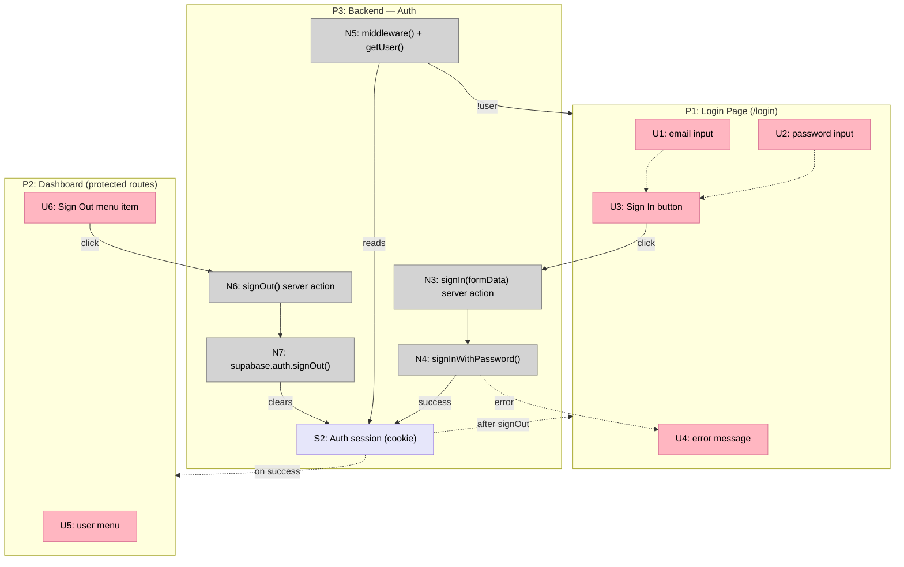
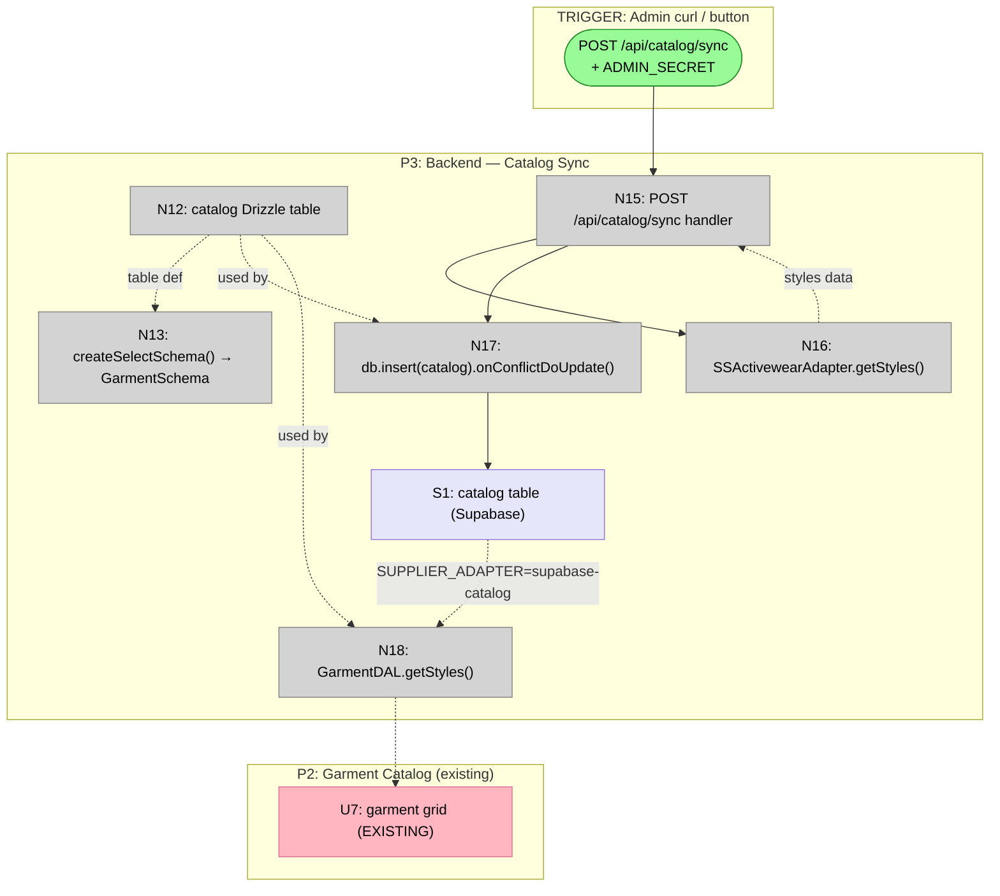
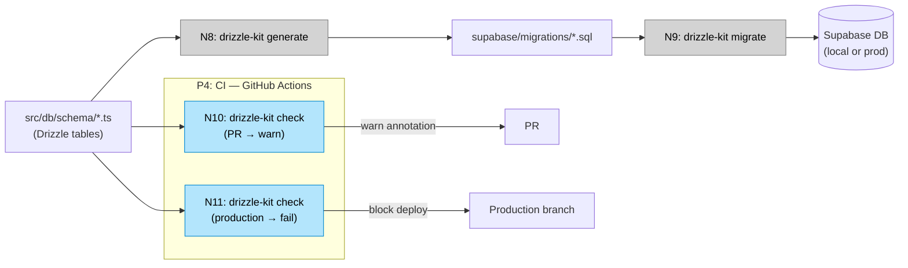

# Supabase Foundation — Breadboard

**Shape**: B — Foundation Layer Only
**Parts**: B1 (Supabase infra) · B2 (Auth) · B3 (Drizzle toolchain) · B4 (CI gate) · B5 (drizzle-zod) · B6 (Catalog sync)

---

## Places

| #   | Place                           | Description                                                           |
| --- | ------------------------------- | --------------------------------------------------------------------- |
| P1  | Login Page (`/login`)           | Email/password login form — replaces `/demo-login`. New Place.        |
| P2  | Dashboard (any protected route) | All existing vertical pages. Existing — middleware now guards access. |
| P3  | Backend                         | Middleware, server actions, API routes, Supabase Auth, Drizzle DB.    |
| P4  | Dev Toolchain                   | `drizzle-kit` CLI + GitHub Actions CI. Developer-facing.              |

---

## UI Affordances

| #   | Place | Component       | Affordance              | Control | Wires Out | Returns To |
| --- | ----- | --------------- | ----------------------- | ------- | --------- | ---------- |
| U1  | P1    | login-form      | email input             | type    | —         | —          |
| U2  | P1    | login-form      | password input          | type    | —         | —          |
| U3  | P1    | login-form      | "Sign In" button        | click   | → N3      | —          |
| U4  | P1    | login-form      | error message           | render  | —         | —          |
| U5  | P2    | topbar          | user menu               | click   | —         | —          |
| U6  | P2    | topbar          | "Sign Out" menu item    | click   | → N6      | —          |
| U7  | P2    | garment-catalog | garment grid (EXISTING) | render  | —         | —          |

**Notes on U7:** Existing affordance — already built in Phase 1. In V2, it starts reading from the Supabase `catalog` table instead of live S&S API (when `SUPPLIER_ADAPTER=supabase-catalog`). No UI change required; only the data source changes.

---

## Code Affordances

| #                               | Place | Component                           | Affordance                                                            | Control | Wires Out                       | Returns To       |
| ------------------------------- | ----- | ----------------------------------- | --------------------------------------------------------------------- | ------- | ------------------------------- | ---------------- | --- | --- |
| **B1: Supabase infrastructure** |       |                                     |                                                                       |         |                                 |                  |     |     |
| N1                              | P3    | `src/shared/lib/supabase/client.ts` | `createClient()` — `createBrowserClient()` factory                    | call    | —                               | → N3 (browser)   |
| N2                              | P3    | `src/shared/lib/supabase/server.ts` | `createClient()` — `createServerClient()` + cookie adapter            | call    | —                               | → N3, N4, N6, N7 |
| N2b                             | P3    | `src/shared/lib/supabase/db.ts`     | `db` — Drizzle `postgres` client (Transaction mode, `prepare: false`) | call    | —                               | → N9, N11        |
| **B2: Auth**                    |       |                                     |                                                                       |         |                                 |                  |     |     |
| N3                              | P3    | `src/app/(auth)/login/actions.ts`   | `signIn(formData)` server action                                      | call    | → N4                            | → U4 (on error)  |
| N4                              | P3    | `@supabase/ssr`                     | `supabase.auth.signInWithPassword({ email, password })`               | call    | → S2 (on success) → P2 redirect | → N3             |
| N5                              | P3    | `middleware.ts`                     | `middleware()` — `createServerClient()` + `supabase.auth.getUser()`   | invoke  | → P1 redirect (if !user)        | —                |
| N6                              | P3    | `src/features/auth/actions.ts`      | `signOut()` server action                                             | call    | → N7                            | —                |
| N7                              | P3    | `@supabase/ssr`                     | `supabase.auth.signOut()`                                             | call    | → S2 (clear) → P1 redirect      | → N6             |
| **B3: Drizzle toolchain**       |       |                                     |                                                                       |         |                                 |                  |     |     |
| N8                              | P4    | `drizzle.config.ts` + CLI           | `drizzle-kit generate` — reads schema, outputs SQL migration file     | invoke  | → `supabase/migrations/*.sql`   | —                |
| N9                              | P4    | `drizzle-kit` CLI                   | `drizzle-kit migrate` — applies pending migrations to local Supabase  | invoke  | → P3 DB (Supabase)              | —                |
| **B4: CI migration gate**       |       |                                     |                                                                       |         |                                 |                  |     |     |
| N10                             | P4    | GitHub Actions                      | PR check: `drizzle-kit check` — warns if schema drift detected        | invoke  | → warn annotation on PR         | —                |
| N11                             | P4    | GitHub Actions                      | Production deploy check: `drizzle-kit check` — hard-fails if drift    | invoke  | → block deploy                  | —                |
| **B5: drizzle-zod**             |       |                                     |                                                                       |         |                                 |                  |     |     |
| N12                             | P3    | `src/db/schema/catalog.ts`          | `catalog` Drizzle table definition                                    | define  | —                               | → N13, N14       |
| N13                             | P3    | `src/domain/entities/garment.ts`    | `createSelectSchema(catalog)` → `GarmentSchema`                       | call    | —                               | → consumers      |
| N14                             | P3    | `src/domain/entities/garment.ts`    | `createInsertSchema(catalog)` → `NewGarmentSchema`                    | call    | —                               | → N15            |
| **B6: Catalog sync**            |       |                                     |                                                                       |         |                                 |                  |     |     |
| N15                             | P3    | `app/api/catalog/sync/route.ts`     | `POST /api/catalog/sync` — validates `ADMIN_SECRET` header            | invoke  | → N16                           | —                |
| N16                             | P3    | `SSActivewearAdapter`               | `getStyles()` — fetches all styles from S&S API                       | call    | → N17                           | → N15            |
| N17                             | P3    | `src/shared/lib/supabase/db.ts`     | `db.insert(catalog).onConflictDoUpdate(styleId)` — upsert all rows    | call    | → S1                            | —                |
| N18                             | P3    | `src/infrastructure/repositories/`  | `GarmentDAL.getStyles()` — reads from `catalog` table via Drizzle     | call    | —                               | → U7             |

---

## Data Stores

| #   | Place | Store                 | Description                                                                                                        |
| --- | ----- | --------------------- | ------------------------------------------------------------------------------------------------------------------ |
| S1  | P3    | `catalog` table       | Supabase PostgreSQL: `styleId`, `name`, `brand`, `categoryId`, `colorways` (jsonb), `sizes`, `images`, `updatedAt` |
| S2  | P3    | Supabase Auth session | Cookie-based JWT session. Written by N4 (sign in), cleared by N7 (sign out), read by N5 (middleware).              |

---

## Mermaid Diagram

### Auth Flow

### Catalog Sync Flow

### Developer Toolchain Flow

---

## Scope Coverage Verification

| Req | Requirement                                                             | Affordances                            | Covered? |
| --- | ----------------------------------------------------------------------- | -------------------------------------- | -------- |
| R0  | Gary can authenticate; session persists across browser restarts         | U1–U4, N3–N5, S2                       | Yes      |
| R1  | Any vertical's repository swappable without changing call sites         | N12, N18, N2b                          | Yes      |
| R2  | Garment catalog populated from S&S and queryable at rest                | N15–N18, S1                            | Yes      |
| R3  | Schema changes tracked in migration history, CI-gated before prod       | N8–N11                                 | Yes      |
| R4  | Zod domain types derive from Drizzle — single source of truth           | N12–N14                                | Yes      |
| R5  | Local dev runs offline via `supabase start` CLI                         | `supabase/` dir                        | Yes      |
| R6  | Middleware redirects unauthenticated; `getUser()` validates server-side | N5                                     | Yes      |
| R7  | Catalog sync triggerable manually; same handler auto-scheduled later    | N15                                    | Yes      |
| R8  | Service role key never exposed to browser; RLS enforced                 | N2b (server-only), Supabase RLS config | Yes      |
| R9  | Ships as horizontal — no vertical required                              | All V1–V3 slices operate independently | Yes      |

---

## Vertical Slices

### Slice Summary

| #   | Slice                      | Parts  | Affordances          | Demo                                                                                                                                                                                                  |
| --- | -------------------------- | ------ | -------------------- | ----------------------------------------------------------------------------------------------------------------------------------------------------------------------------------------------------- |
| V1  | Auth end-to-end            | B1, B2 | U1–U6, N1–N7, S2     | "Visit `/`, get redirected to `/login`. Enter credentials, land on dashboard. Click Sign Out, back to `/login`."                                                                                      |
| V2  | Catalog sync live          | B5, B6 | U7, N12–N18, N2b, S1 | "Run `curl -X POST /api/catalog/sync -H 'x-admin-secret: ...'`. Garment catalog page now shows real S&S styles from Supabase."                                                                        |
| V3  | Schema toolchain + CI gate | B3, B4 | N8–N11               | "Add a table to `src/db/schema/`. Run `npm run db:generate` → SQL migration appears. `npm run db:migrate` → table visible in Supabase Studio. PR CI warns on drift; production branch CI hard-fails." |

### V1: Auth End-to-End

**Adds:**

| #   | Component                           | Affordance                       | Control | Wires Out                    | Returns To   |
| --- | ----------------------------------- | -------------------------------- | ------- | ---------------------------- | ------------ |
| U1  | login-form                          | email input                      | type    | —                            | —            |
| U2  | login-form                          | password input                   | type    | —                            | —            |
| U3  | login-form                          | "Sign In" button                 | click   | → N3                         | —            |
| U4  | login-form                          | error message                    | render  | —                            | —            |
| U5  | topbar                              | user menu                        | click   | —                            | —            |
| U6  | topbar                              | "Sign Out" menu item             | click   | → N6                         | —            |
| N1  | `src/shared/lib/supabase/client.ts` | `createClient()` browser factory | call    | —                            | → auth calls |
| N2  | `src/shared/lib/supabase/server.ts` | `createClient()` server factory  | call    | —                            | → N3, N5, N6 |
| N3  | `src/app/(auth)/login/actions.ts`   | `signIn(formData)` server action | call    | → N4                         | → U4 (error) |
| N4  | `@supabase/ssr`                     | `signInWithPassword()`           | call    | → S2 (success) → P2 redirect | → N3         |
| N5  | `middleware.ts`                     | `middleware()` + `getUser()`     | invoke  | → P1 redirect if !user       | —            |
| N6  | `src/features/auth/actions.ts`      | `signOut()` server action        | call    | → N7                         | —            |
| N7  | `@supabase/ssr`                     | `supabase.auth.signOut()`        | call    | → S2 clear → P1 redirect     | → N6         |
| S2  | Supabase Auth                       | session cookie                   | write   | —                            | → N5 (reads) |

**Also removed:** `src/app/demo-login/` route, `app/api/demo-login/` route, `DEMO_ACCESS_CODE` cookie check in middleware.

**Demo**: Gary opens the app. Gets sent to `/login`. Types `gary@4ink.shop` + password. Lands on dashboard. Refreshes — still logged in. Clicks user menu → Sign Out → redirected back to `/login`. Any direct URL navigation while logged out → redirected to `/login`.

---

### V2: Catalog Sync Live

**Adds (on top of V1):**

| #   | Component                          | Affordance                                         | Control | Wires Out | Returns To      |
| --- | ---------------------------------- | -------------------------------------------------- | ------- | --------- | --------------- |
| N2b | `src/shared/lib/supabase/db.ts`    | `db` Drizzle client (Transaction mode)             | call    | —         | → N17, N18      |
| N12 | `src/db/schema/catalog.ts`         | `catalog` Drizzle table definition                 | define  | —         | → N13, N17, N18 |
| N13 | `src/domain/entities/garment.ts`   | `createSelectSchema(catalog)` → `GarmentSchema`    | call    | —         | → consumers     |
| N14 | `src/domain/entities/garment.ts`   | `createInsertSchema(catalog)` → `NewGarmentSchema` | call    | —         | → N17           |
| N15 | `app/api/catalog/sync/route.ts`    | `POST /api/catalog/sync` (validates ADMIN_SECRET)  | invoke  | → N16     | —               |
| N16 | `SSActivewearAdapter`              | `getStyles()` — fetches all S&S styles             | call    | → N17     | → N15           |
| N17 | Drizzle `db`                       | `db.insert(catalog).onConflictDoUpdate()`          | call    | → S1      | —               |
| N18 | `src/infrastructure/repositories/` | `GarmentDAL.getStyles()` (supabase-catalog path)   | call    | —         | → U7            |
| S1  | Supabase PostgreSQL                | `catalog` table                                    | write   | —         | → N18           |

**Demo**: Run `curl -X POST http://localhost:3000/api/catalog/sync -H "x-admin-secret: $ADMIN_SECRET"`. Navigate to `/garments` — real S&S styles visible. Refresh — data persists (no S&S API call on page load).

---

### V3: Schema Toolchain + CI Gate

**Adds (developer-facing — no UI changes):**

| #   | Component         | Affordance                                    | Control | Wires Out                | Returns To |
| --- | ----------------- | --------------------------------------------- | ------- | ------------------------ | ---------- |
| N8  | `drizzle-kit` CLI | `npm run db:generate` → migration SQL file    | invoke  | → `supabase/migrations/` | —          |
| N9  | `drizzle-kit` CLI | `npm run db:migrate` → apply to local DB      | invoke  | → Supabase local DB      | —          |
| N10 | GitHub Actions    | PR check: `drizzle-kit check` (warn)          | invoke  | → PR annotation          | —          |
| N11 | GitHub Actions    | Production deploy: `drizzle-kit check` (fail) | invoke  | → deploy blocked         | —          |

**Also adds:** `drizzle.config.ts`, `package.json` db scripts, `src/domain/entities/TODO-drizzle.md`

**Demo**: Developer adds a `notes` table to `src/db/schema/notes.ts`. Runs `npm run db:generate` → migration SQL appears in `supabase/migrations/`. Runs `npm run db:migrate` → table visible in Supabase Studio at `localhost:54323`. Opens PR → CI check runs → warns if schema drift. Pushes to `production` → CI hard-fails if migrations not applied.

---

## Quality Gate

- [x] Every Place passes the blocking test
  - P1 (Login): blocks all content behind — only affordance is the form
  - P2 (Dashboard): existing pages, now requires session in S2
  - P3 (Backend): bounded by server/middleware boundary
  - P4 (Dev toolchain): bounded by CLI execution context
- [x] Every R from shaping has corresponding affordances (scope coverage table above)
- [x] Every U has at least one Wires Out or Returns To
  - U1, U2 feed U3 (type → enables button)
  - U3 → N3 (sign in action)
  - U4 ← N4 (error render)
  - U5 reveals U6 (menu opens)
  - U6 → N6 (sign out action)
  - U7 ← N18 (catalog data)
- [x] Every N has a trigger and either Wires Out or Returns To
- [x] Every S has at least one reader and one writer
  - S1: written by N17, read by N18
  - S2: written by N4, cleared by N7, read by N5
- [x] No dangling wire references
- [x] Slices defined with demo statements (V1–V3)
- [x] Phase indicators: all code affordances are Phase 2 (server-side, DB, auth)
- [x] Mermaid diagrams match tables
