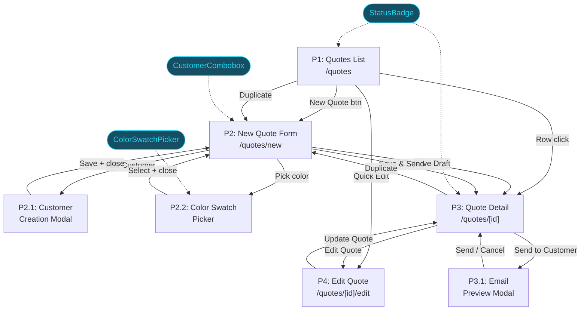
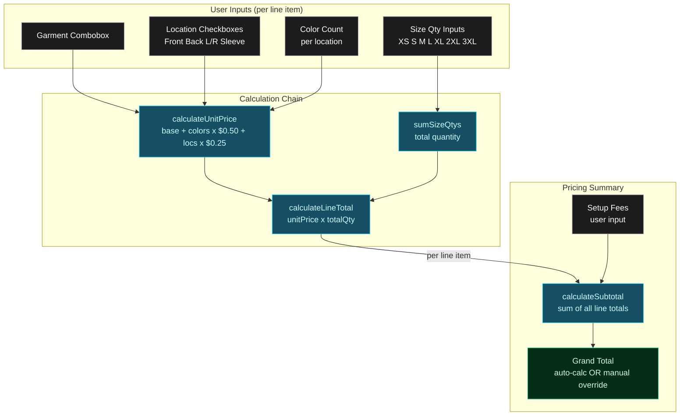

| Metric | Value |
|--------|-------|
| Places | 7 |
| UI Affordances | 65 |
| Code Affordances | 32 |
| Data Stores | 18 |

## Places & Navigation Flow

### How users move through the Quoting vertical

Pages (rectangles) are routes. Modals/popovers (rounded) block interaction with the parent Place. Shared components (dashed cyan) feed into multiple Places and will be reusable across future verticals.

## New Quote Form — Pricing Data Flow

### How user inputs flow through the calculation chain

Every calculation is instant and client-side — never blocks input. This is the #1 improvement over Print Life (which blocks on every quantity change). The pricing formula is simplified for Phase 1; Phase 2 will read from a configurable pricing matrix.

## Places

| ID | Place | Type | Entry Point |
|----|-------|------|-------------|
| P1 | Quotes List | Page | `/quotes` |
| P2 | New Quote Form | Page | `/quotes/new` |
| P2.1 | Customer Creation Modal | Modal | "Add New Customer" in P2 |
| P2.2 | Color Swatch Picker | Popover | Color field in P2 line item |
| P3 | Quote Detail | Page | `/quotes/[id]` |
| P3.1 | Email Preview Modal | Modal | "Send to Customer" in P3 |
| P4 | Edit Quote Form | Page | `/quotes/[id]/edit` |

## Shared Components (Reusable)

Built first, used across verticals.

| Component | Used In | Location |
|-----------|---------|----------|
| **ColorSwatchPicker** | P2.2 (Quote Form color selection) | `components/features/` |
| **CustomerCombobox** | P2, P4 (customer selection) | `components/features/` |
| **StatusBadge** | P1, P3 (quote status display) | `components/features/` |

## Build Order

Dependency-ordered execution plan:

1. **Schema Updates** (Low) — Update quote.ts (new statuses, richer line items), new color.ts, garment catalog variant. Blocks everything.
2. **Mock Data Expansion** (Medium) — 40 colors with S&S-aligned fields, 6+ garment styles, 6 quotes with full line items. Blocks all UI.
3. **Shared Components** (Medium) — ColorSwatchPicker + CustomerCombobox + StatusBadge. Can run in parallel. Block the Quote Form.
4. **Quotes List Page** (Medium) — P1: DataTable with filters, search, sort, quick actions. Can run in parallel with step 5.
5. **QuoteForm + Pricing** (High) — Core form component: LineItemRow, PricingSummary, pricing calculations. Heart of the vertical.
6. **New Quote + Edit Quote Pages** (Medium) — P2 + P4: Wire QuoteForm into page routes with Customer Modal integration.
7. **Quote Detail + Email Preview** (Medium) — P3 + P3.1: Read-only view with action buttons and email mockup modal.

**Critical path:** Schemas → Mock Data → ColorSwatchPicker → QuoteForm → New Quote page

## Key Design Decisions

### Single-page form, not a wizard

Print Life forces 6 sequential steps. We use one scrollable page with 4 collapsible sections. Users only interact with what they need.

### Instant pricing (never block input)

Print Life's #1 friction: recalculation blocks typing. Our N32 → N11 → N16 chain runs synchronously on every keystroke with zero delay.

### Color swatch picker as popover (P2.2)

Inline grids per line item would consume too much vertical space. Popover opens on click, blocks form, closes on selection. Passes the blocking test = its own Place.

### QuoteForm shared between New + Edit

P2 and P4 use the same component. P4 calls N31 (loadQuoteForEdit) on mount to pre-fill. Reduces build effort and ensures consistency.

## Artifacts

Full breadboard document (tables + diagrams): `docs/breadboards/quoting-breadboard.md`

Contains: Places, UI Affordances (65), Code Affordances (32), Data Stores (18), Wiring Verification, Component Boundaries, Build Order, Scope Coverage, Phase 2 Extensions. Mermaid diagrams render on GitHub.
